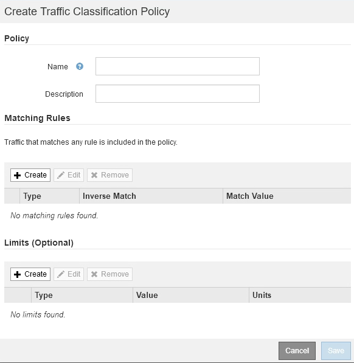

= 트래픽 분류 정책을 생성합니다
:allow-uri-read: 
:icons: font
:imagesdir: ../media/

[role="lead"]
버킷, 테넌트, IP 서브넷 또는 로드 밸런서 끝점별로 네트워크 트래픽을 모니터링하고 선택적으로 제한하려는 경우 트래픽 분류 정책을 생성합니다. 필요에 따라 대역폭, 동시 요청 수 또는 요청 속도를 기준으로 정책에 대한 제한을 설정할 수 있습니다.

.무엇을 &#8217;필요로 할거야
* 를 사용하여 그리드 관리자에 로그인했습니다 xref:../admin/web-browser-requirements.adoc[지원되는 웹 브라우저].
* 루트 액세스 권한이 있습니다.
* 일치시킬 로드 밸런서 끝점을 만들었습니다.
* 일치시킬 테넌트를 만들었습니다.

.단계
. 구성 * > * 네트워크 * > * 트래픽 분류 * 를 선택합니다.
+
교통 분류 정책 페이지가 나타납니다.

+
image::../media/traffic_classification_policies_main_screen.png[트래픽 분류 정책 - 기본 화면]

. Create * 를 선택합니다.
+
트래픽 분류 정책 생성 대화 상자가 나타납니다.

+

. 이름 * 필드에 정책의 이름을 입력합니다.
+
정책을 인식할 수 있도록 설명 이름을 입력합니다.

. 필요에 따라 * Description * (설명 *) 필드에 정책에 대한 설명을 추가합니다.
+
예를 들어, 이 트래픽 분류 정책이 적용되는 대상 및 제한할 내용에 대해 설명하십시오.

. 정책에 일치하는 규칙을 하나 이상 생성합니다.
+
일치 규칙은 이 트래픽 분류 정책의 영향을 받을 엔터티를 제어합니다. 예를 들어 특정 테넌트의 네트워크 트래픽에 이 정책을 적용하려면 Tenant를 선택합니다. 또는 이 정책을 특정 로드 밸런싱 장치 끝점의 네트워크 트래픽에 적용하려면 끝점 을 선택합니다.

+
.. 일치 규칙 * 섹션에서 * 만들기 * 를 선택합니다.
+
일치 규칙 만들기 대화 상자가 나타납니다.

+
image::../media/traffic_classification_policy_create_matching_rule.png[일치 규칙을 생성합니다]

.. Type * 드롭다운에서 일치하는 규칙에 포함할 요소의 유형을 선택합니다.
.. 일치 값 * 필드에 선택한 요소의 유형에 따라 일치 값을 입력합니다.
+
*** 버킷: 버킷 이름을 입력합니다.
*** Bucket Regex: 버킷 이름 집합과 일치시키는 데 사용할 정규식을 입력합니다.
+
정규식이 고정 해제됩니다. {캐럿} 앵커를 사용하여 버킷 이름의 시작 부분에 일치시키고 $ 앵커를 사용하여 이름 끝에 일치시킵니다.

*** CIDR: 원하는 서브넷과 일치하는 IPv4 서브넷을 CIDR 표기법으로 입력합니다.
*** 끝점: 기존 끝점 목록에서 끝점을 선택합니다. 로드 밸런서 엔드포인트 페이지에서 정의한 로드 밸런서 엔드포인입니다. 을 참조하십시오 xref:configuring-load-balancer-endpoints.adoc[로드 밸런서 엔드포인트를 구성합니다].
*** 테넌트: 기존 테넌트 목록에서 테넌트를 선택합니다. 테넌트 일치는 액세스 중인 버킷의 소유권을 기반으로 합니다. 버킷에 대한 익명 액세스는 버킷을 소유하는 테넌트와 일치합니다.

.. 방금 정의한 유형 및 일치 값과 일치하는 모든 network traffic_except_traffic을 일치시키려면 * Inverse * 확인란을 선택합니다. 그렇지 않으면 확인란을 선택하지 않은 상태로 둡니다.
+
예를 들어, 이 정책이 로드 밸런서 끝점 중 하나를 제외한 모든 항목에 적용되도록 하려면 제외할 로드 밸런서 끝점을 지정하고 * Inverse * 를 선택합니다.

+

IMPORTANT: 하나 이상의 교자가 역마쳐인 여러 마처를 포함하는 정책의 경우 모든 요청과 일치하는 정책을 만들지 않도록 주의하십시오.

.. Apply * 를 선택합니다.
+
규칙이 만들어지고 일치하는 규칙 테이블에 나열됩니다.

+
image::../media/traffic_classification_policy_rules.png[트래픽 정책 일치 규칙]

.. 정책에 대해 생성할 각 규칙에 대해 이 단계를 반복합니다.
+

NOTE: 모든 규칙과 일치하는 트래픽은 정책에 의해 처리됩니다.

. 필요에 따라 정책에 대한 제한을 생성합니다.
+

NOTE: 제한을 만들지 않더라도 StorageGRID는 정책과 일치하는 네트워크 트래픽을 모니터링할 수 있도록 메트릭을 수집합니다.

+
.. Limits * 섹션에서 * Create * 를 선택합니다.
+
Create Limit 대화상자가 나타납니다.

+
image::../media/traffic_classification_policy_create_limit.png[제한 생성]

.. Type * 드롭다운에서 정책에 적용할 제한 유형을 선택합니다.
+
다음 목록에서 * in * 은 S3 또는 Swift 클라이언트에서 StorageGRID 로드 밸런서로의 트래픽을 나타내고 * out * 은 로드 밸런서에서 S3 또는 Swift 클라이언트로 보내는 트래픽을 나타냅니다.

+
*** 총 대역폭
*** 총 대역폭 출력
*** 동시 읽기 요청
*** 동시 쓰기 요청
*** 요청 당 대역폭
*** 요청 당 대역폭 출력
*** 읽기 요청 속도
*** 쓰기 요청 속도
+
[NOTE]
====
정책을 생성하여 애그리게이트 대역폭을 제한하거나 요청당 대역폭을 제한할 수 있습니다. 그러나 StorageGRID는 두 가지 유형의 대역폭을 동시에 제한할 수 없습니다. 애그리게이트 대역폭 제한은 제한 없는 트래픽에 약간의 성능 영향을 줄 수 있습니다.

====
+
대역폭 제한에 대해 StorageGRID는 설정된 제한 유형과 가장 일치하는 정책을 적용합니다. 예를 들어, 트래픽을 한 방향으로만 제한하는 정책이 있는 경우 대역폭 제한이 있는 추가 정책과 일치하는 트래픽이 있더라도 반대 방향의 트래픽은 무제한입니다. StorageGRID는 대역폭 제한에 대해 다음 순서로 ""가장 적합한"" 일치 항목을 구현합니다.

+
**** 정확한 IP 주소(/32 마스크)
**** 정확한 버킷 이름입니다
**** 버킷 regex
**** 테넌트
**** 엔드포인트
**** 일치하지 않는 CIDR 일치(NOT/32)
**** 역 일치

.. 값 * 필드에 선택한 제한 유형의 숫자 값을 입력합니다.
+
한계를 선택하면 예상 단위가 표시됩니다.

.. Apply * 를 선택합니다.
+
제한이 생성되고 Limits 테이블에 나열됩니다.

+
image::../media/traffic_classification_policy_limits.png[트래픽 정책 제한]

.. 정책에 추가할 각 제한에 대해 이 단계를 반복합니다.
+
예를 들어, SLA 계층에 대해 40Gbps 대역폭 제한을 생성하려면 한도 내의 총 대역폭 및 총 대역폭 제한을 생성하고 각 대역폭을 40Gbps로 설정합니다.

+

NOTE: 초당 메가바이트를 초당 기가비트 수로 변환하려면 8을 곱합니다. 예를 들어, 125MB/s는 1,000Mbps 또는 1Gbps와 동일합니다.

. 규칙 및 제한 만들기를 마치면 * 저장 * 을 선택합니다.
+
정책이 저장되고 트래픽 분류 정책 표에 나열됩니다.

+
image::../media/traffic_classification_policies_main_screen_w_examples.png[트래픽 정책의 예]

+
이제 S3 및 Swift 클라이언트 트래픽이 트래픽 분류 정책에 따라 처리됩니다. 트래픽 차트를 보고 정책이 기대하는 트래픽 제한을 적용하고 있는지 확인할 수 있습니다. 을 참조하십시오 xref:viewing-network-traffic-metrics.adoc[네트워크 트래픽 메트릭을 확인합니다].

