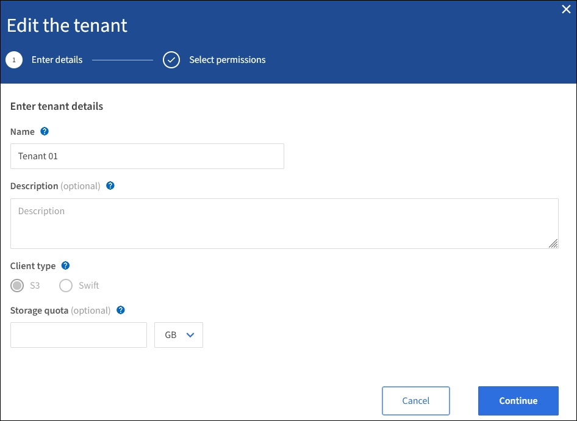

= 테넌트 계정을 편집합니다
:allow-uri-read: 
:icons: font
:imagesdir: ../media/

[role="lead"]
테넌트 계정을 편집하여 표시 이름을 변경하거나, ID 소스 설정을 변경하거나, 플랫폼 서비스를 허용 또는 금지하거나, 스토리지 할당량을 입력할 수 있습니다.

.필요한 것
* 를 사용하여 그리드 관리자에 로그인했습니다 xref:../admin/web-browser-requirements.adoc[지원되는 웹 브라우저].
* 특정 액세스 권한이 있습니다.

.단계
. Tenants * 를 선택합니다.
+
image::../media/tenant_accounts_page.png[테넌트 계정 페이지입니다]

. 편집할 테넌트 계정을 선택합니다.
+
검색 상자를 사용하여 이름 또는 테넌트 ID로 테넌트 계정을 검색합니다.

. 작업 드롭다운에서 * 편집 * 을 선택합니다.
+
이 예제는 SSO(Single Sign-On)를 사용하지 않는 그리드에 대한 것입니다. 이 테넌트 계정은 자체 ID 소스를 구성하지 않았습니다.

+

. 필요에 따라 다음 필드의 값을 변경합니다.
+
** * 이름 *
** * 설명 *
** * 클라이언트 유형 *
** * 스토리지 할당량 *

. Continue * 를 선택합니다.
. 테넌트 계정에 대한 사용 권한을 선택하거나 선택 취소합니다.
+
** 이미 사용 중인 테넌트에 대해 * 플랫폼 서비스 * 를 비활성화하면 해당 S3 버킷에 대해 구성된 서비스가 작동을 멈춥니다. 테넌트에 오류 메시지가 전송되지 않습니다. 예를 들어, 테넌트가 S3 버킷에 대해 CloudMirror 복제를 구성한 경우 버킷에 오브젝트를 저장할 수 있지만 해당 오브젝트의 복사본은 더 이상 엔드포인트로 구성된 외부 S3 버킷에서 생성할 수 없습니다.
** 사용자 지정 ID 소스 사용 * 확인란의 설정을 변경하여 테넌트 계정에서 자체 ID 소스를 사용할지 또는 Grid Manager용으로 구성된 ID 소스를 사용할지 여부를 결정합니다.
+
고유 ID 원본 사용 * 확인란이 다음과 같은 경우:

+
*** 비활성화된 후 선택한 경우 테넌트는 이미 자체 ID 소스를 사용하도록 설정되어 있습니다. 테넌트는 그리드 관리자에 대해 구성된 ID 소스를 사용하기 전에 해당 ID 소스를 비활성화해야 합니다.
*** 비활성화되고 선택 취소되며 StorageGRID 시스템에 대해 SSO가 활성화됩니다. 테넌트는 Grid Manager에 대해 구성된 ID 소스를 사용해야 합니다.

** 필요에 따라 * S3 Select * 를 활성화 또는 비활성화합니다. 을 참조하십시오 xref:manage-s3-select-for-tenant-accounts.adoc[관리 S3 테넌트 계정에 대해 선택].

. 저장 * 을 선택합니다.

.관련 정보
* xref:manage-platform-services-for-tenants.adoc[S3 테넌트 계정에 대한 플랫폼 서비스 관리]
* xref:../tenant/index.adoc[테넌트 계정을 사용합니다]

