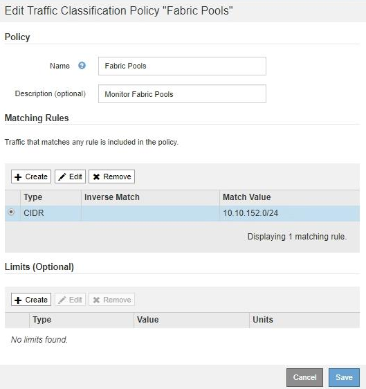

= 트래픽 분류 정책을 편집합니다
:allow-uri-read: 
:icons: font
:imagesdir: ../media/

[role="lead"]
트래픽 분류 정책을 편집하여 이름 또는 설명을 변경하거나 정책에 대한 규칙 또는 제한을 생성, 편집 또는 삭제할 수 있습니다.

.필요한 것
* 를 사용하여 그리드 관리자에 로그인했습니다 xref:../admin/web-browser-requirements.adoc[지원되는 웹 브라우저].
* 루트 액세스 권한이 있습니다.

.단계
. 구성 * > * 네트워크 * > * 트래픽 분류 * 를 선택합니다.
+
트래픽 분류 정책 페이지가 나타나고 기존 정책이 표에 나열됩니다.

+
image::../media/traffic_classification_policies_main_screen_w_examples.png[트래픽 분류 정책의 예]

. 편집할 정책 왼쪽의 라디오 버튼을 선택합니다.
. 편집 * 을 선택합니다.
+
트래픽 분류 정책 편집 대화 상자가 나타납니다.

+

. 필요에 따라 일치하는 규칙 및 제한을 생성, 편집 또는 제거합니다.
+
.. 일치하는 규칙 또는 제한을 만들려면 * 만들기 * 를 선택하고 규칙을 만들거나 제한을 만드는 방법에 대한 지침을 따릅니다.
.. 일치하는 규칙 또는 제한을 편집하려면 규칙 또는 제한에 대한 라디오 버튼을 선택하고 * 일치 규칙 * 섹션 또는 * 제한 * 섹션에서 * 편집 * 을 선택한 다음 규칙 생성 또는 제한 생성 지침을 따릅니다.
.. 일치하는 규칙 또는 제한을 제거하려면 규칙 또는 제한에 대한 라디오 단추를 선택하고 * 제거 * 를 선택합니다. 그런 다음 * 확인 * 을 선택하여 규칙 또는 제한을 제거할 것인지 확인합니다.

. 규칙 또는 제한을 만들거나 편집한 후에는 * 적용 * 을 선택합니다.
. 정책 편집을 마치면 * Save * 를 선택합니다.
+
정책 변경 사항이 저장되고 이제 트래픽 분류 정책에 따라 네트워크 트래픽이 처리됩니다. 트래픽 차트를 보고 정책이 기대하는 트래픽 제한을 적용하고 있는지 확인할 수 있습니다.

