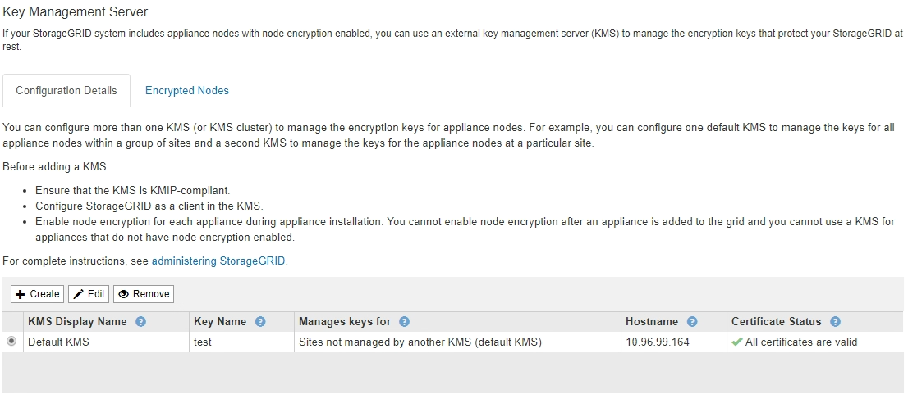

= KMS(키 관리 서버) 제거
:icons: font
:imagesdir: ../media/

[role="lead"]
경우에 따라 키 관리 서버를 제거할 수 있습니다. 예를 들어 사이트를 해체한 경우 사이트별 KMS를 제거할 수 있습니다.

.무엇을 &#8217;필요로 할거야
* 을(를) 검토했습니다 xref:kms-considerations-and-requirements.adoc[키 관리 서버 사용에 대한 고려 사항 및 요구 사항].
* 를 사용하여 그리드 관리자에 로그인했습니다 xref:../admin/web-browser-requirements.adoc[지원되는 웹 브라우저].
* 루트 액세스 권한이 있습니다.

다음과 같은 경우 KMS를 제거할 수 있습니다.

* 사이트를 폐기했거나 사이트에 노드 암호화가 활성화된 어플라이언스 노드가 없는 경우 사이트별 KMS를 제거할 수 있습니다.
* 노드 암호화가 활성화된 어플라이언스 노드가 있는 각 사이트에 대해 사이트별 KMS가 이미 있는 경우 기본 KMS를 제거할 수 있습니다.

.단계
. 구성 * > * 보안 * > * 키 관리 서버 * 를 선택합니다.
+
Key Management Server 페이지가 나타나고 구성된 모든 키 관리 서버가 표시됩니다.

+

. 제거할 KMS의 라디오 단추를 선택하고 * 제거 * 를 선택합니다.
. 경고 대화 상자에서 고려 사항을 검토합니다.
+
image::../media/kms_remove_warning.png[KMS 제거 경고]

. OK * 를 선택합니다.
+
KMS 구성이 제거되었습니다.

