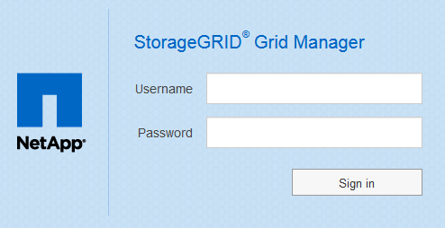

= Grid Manager에 로그인합니다
:allow-uri-read: 
:icons: font
:imagesdir: ../media/

[role="lead"]
지원되는 웹 브라우저의 주소 표시줄에 FQDN(정규화된 도메인 이름) 또는 관리 노드의 IP 주소를 입력하여 Grid Manager 로그인 페이지에 액세스합니다.

.무엇을 &#8217;필요로 할거야
* 로그인 자격 증명이 있습니다.
* 그리드 관리자의 URL이 있습니다.
* 을(를) 사용하고 있습니다 xref:../admin/web-browser-requirements.adoc[지원되는 웹 브라우저].
* 쿠키는 웹 브라우저에서 활성화됩니다.
* 특정 액세스 권한이 있습니다.

각 StorageGRID 시스템에는 1개의 기본 관리 노드와 1차 관리자가 아닌 노드 수가 포함되어 있습니다. 관리자 노드의 그리드 관리자에 로그인하여 StorageGRID 시스템을 관리할 수 있습니다. 그러나 관리 노드는 정확히 동일하지 않습니다.

* 한 관리 노드에서 이루어진 알람 승인(레거시 시스템)은 다른 관리 노드에 복사되지 않습니다. 이러한 이유로 알람에 대해 표시되는 정보는 각 관리 노드에서 동일하지 않을 수 있습니다.
* 일부 유지 보수 절차는 기본 관리 노드에서만 수행할 수 있습니다.

HA(고가용성) 그룹에 관리 노드가 포함된 경우 HA 그룹의 가상 IP 주소 또는 가상 IP 주소에 매핑되는 정규화된 도메인 이름을 사용하여 연결합니다. 기본 관리 노드를 그룹의 기본 인터페이스로 선택해야 그리드 관리자에 액세스할 때 기본 관리 노드를 사용할 수 없는 경우를 제외하고 기본 관리 노드에서 액세스할 수 있습니다.

.단계
. 지원되는 웹 브라우저를 실행합니다.
. 브라우저의 주소 표시줄에 Grid Manager의 URL을 입력합니다.
+
"https://_FQDN_or_Admin_Node_IP_/`

+
여기서, '_FQDN_OR_Admin_Node_IP_'는 관리자 노드의 정규화된 도메인 이름 또는 관리 노드의 HA 그룹의 가상 IP 주소입니다.

+
HTTPS의 표준 포트(443)가 아닌 포트에서 Grid Manager에 액세스해야 하는 경우 다음을 입력합니다. 여기서, '_FQDN_or_Admin_Node_IP_'는 정규화된 도메인 이름 또는 IP 주소이고 port는 포트 번호입니다.

+
"https://_FQDN_or_Admin_Node_IP:port_/`

. 보안 경고 메시지가 나타나면 브라우저의 설치 마법사를 사용하여 인증서를 설치합니다( 참조) xref:using-storagegrid-security-certificates.adoc[보안 인증서 정보])를 클릭합니다.
. Grid Manager에 로그인:
+
** SSO(Single Sign-On)를 StorageGRID 시스템에 사용하지 않는 경우:
+
... Grid Manager의 사용자 이름과 암호를 입력합니다.
... 로그인 * 을 선택합니다.
+

** StorageGRID 시스템에서 SSO가 활성화되어 있고 이 브라우저에서 URL에 처음 액세스한 경우:
+
... 로그인 * 을 선택합니다. 계정 ID 필드는 비워 둘 수 있습니다.
+
image::../media/sso_sign_in_first_time.gif[SSO가 활성화되어 있고 쿠키가 없는 경우 로그인 화면으로 로그인합니다]

... 조직의 SSO 로그인 페이지에 표준 SSO 자격 증명을 입력합니다. 예를 들면 다음과 같습니다.
+
image::../media/sso_organization_page.gif[SSO에 대한 조직 로그인 페이지의 예]

** StorageGRID 시스템에 대해 SSO가 활성화되어 있고 이전에 그리드 관리자 또는 테넌트 계정에 액세스한 경우:
+
... 다음 중 하나를 수행합니다.
+
**** 0 * (그리드 관리자의 계정 ID)을 입력하고 * 로그인 * 을 선택합니다.
**** 최근 계정 목록에 나타나는 경우 * Grid Manager * 를 선택하고 * Sign in * 을 선택합니다.
+
image::../media/sign_in_grid_manager_sso.gif[SSO가 활성화된 경우 최근 계정 목록에서 Grid Manager를 선택합니다]

... 조직의 SSO 로그인 페이지에서 표준 SSO 자격 증명을 사용하여 로그인합니다. 로그인하면 대시보드가 포함된 그리드 관리자의 홈 페이지가 나타납니다. 제공되는 정보에 대한 자세한 내용은 을 참조하십시오 xref:../monitor/viewing-dashboard.adoc[대시보드 보기].

+
image::../media/grid_manager_dashboard.png[대시보드]

. 다른 관리자 노드에 로그인하려면:
+
[cols="1a,2a"]
|===
| 옵션을 선택합니다 | 단계 

 a| 
SSO가 활성화되지 않았습니다
 a| 
.. 브라우저의 주소 표시줄에 다른 관리 노드의 정규화된 도메인 이름 또는 IP 주소를 입력합니다. 필요에 따라 포트 번호를 포함시킵니다.
.. Grid Manager의 사용자 이름과 암호를 입력합니다.
.. 로그인 * 을 선택합니다.

 a| 
SSO가 활성화되었습니다
 a| 
브라우저의 주소 표시줄에 다른 관리 노드의 정규화된 도메인 이름 또는 IP 주소를 입력합니다.

한 관리 노드에 로그인한 경우 다시 로그인하지 않고도 다른 관리 노드에 액세스할 수 있습니다. 그러나 SSO 세션이 만료되면 자격 증명을 다시 입력하라는 메시지가 표시됩니다.

* 참고: * SSO는 제한된 Grid Manager 포트에서 사용할 수 없습니다. 사용자가 SSO(Single Sign-On)로 인증하도록 하려면 기본 HTTPS 포트(443)를 사용해야 합니다.

|===

.관련 정보
* xref:controlling-access-through-firewalls.adoc[방화벽을 통한 액세스 제어]
* xref:configuring-sso.adoc[Single Sign-On 구성]
* xref:managing-admin-groups.adoc[관리 그룹을 관리합니다]
* xref:managing-high-availability-groups.adoc[고가용성 그룹을 관리합니다]
* xref:../tenant/index.adoc[테넌트 계정을 사용합니다]
* xref:../monitor/index.adoc[모니터링하고 문제를 해결합니다]

