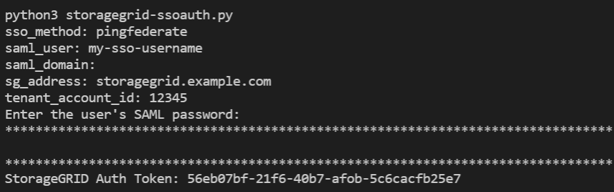

= SSO(Single Sign-On)가 활성화된 경우 API 사용(PingFederate)
:allow-uri-read: 
:icons: font
:imagesdir: ../media/

[role="lead"]
있는 경우 xref:../admin/configuring-sso.adoc[SSO(Single Sign-On) 구성 및 활성화] 그리고 PingFederate를 SSO 공급자로 사용하는 경우 일련의 API 요청을 발급하여 Grid Management API 또는 Tenant Management API에 유효한 인증 토큰을 얻어야 합니다.

== SSO(Single Sign-On)가 활성화된 경우 API에 로그인합니다

이 지침은 PingFederate를 SSO ID 공급자로 사용하는 경우 적용됩니다

.필요한 것
* StorageGRID 사용자 그룹에 속한 페더레이션 사용자의 SSO 사용자 이름과 암호를 알고 있습니다.
* 테넌트 관리 API에 액세스하려면 테넌트 계정 ID를 알고 있어야 합니다.

.이 작업에 대해
인증 토큰을 얻으려면 다음 예 중 하나를 사용할 수 있습니다.

* StorageGRID 설치 파일 디렉토리( Red Hat Enterprise Linux 또는 CentOS의 경우 ./rpms, Ubuntu 또는 Debian의 경우 ./debs, VMware의 경우 ./vsphere)에 있는 toragegrid-ssoauth.py Python 스크립트입니다.
* curl 요청의 워크플로 예
+
컬을 너무 느리게 수행하면 컬링 작업 시간이 초과될 수 있습니다. "이 응답에 유효한 SubjectConfirmation을 찾을 수 없습니다."라는 오류가 표시될 수 있습니다.

+

NOTE: 예제 curl 워크플로는 다른 사용자가 암호를 볼 수 없도록 보호하지 않습니다.

+
URL 인코딩 문제가 있는 경우 '지원되지 않는 SAML 버전' 오류가 표시될 수 있습니다.

.단계
. 인증 토큰을 얻으려면 다음 방법 중 하나를 선택합니다.
+
** toragegrid-soauth.py Python 스크립트를 사용하십시오. 2단계로 이동합니다.
** curl 요청을 사용합니다. 3단계로 이동합니다.

. 'toragegrid-ssoauth.py' 스크립트를 사용하려면 스크립트를 Python 해석기로 전달하고 스크립트를 실행합니다.
+
프롬프트가 표시되면 다음 인수에 대한 값을 입력합니다.

+
** SSO 방법 ""핑남부연합"(PINGFEDERATE, 핑남부연합 등)의 모든 변형을 입력할 수 있습니다.
** SSO 사용자 이름입니다
** StorageGRID가 설치된 도메인입니다. 이 필드는 PingFederate에 사용되지 않습니다. 빈 칸으로 두거나 원하는 값을 입력할 수 있습니다.
** StorageGRID의 주소입니다
** 테넌트 관리 API에 액세스하려는 경우 테넌트 계정 ID입니다.
+

+
StorageGRID 인증 토큰은 출력에 제공됩니다. 이제 SSO가 사용되지 않는 경우 API를 사용하는 방법과 유사하게 다른 요청에 토큰을 사용할 수 있습니다.

. curl 요청을 사용하려면 다음 절차를 따르십시오.
+
.. 로그인에 필요한 변수를 선언합니다.
+
[source, bash]
----
export SAMLUSER='my-sso-username'
export SAMLPASSWORD='my-password'
export TENANTACCOUNTID='12345'
export STORAGEGRID_ADDRESS='storagegrid.example.com'
----
+

NOTE: Grid Management API에 액세스하려면 0을 "TENANTACCOUNTID"로 사용합니다.

.. 서명된 인증 URL을 받으려면 '/api/v3/authorize-SAML'에 POST 요청을 보내고 응답에서 추가 JSON 인코딩을 제거합니다.
+
이 예제에서는 TENANTACCOUNTID에 대한 서명된 인증 URL에 대한 POST 요청을 보여 줍니다. 결과는 python-m json.tool에 전달되어 JSON 인코딩을 제거합니다.

+
[source, bash]
----
curl -X POST "https://$STORAGEGRID_ADDRESS/api/v3/authorize-saml" \
  -H "accept: application/json" -H  "Content-Type: application/json" \
  --data "{\"accountId\": \"$TENANTACCOUNTID\"}" | python -m json.tool
----
+
이 예제의 응답에는 URL로 인코딩된 서명된 URL이 포함되어 있지만 추가 JSON 인코딩 계층은 포함되지 않습니다.

+
[listing]
----
{
    "apiVersion": "3.0",
    "data": "https://my-pf-baseurl/idp/SSO.saml2?...",
    "responseTime": "2018-11-06T16:30:23.355Z",
    "status": "success"
}
----
.. 후속 명령어에 사용하기 위해 응답에서 'AMLRequest'를 저장한다.
+
[listing]
----
export SAMLREQUEST="https://my-pf-baseurl/idp/SSO.saml2?..."
----
.. 응답과 쿠키를 내보내고 응답을 에코합니다.
+
[source, bash]
----
RESPONSE=$(curl -c - "$SAMLREQUEST")
----
+
[source, bash]
----
echo "$RESPONSE" | grep 'input type="hidden" name="pf.adapterId" id="pf.adapterId"'
----
.. 'pf.adapterId' 값을 내보내고 응답을 에코합니다.
+
[listing]
----
export ADAPTER='myAdapter'
----
+
[source, bash]
----
echo "$RESPONSE" | grep 'base'
----
.. 'href' 값을 내보내고(후행 슬래시/ 제거) 응답을 에코합니다.
+
[listing]
----
export BASEURL='https://my-pf-baseurl'
----
+
[source, bash]
----
echo "$RESPONSE" | grep 'form method="POST"'
----
.. '조치' 값 내보내기:
+
[listing]
----
export SSOPING='/idp/.../resumeSAML20/idp/SSO.ping'
----
.. 자격 증명과 함께 쿠키 보내기:
+
[source, bash]
----
curl -b <(echo "$RESPONSE") -X POST "$BASEURL$SSOPING" \
--data "pf.username=$SAMLUSER&pf.pass=$SAMLPASSWORD&pf.ok=clicked&pf.cancel=&pf.adapterId=$ADAPTER" --include
----
.. 숨겨진 필드에서 '응답'을 저장합니다.
+
[source, bash]
----
export SAMLResponse='PHNhbWxwOlJlc3BvbnN...1scDpSZXNwb25zZT4='
----
.. 저장된 'SAMLResponse'를 사용하여 StorageGRID 인증 토큰을 생성하기 위한 StorageGRID '/API/SAML-RESPONSE' 요청을 생성합니다.
+
RelayState의 경우, Grid Management API에 로그인하려면 테넌트 계정 ID를 사용하거나 0을 사용하십시오.

+
[source, bash]
----
curl -X POST "https://$STORAGEGRID_ADDRESS:443/api/saml-response" \
  -H "accept: application/json" \
  --data-urlencode "SAMLResponse=$SAMLResponse" \
  --data-urlencode "RelayState=$TENANTACCOUNTID" \
  | python -m json.tool
----
+
응답에는 인증 토큰이 포함됩니다.

+
[listing]
----
{
    "apiVersion": "3.0",
    "data": "56eb07bf-21f6-40b7-af0b-5c6cacfb25e7",
    "responseTime": "2018-11-07T21:32:53.486Z",
    "status": "success"
}
----
.. 응답에 인증 토큰을 MYTOKEN으로 저장합니다.
+
[source, bash]
----
export MYTOKEN="56eb07bf-21f6-40b7-af0b-5c6cacfb25e7"
----
+
이제 다른 요청에는 MYTOKEN을 사용할 수 있습니다. SSO를 사용하지 않을 경우 API를 사용하는 방법과 비슷합니다.

== SSO(Single Sign-On)가 활성화된 경우 API에서 로그아웃합니다

SSO(Single Sign-On)가 활성화된 경우 그리드 관리 API 또는 테넌트 관리 API에서 로그아웃하기 위해 일련의 API 요청을 실행해야 합니다. 이 지침은 PingFederate를 SSO ID 공급자로 사용하는 경우 적용됩니다

.이 작업에 대해
필요한 경우 조직의 단일 로그아웃 페이지에서 로그아웃하기만 하면 StorageGRID API에서 로그아웃할 수 있습니다. 또는 StorageGRID에서 유효한 StorageGRID 베어러 토큰이 필요한 단일 로그아웃(SLO)을 트리거할 수 있습니다.

.단계
. 서명된 로그아웃 요청을 생성하려면 SLO API에 쿠키 "SSO=true""를 전달합니다.
+
[source, bash]
----
curl -k -X DELETE "https://$STORAGEGRID_ADDRESS/api/v3/authorize" \
-H "accept: application/json" \
-H "Authorization: Bearer $MYTOKEN" \
--cookie "sso=true" \
| python -m json.tool
----
+
로그아웃 URL이 반환됩니다.

+
[listing]
----
{
    "apiVersion": "3.0",
    "data": "https://my-ping-url/idp/SLO.saml2?SAMLRequest=fZDNboMwEIRfhZ...HcQ%3D%3D",
    "responseTime": "2021-10-12T22:20:30.839Z",
    "status": "success"
}
----
. 로그아웃 URL을 저장합니다.
+
[source, bash]
----
export LOGOUT_REQUEST='https://my-ping-url/idp/SLO.saml2?SAMLRequest=fZDNboMwEIRfhZ...HcQ%3D%3D'
----
. 로그아웃 URL에 요청을 보내 SLO를 트리거하고 StorageGRID로 다시 리디렉션합니다.
+
[source, bash]
----
curl --include "$LOGOUT_REQUEST"
----
+
302 응답이 반환됩니다. 리디렉션 위치는 API 전용 로그아웃에는 적용되지 않습니다.

+
[listing]
----
HTTP/1.1 302 Found
Location: https://$STORAGEGRID_ADDRESS:443/api/saml-logout?SAMLResponse=fVLLasMwEPwVo7ss%...%23rsa-sha256
Set-Cookie: PF=QoKs...SgCC; Path=/; Secure; HttpOnly; SameSite=None
----
. StorageGRID bearer token을 삭제한다.
+
StorageGRID 베어러 토큰을 삭제하는 것은 SSO를 사용하지 않는 것과 동일한 방식으로 작동합니다. cookie "sso=true"'를 제공하지 않으면 SSO 상태에 영향을 주지 않고 StorageGRID에서 로그아웃됩니다.

+
[source, bash]
----
curl -X DELETE "https://$STORAGEGRID_ADDRESS/api/v3/authorize" \
-H "accept: application/json" \
-H "Authorization: Bearer $MYTOKEN" \
--include
----
+
204 콘텐츠 없음 응답은 사용자가 로그아웃되었음을 나타냅니다.

+
[listing]
----
HTTP/1.1 204 No Content
----

