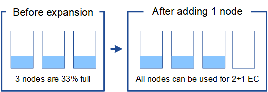

= 삭제 코딩 오브젝트를 위한 스토리지 용량을 추가합니다
:icons: font
:imagesdir: ../media/

[role="lead"]
ILM 정책에 삭제 코딩 복사본을 만드는 규칙이 포함된 경우 새 스토리지를 추가할 위치와 새 스토리지를 추가할 시기를 계획해야 합니다. 추가하는 스토리지의 양과 추가 시점에 따라 그리드의 가용 스토리지 용량이 영향을 받을 수 있습니다.

스토리지 확장을 계획하는 첫 번째 단계는 삭제 코딩 오브젝트를 생성하는 ILM 정책의 규칙을 검토하는 것입니다. StorageGRID는 모든 삭제 코딩 오브젝트에 대해 _k+m_fagment를 생성하고 각 조각을 다른 스토리지 노드에 저장하기 때문에 확장 후 새로운 삭제 코딩 데이터를 위한 공간이 최소한 _k+m_개 이상 있어야 합니다. 삭제 코딩 프로파일이 사이트 손실 방지 기능을 제공하는 경우 각 사이트에 스토리지를 추가해야 합니다. 을 참조하십시오 xref:../ilm/index.adoc[ILM을 사용하여 개체를 관리합니다].

추가해야 하는 노드 수도 확장을 수행할 때 기존 노드의 전체 수에 따라 달라집니다.

== 삭제 코딩 오브젝트를 위한 스토리지 용량을 추가하는 일반 권장 사항입니다

자세한 계산을 방지하려면 기존 스토리지 노드가 70% 용량에 도달할 때 사이트당 두 개의 스토리지 노드를 추가할 수 있습니다.

이 일반적인 권장사항은 단일 사이트 그리드 및 삭제 코딩이 사이트 손실을 보호하는 그리드에 대한 광범위한 삭제 코딩 체계에서 합리적인 결과를 제공합니다.

이 권장사항으로 이어지는 요인을 더 잘 이해하거나 사이트에 대한 보다 정확한 계획을 개발하려면 다음 섹션을 검토하십시오. 현재 상황에 맞는 맞춤형 권장사항을 보려면 NetApp 어카운트 담당자에게 문의하십시오.

== 삭제 코딩 오브젝트에 추가할 확장 스토리지 노드의 수를 계산합니다

삭제 코딩 오브젝트를 저장하는 배포 방법을 최적화하려면 다음과 같은 여러 요소를 고려해야 합니다.

* 삭제 코딩 방법을 사용하고 있습니다
* 각 사이트의 노드 수 및 각 노드의 사용 가능한 공간 크기를 포함하여 삭제 코딩에 사용되는 스토리지 풀의 특성
* 그리드가 이전에 확장되었는지 여부(스토리지 노드당 사용 가능한 공간의 양이 모든 노드에서 거의 동일하지 않을 수 있음)
* ILM 규칙이 복제된 개체와 삭제 코딩 개체를 모두 만들었는지 여부와 같은 ILM 정책의 정확한 특성

다음 예에서는 삭제 코딩 구조, 스토리지 풀의 노드 수, 각 노드의 사용 가능한 공간 크기를 이해하는 데 도움이 될 수 있습니다.

이와 유사한 고려 사항은 복제된 데이터와 삭제 코딩 데이터를 모두 저장하는 ILM 정책의 계산과 이전에 확장된 그리드에 대한 계산에도 영향을 줍니다.

IMPORTANT: 이 섹션의 예는 StorageGRID 시스템에 스토리지 용량을 추가하는 모범 사례를 보여줍니다. 권장되는 노드 수를 추가할 수 없는 경우 삭제 코딩 오브젝트를 추가로 저장할 수 있도록 EC 균형 조정 절차를 실행해야 할 수 있습니다. 을 참조하십시오 xref:considerations-for-rebalancing-erasure-coded-data.adoc[삭제 코딩 데이터의 균형을 재조정합니다].

== 예 1: 2+1 삭제 코딩을 사용하는 단일 사이트 그리드를 확장합니다

이 예제에서는 세 개의 스토리지 노드만 포함하는 단순 그리드를 확장하는 방법을 보여 줍니다.

NOTE: 이 예제에서는 세 개의 스토리지 노드만 사용하여 작업을 간단하게 합니다. 그러나 세 개의 스토리지 노드만 사용하는 것은 권장되지 않습니다. 실제 운영 그리드는 이중화를 위해 최소 _k+m_+1 스토리지 노드를 사용해야 합니다. 이 경우 스토리지 노드 4개(2+1+1)가 됩니다.

다음 사항을 가정합니다.

* 모든 데이터는 2+1 삭제 코딩 체계를 사용하여 저장됩니다. 2+1 삭제 코딩 체계를 사용하면 모든 오브젝트는 3개의 조각으로 저장되며 각 단편은 다른 스토리지 노드에 저장됩니다.
* 스토리지 노드 3개가 있는 사이트가 1개 있습니다. 각 스토리지 노드의 총 용량은 100TB입니다.
* 새로운 100TB 스토리지 노드를 추가하여 확장할 수 있습니다.
* 따라서 이전 노드와 새 노드에서 삭제 코딩 데이터의 균형을 최종적으로 조정하려고 합니다.

확장을 수행할 때 스토리지 노드의 전체 성능을 기준으로 다양한 옵션이 제공됩니다.

* * 기존 노드가 100% 찰 경우 100TB 스토리지 노드 3개 추가 *
+
이 예에서는 기존 노드가 100% 찼습니다. 사용 가능한 용량이 없기 때문에 2+1 삭제 코딩을 계속하려면 노드 3개를 즉시 추가해야 합니다.

+
확장이 완료된 후 오브젝트를 삭제 코딩하면 모든 조각이 새 노드에 배치됩니다.

+
image::../media/used_space_after_3_node_expansion.png[3노드 확장 후 사용된 공간]

+

NOTE: 이 확장에서는 _k+m_nodes가 추가됩니다. 이중화를 위해 4개의 노드를 추가하는 것이 좋습니다. 기존 노드가 100% 차 있을 때 _k+m_확장 스토리지 노드만 추가하면 모든 새 오브젝트가 확장 노드에 저장됩니다. 새로운 노드 중 하나를 일시적으로 사용할 수 없게 되는 경우에도 StorageGRID는 ILM 요구 사항을 충족할 수 없습니다.

* * 기존 스토리지 노드가 67% 찰 때 100TB 스토리지 노드 2개 추가 *
+
이 예에서는 기존 노드가 67% 찼습니다. 기존 노드에 100TB의 여유 용량이 있기 때문에(노드당 33TB) 지금 확장을 수행하는 경우에만 노드 2개만 추가하면 됩니다.

+
200TB의 용량을 추가하면 2+1 삭제 코딩을 계속할 수 있으며, 결국 모든 노드에서 삭제 코딩 데이터의 균형을 유지할 수 있습니다.

+
image::../media/node_expansion_example_67_percent.png[노드 확장 예 1 67%]

* * 기존 스토리지 노드가 33% 찰 경우 100TB 스토리지 노드 1개 추가 *
+
이 예에서는 기존 노드가 33% 찼습니다. 기존 노드에 200TB의 여유 용량(노드당 67TB)이 있으므로 지금 확장을 수행하는 경우에만 노드를 추가하면 됩니다.

+
100TB의 용량을 추가하면 2+1 삭제 코딩을 계속할 수 있으며, 결국 모든 노드에서 삭제 코딩 데이터의 균형을 유지할 수 있습니다.

+

== 예 2: 6+3 삭제 코딩을 사용하는 3개 사이트 그리드를 확장합니다

이 예에서는 여러 조각으로 이루어진 삭제 코딩 체계를 갖춘 다중 사이트 그리드에 대한 확장 계획을 개발하는 방법을 보여 줍니다. 이러한 예들의 차이에도 불구하고 권장 확장 계획은 매우 유사합니다.

다음 사항을 가정합니다.

* 모든 데이터는 6+3 삭제 코딩 체계를 사용하여 저장됩니다. 6+3 삭제 코딩 체계를 사용하면 모든 오브젝트는 9 조각으로 저장되며 각 단편은 다른 스토리지 노드에 저장됩니다.
* 3개의 사이트가 있고 각 사이트에는 4개의 스토리지 노드(총 12개 노드)가 있습니다. 각 노드의 총 용량은 100TB입니다.
* 새로운 100TB 스토리지 노드를 추가하여 확장할 수 있습니다.
* 따라서 이전 노드와 새 노드에서 삭제 코딩 데이터의 균형을 최종적으로 조정하려고 합니다.

확장을 수행할 때 스토리지 노드의 전체 성능을 기준으로 다양한 옵션이 제공됩니다.

* * 기존 노드가 100% 꽉 찬 경우 사이트당 3개씩 총 9개의 100TB 스토리지 노드를 추가합니다. *
+
이 예에서는 기존 노드 12개가 100% 찼습니다. 사용 가능한 용량이 없으므로 6개 이상의 3 삭제 코딩을 계속하려면 9개 노드(900TB의 추가 용량)를 즉시 추가해야 합니다.

+
확장이 완료된 후 오브젝트를 삭제 코딩하면 모든 조각이 새 노드에 배치됩니다.

+

NOTE: 이 확장에서는 _k+m_nodes가 추가됩니다. 이중화를 위해 12개 노드(사이트당 4개)를 추가하는 것이 좋습니다. 기존 노드가 100% 차 있을 때 _k+m_확장 스토리지 노드만 추가하면 모든 새 오브젝트가 확장 노드에 저장됩니다. 새로운 노드 중 하나를 일시적으로 사용할 수 없게 되는 경우에도 StorageGRID는 ILM 요구 사항을 충족할 수 없습니다.

* * 기존 노드가 75% 차 있는 경우 사이트당 2개의 100TB 스토리지 노드 6개 추가 *
+
이 예에서는 기존 노드 12개가 75% 찼습니다. 300TB의 여유 용량(노드당 25TB)이 있으므로 지금 확장을 수행하는 경우에는 6개의 노드만 추가하면 됩니다. 세 사이트 각각에 두 개의 노드를 추가합니다.

+
600TB의 스토리지 용량을 추가하면 6개 이상의 3 삭제 코딩을 계속할 수 있으며, 결국 모든 노드에서 삭제 코딩 데이터의 균형을 맞출 수 있습니다.

* * 기존 노드가 50% 찰 경우 사이트당 하나씩 100TB 스토리지 노드 3개를 추가합니다. *
+
이 예에서는 기존 노드 12개가 50% 찼습니다. 사용 가능한 용량이 600TB(노드당 50TB)이므로 지금 확장을 수행하는 경우에만 노드를 3개만 추가하면 됩니다. 세 사이트 각각에 하나의 노드를 추가합니다.

+
300TB의 스토리지 용량을 추가하면 6+3 삭제 코딩을 계속할 수 있으며, 결국 모든 노드에서 삭제 코딩 데이터의 균형을 맞출 수 있습니다.

