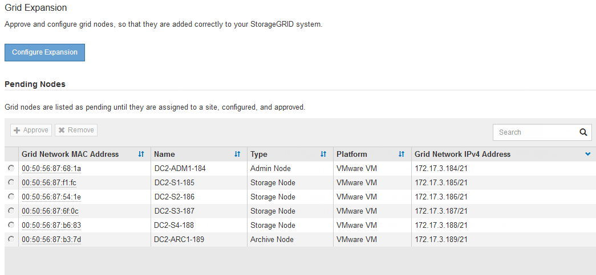

= 확장을 수행합니다
:icons: font
:imagesdir: ../media/

[role="lead"]
확장을 수행하면 새 그리드 노드가 기존 StorageGRID 배포에 추가됩니다.

.무엇을 &#8217;필요로 할거야
* 를 사용하여 그리드 관리자에 로그인했습니다 xref:../admin/web-browser-requirements.adoc[지원되는 웹 브라우저].
* 유지 관리 또는 루트 액세스 권한이 있습니다.
* 프로비저닝 암호가 있습니다.
* 이 확장에서 추가되는 모든 그리드 노드를 배포했습니다.
* 스토리지 노드를 추가하는 경우 복구의 일부로 수행된 모든 데이터 복구 작업이 완료되었음을 확인했습니다. 을 참조하십시오 xref:../maintain/checking-data-repair-jobs.adoc[데이터 복구 작업을 확인합니다].
* 새 사이트를 추가하는 경우 확장 절차를 시작하기 전에 ILM 규칙을 검토 및 업데이트하여 확장이 완료될 때까지 개체 복사본이 새 사이트에 저장되지 않도록 해야 합니다. 예를 들어 규칙이 기본 스토리지 풀(모든 스토리지 노드)을 사용하는 경우 기존 스토리지 노드만 포함하는 새 스토리지 풀을 생성하고 ILM 규칙을 업데이트하여 새 스토리지 풀을 사용해야 합니다. 그렇지 않으면 해당 사이트의 첫 번째 노드가 활성 상태가 되는 즉시 새 사이트에 개체가 복사됩니다. 의 지침을 참조하십시오 xref:../ilm/index.adoc[ILM을 사용하여 개체 관리].

확장을 수행하는 단계에는 다음 단계가 포함됩니다.

. 새 그리드 노드를 추가할지 새 사이트를 추가할지 지정하고 추가할 그리드 노드를 승인하여 확장을 구성합니다.
. 확장을 시작합니다.
. 확장 프로세스가 실행되는 동안 새 복구 패키지 파일을 다운로드합니다.
. 자동으로 실행되는 그리드 구성 단계의 상태를 모니터링합니다. 단계 집합은 추가할 그리드 노드의 유형과 새 사이트를 추가하는지 여부에 따라 달라집니다.
+

IMPORTANT: 일부 단계는 큰 그리드에서 실행하는 데 상당한 시간이 걸릴 수 있습니다. 예를 들어 Cassandra를 새 스토리지 노드로 스트리밍하는 데 Cassandra 데이터베이스가 비어 있는 경우 몇 분 밖에 걸리지 않습니다. 하지만 Cassandra 데이터베이스에 많은 양의 개체 메타데이터가 있는 경우, 이 단계에서는 몇 시간 이상이 걸릴 수 있습니다. "Cassandra 클러스터 확장" 또는 "Cassandra 및 스트리밍 데이터 시작" 단계에서 스토리지 노드를 재부팅하지 마십시오.

.단계
. 유지보수 * > * 작업 * > * 확장 * 을 선택합니다.
+
그리드 확장 페이지가 나타납니다. 보류 중인 노드 섹션에는 추가할 준비가 된 모든 노드가 나열됩니다.

+

. Configure Expansion * 을 선택합니다.
+
사이트 선택 대화 상자가 나타납니다.

+
image::../media/configure_expansion_dialog.gif[사이트 선택 대화 상자]

. 시작할 확장 유형을 선택합니다.
+
** 새 사이트를 추가하는 경우 * New * 를 선택하고 새 사이트의 이름을 입력합니다.
** 기존 사이트에 그리드 노드를 추가하는 경우 * 기존 * 를 선택합니다.

. 저장 * 을 선택합니다.
. Pending Nodes * 목록을 검토하고 배포한 모든 그리드 노드가 표시되는지 확인합니다.
+
필요한 경우 노드의 * Grid Network MAC Address * 에 커서를 올려 놓으면 해당 노드에 대한 세부 정보를 볼 수 있습니다.

+
image::../media/grid_node_details.gif[그리드 노드 세부 정보의 스크린샷]

+

NOTE: 그리드 노드가 누락된 경우 성공적으로 배포되었는지 확인합니다.

. 보류 중인 노드 목록에서 이 확장에 대한 그리드 노드를 승인합니다.
+
.. 승인하려는 첫 번째 보류 중인 그리드 노드 옆에 있는 라디오 버튼을 선택합니다.
.. Approve * 를 선택합니다.
+
그리드 노드 구성 양식이 나타납니다.

+
image::../media/grid_node_configuration.gif[그리드 노드 구성 양식]

.. 필요에 따라 일반 설정을 수정합니다.
+
*** * Site *: 그리드 노드가 연결될 사이트의 이름입니다. 여러 노드를 추가하는 경우 각 노드에 대해 올바른 사이트를 선택해야 합니다. 새 사이트를 추가하는 경우 모든 노드가 새 사이트에 추가됩니다.
*** * 이름 *: 노드에 할당될 호스트 이름 및 그리드 관리자에 표시될 이름입니다.
*** * NTP 역할 *: 그리드 노드의 NTP(Network Time Protocol) 역할입니다. 옵션은 * 자동 *, * 기본 * 및 * 클라이언트 * 입니다. Automatic * 을 선택하면 기본 역할이 관리 노드, ADC 서비스가 있는 스토리지 노드, 게이트웨이 노드 및 비정적 IP 주소가 있는 모든 그리드 노드에 할당됩니다. 다른 모든 그리드 노드에는 클라이언트 역할이 할당됩니다.
+

NOTE: 각 사이트에서 최소 2개의 노드에 기본 NTP 역할을 할당합니다. 이를 통해 외부 타이밍 소스에 대한 중복 시스템 액세스를 제공합니다.

*** * ADC 서비스 * (스토리지 노드 전용): 이 스토리지 노드가 관리 도메인 컨트롤러(ADC) 서비스를 실행할지 여부를 나타냅니다. ADC 서비스는 그리드 서비스의 위치 및 가용성을 추적합니다. 각 사이트에 적어도 3개의 스토리지 노드가 ADC 서비스를 포함해야 합니다. ADC 서비스를 배포한 후에는 노드에 추가할 수 없습니다.
+
**** 스토리지 노드를 교체하기 위해 이 노드를 추가하는 경우 교체할 노드에 ADC 서비스가 포함된 경우 * 예 * 를 선택합니다. 너무 적은 ADC 서비스가 남아 있는 경우 스토리지 노드를 해제할 수 없으므로 이전 서비스를 제거하기 전에 새 ADC 서비스를 사용할 수 있습니다.
**** 그렇지 않으면 * Automatic * 을 선택하여 시스템이 이 노드에 ADC 서비스가 필요한지 여부를 결정합니다. ADC 쿼럼에 대해 알아보십시오 xref:../maintain/understanding-adc-service-quorum.adoc[여기].

.. 필요에 따라 그리드 네트워크, 관리자 네트워크 및 클라이언트 네트워크에 대한 설정을 수정합니다.
+
*** * IPv4 주소(CIDR) *: 네트워크 인터페이스의 CIDR 네트워크 주소입니다. 예: 172.16.10.100/24
*** * 게이트웨이 *: 그리드 노드의 기본 게이트웨이입니다. 예: 172.16.10.1
*** * 서브넷(CIDR) *: 관리 네트워크에 대한 하나 이상의 하위 네트워크.

.. 저장 * 을 선택합니다.
+
승인된 그리드 노드는 승인된 노드 목록으로 이동합니다.

+
image::../media/grid_expansion_approved_nodes.png[승인된 노드를 보여 주는 스크린샷]

+
*** 승인된 그리드 노드의 속성을 수정하려면 해당 라디오 버튼을 선택하고 * Edit * 를 선택합니다.
*** 승인된 그리드 노드를 다시 Pending Nodes 목록으로 이동하려면 해당 라디오 버튼을 선택하고 * Reset * 을 선택합니다.
*** 승인된 그리드 노드를 영구적으로 제거하려면 노드 전원을 끕니다. 그런 다음 해당 라디오 버튼을 선택하고 * 제거 * 를 선택합니다.

.. 승인하려는 보류 중인 각 그리드 노드에 대해 이 단계를 반복합니다.
+

NOTE: 가능한 경우 보류 중인 모든 그리드 노트를 승인하고 단일 확장을 수행해야 합니다. 여러 개의 소규모 확장을 수행하는 경우 더 많은 시간이 필요합니다.

. 모든 그리드 노드를 승인하면 * Provisioning Passphrase * 를 입력하고 * Expand * 를 선택합니다.
+
몇 분 후 이 페이지가 업데이트되어 확장 절차의 상태가 표시됩니다. 개별 그리드 노드에 영향을 미치는 작업이 진행 중인 경우 그리드 노드 상태 섹션에는 각 그리드 노드에 대한 현재 상태가 나열됩니다.

+

NOTE: 이 프로세스 동안 어플라이언스의 경우 StorageGRID 어플라이언스 설치 프로그램이 3단계에서 4단계로 이동하는 설치 완료 를 보여줍니다. 4단계가 완료되면 컨트롤러가 재부팅됩니다.

+
image::../media/grid_expansion_progress.png[이 이미지는 주변 텍스트로 설명됩니다.]

+

NOTE: 사이트 확장에는 새 사이트에 대한 Cassandra를 구성하는 추가 작업이 포함됩니다.

. 복구 패키지 다운로드 * 링크가 나타나면 즉시 복구 패키지 파일을 다운로드합니다.
+
StorageGRID 시스템에 그리드 토폴로지를 변경한 후 가능한 한 빨리 복구 패키지 파일의 업데이트된 복사본을 다운로드해야 합니다. 복구 패키지 파일을 사용하면 오류가 발생할 경우 시스템을 복원할 수 있습니다.

+
.. 다운로드 링크를 선택합니다.
.. 프로비저닝 암호를 입력하고 * 다운로드 시작 * 을 선택합니다.
.. 다운로드가 완료되면 '.zip' 파일을 열고 GPT-backup 디렉토리와 _ saed.zip 파일이 포함되어 있는지 확인합니다. 그런 다음 '_then.zip' 파일의 압축을 풀고 '/GID*_REV*' 디렉토리로 이동한 다음 'passwords.txt' 파일을 열 수 있는지 확인합니다.
.. 다운로드한 복구 패키지 파일(.zip)을 두 개의 안전한 별도의 위치에 복사합니다.
+

IMPORTANT: 복구 패키지 파일은 StorageGRID 시스템에서 데이터를 가져오는 데 사용할 수 있는 암호화 키와 암호가 포함되어 있으므로 보안을 유지해야 합니다.

. 기존 사이트에 스토리지 노드를 추가하거나 새 사이트를 추가하는 방법에 대한 지침을 따릅니다.

[role="tabbed-block"]
====
.기존 사이트에 스토리지 노드를 추가합니다
--
기존 사이트에 하나 이상의 스토리지 노드를 추가하는 경우 상태 메시지에 표시된 비율을 검토하여 "Cassandra 시작 및 데이터 스트리밍" 단계의 진행 상황을 모니터링합니다.

image::../media/grid_expansion_starting_cassandra.png[Grid Expansion > Cassandra 및 스트리밍 데이터 시작]

이 백분율은 Cassandra 스트리밍 작업이 완료된 정도를 추정합니다. 이 수치는 사용 가능한 Cassandra 데이터의 총 양과 이미 새 노드에 기록된 데이터를 기준으로 합니다.

IMPORTANT: "Cassandra 클러스터 확장" 또는 "Cassandra 시작 및 데이터 스트리밍" 단계 중에 스토리지 노드를 재부팅하지 마십시오. 이러한 단계는 각 새 스토리지 노드에 대해 완료하는 데 몇 시간이 걸릴 수 있습니다. 특히 기존 스토리지 노드에 많은 양의 객체 메타데이터가 포함된 경우 더욱 그렇습니다.

--
.새 사이트를 추가합니다
--
새 사이트를 추가하는 경우 'NOdetool status'를 사용하여 Cassandra 스트리밍 진행 상황을 모니터링하고 'Cassandra 클러스터 확장' 단계에서 새 사이트에 메타데이터가 얼마나 복사되었는지 확인합니다. 새 사이트의 총 데이터 로드는 현재 사이트의 총 데이터 로드 중 약 20% 이내여야 합니다.

IMPORTANT: "Cassandra 클러스터 확장" 또는 "Cassandra 시작 및 데이터 스트리밍" 단계 중에 스토리지 노드를 재부팅하지 마십시오. 이러한 단계는 각 새 스토리지 노드에 대해 완료하는 데 몇 시간이 걸릴 수 있습니다. 특히 기존 스토리지 노드에 많은 양의 객체 메타데이터가 포함된 경우 더욱 그렇습니다.

--
====
. 모든 작업이 완료될 때까지 확장을 계속 모니터링한 후 * 확장 구성 * 버튼이 다시 나타납니다.

추가한 그리드 노드의 유형에 따라 추가 통합 및 구성 단계를 수행해야 합니다. 을 참조하십시오 xref:configuring-expanded-storagegrid-system.adoc[확장 후 구성 단계].
