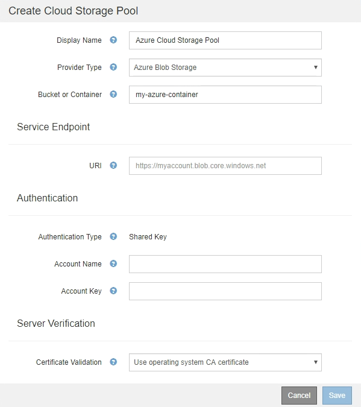

= Azure: 클라우드 스토리지 풀에 대한 인증 세부 정보를 지정합니다
:allow-uri-read: 
:icons: font
:imagesdir: ../media/

[role="lead"]
Azure Blob 스토리지용 Cloud Storage Pool을 생성할 때 StorageGRID에서 개체를 저장하는 데 사용할 외부 컨테이너의 계정 이름 및 계정 키를 지정해야 합니다.

.필요한 것
* 클라우드 스토리지 풀에 대한 기본 정보를 입력하고 공급자 유형으로 * Azure Blob Storage * 를 지정했습니다. * 공유 키 * 가 * 인증 유형 * 필드에 나타납니다.
+

* 클라우드 스토리지 풀에 사용되는 Blob 스토리지 컨테이너에 액세스하는 데 사용되는 URI(Uniform Resource Identifier)를 알고 있습니다.
* 스토리지 계정의 이름과 암호 키를 알고 있습니다. Azure 포털을 사용하여 이러한 값을 찾을 수 있습니다.

.단계
. Service Endpoint * 섹션에서 Cloud Storage Pool에 사용되는 Blob 저장소 컨테이너에 액세스하는 데 사용되는 URI(Uniform Resource Identifier)를 입력합니다.
+
다음 형식 중 하나로 URI를 지정합니다.

+
** (+https://host:port+`)
** (+http://host:port+`)

+
포트를 지정하지 않으면 기본적으로 포트 443이 HTTPS URI에 사용되고 포트 80은 HTTP URI에 사용됩니다. Azure Blob 저장소 컨테이너용 ++ * 예제 URI *: + ``https://_myaccount_.blob.core.windows.net`

. 인증 * 섹션에서 다음 정보를 제공합니다.
+
.. 계정 이름 * 에 대해 외부 서비스 컨테이너를 소유한 Blob 저장소 계정의 이름을 입력합니다.
.. 계정 키 * 의 경우 Blob 저장소 계정의 암호 키를 입력합니다.

+

NOTE: Azure 끝점의 경우 공유 키 인증을 사용해야 합니다.

. 서버 검증 * 섹션에서 클라우드 스토리지 풀에 대한 TLS 연결에 대한 인증서 유효성을 검사하는 데 사용할 방법을 선택합니다.
+
[cols="1a,2a"]
|===
| 옵션을 선택합니다 | 설명 

 a| 
운영 체제 CA 인증서를 사용합니다
 a| 
운영 체제에 설치된 Grid CA 인증서를 사용하여 연결을 보호합니다.

 a| 
사용자 지정 CA 인증서를 사용합니다
 a| 
사용자 지정 CA 인증서를 사용합니다. Select New * 를 선택하고 PEM 인코딩된 인증서를 업로드합니다.

 a| 
인증서를 확인하지 않습니다
 a| 
TLS 연결에 사용되는 인증서가 검증되지 않았습니다.

|===
. 저장 * 을 선택합니다.

클라우드 스토리지 풀을 저장할 때 StorageGRID은 다음을 수행합니다.

* 컨테이너와 URI가 있는지, 지정한 자격 증명을 사용하여 해당 컨테이너에 연결할 수 있는지 확인합니다.
* 컨테이너에 마커 파일을 기록하여 클라우드 스토리지 풀로 식별합니다. x-ntap-sgs-cloud-pool-uuuid라는 이름의 이 파일은 제거하지 마십시오.

Cloud Storage Pool 검증이 실패하면 검증에 실패한 이유를 설명하는 오류 메시지가 표시됩니다. 예를 들어 인증서 오류가 있거나 지정한 컨테이너가 이미 없는 경우 오류가 보고될 수 있습니다.

의 지침을 참조하십시오 xref:troubleshooting-cloud-storage-pools.adoc[클라우드 스토리지 풀 문제 해결]그런 다음 문제를 해결한 다음 Cloud Storage Pool을 다시 저장해 보십시오.
