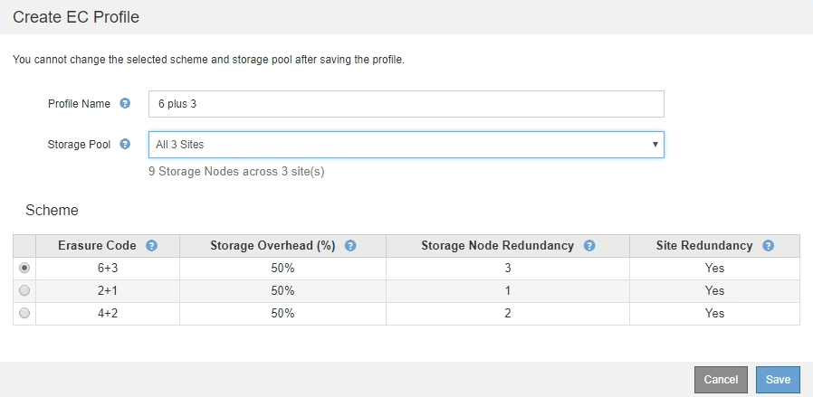

= 삭제 코딩 프로필을 생성합니다
:icons: font
:imagesdir: ../media/

[role="lead"]
삭제 코딩 프로필을 생성하려면 스토리지 노드가 포함된 스토리지 풀을 삭제 코딩 체계와 연결합니다. 이 연관은 생성된 데이터 및 패리티 조각의 수와 시스템이 이러한 조각을 배포하는 위치를 결정합니다.

.무엇을 &#8217;필요로 할거야
* 를 사용하여 그리드 관리자에 로그인했습니다 xref:../admin/web-browser-requirements.adoc[지원되는 웹 브라우저].
* 특정 액세스 권한이 있습니다.
* 정확히 하나의 사이트 또는 세 개 이상의 사이트가 포함된 스토리지 풀이 포함된 스토리지 풀을 생성했습니다. 사이트가 두 개뿐인 스토리지 풀에는 삭제 코딩 스키마를 사용할 수 없습니다.

삭제 코딩 프로필에 사용되는 스토리지 풀에는 정확히 하나의 사이트 또는 세 개 이상의 사이트가 포함되어야 합니다. 사이트 이중화를 제공하려면 스토리지 풀에 사이트가 3개 이상 있어야 합니다.

NOTE: 스토리지 노드가 포함된 스토리지 풀을 선택해야 합니다. 삭제 코딩 데이터에는 아카이브 노드를 사용할 수 없습니다.

.단계
. ILM * > * 삭제 코딩 * 을 선택합니다.
+
삭제 코딩 프로필 페이지가 나타납니다.

+
image::../media/ec_profiles_page.png[삭제 코딩 프로필 페이지]

. Create * 를 선택합니다.
+
EC 프로파일 만들기 대화 상자가 나타납니다.

+
image::../media/create_ec_profile_page.png[EC 프로파일 만들기 페이지]

. 삭제 코딩 프로필의 고유한 이름을 입력합니다.
+
삭제 코딩 프로필 이름은 고유해야 합니다. 기존 프로파일의 이름을 사용하면 프로파일이 비활성화된 경우에도 유효성 검사 오류가 발생합니다.

+

NOTE: 삭제 코딩 프로파일 이름은 ILM 규칙에 대한 배치 지침의 스토리지 풀 이름에 추가됩니다.

+
image::../media/storage_pool_and_erasure_coding_profile.png[스토리지 풀 및 EC 프로파일 이름입니다]

. 이 삭제 코딩 프로파일에 대해 생성한 스토리지 풀을 선택합니다.
+

NOTE: 그리드에 현재 사이트가 하나만 포함된 경우 기본 스토리지 풀, 모든 스토리지 노드 또는 기본 사이트, 모든 사이트를 포함하는 스토리지 풀을 사용할 수 없습니다. 이 동작은 두 번째 사이트가 추가된 경우 삭제 코딩 프로필이 무효로 되는 것을 방지합니다.

+

NOTE: 스토리지 풀에 정확히 두 개의 사이트가 포함된 경우 해당 스토리지 풀을 삭제 코딩에 사용할 수 없습니다. 두 개의 사이트가 있는 스토리지 풀에는 삭제 코딩 스키마를 사용할 수 없습니다.

+
스토리지 풀을 선택하면 풀의 스토리지 노드 및 사이트 수에 따라 사용 가능한 삭제 코딩 구성표 목록이 표시됩니다.

+

+
사용 가능한 각 삭제 코딩 구성표에 대해 다음 정보가 나열됩니다.

+
** * 삭제 코드 *: 삭제 코딩 체계의 이름(데이터 조각 + 패리티 단편).
** * 스토리지 오버헤드(%) *: 오브젝트의 데이터 크기에 상대적인 패리티 조각에 필요한 추가 스토리지 스토리지 오버헤드 = 총 패리티 조각 수/총 데이터 조각 수
** * 스토리지 노드 이중화 *: 객체 데이터 검색 기능을 유지하면서 손실될 수 있는 스토리지 노드 수입니다.
** * 사이트 이중화 *: 사이트가 손실된 경우 선택한 삭제 코드로 오브젝트 데이터를 검색할 수 있는지 여부.
+
사이트 이중화를 지원하려면 선택한 스토리지 풀에 사이트 손실을 허용할 수 있는 충분한 스토리지 노드가 있는 여러 사이트가 포함되어 있어야 합니다. 예를 들어, 6+3 삭제 코딩 체계를 사용하여 사이트 이중화를 지원하려면 선택한 스토리지 풀에 각 사이트에 3개 이상의 스토리지 노드가 포함된 사이트가 3개 이상 포함되어야 합니다.

+
다음과 같은 경우 메시지가 표시됩니다.

+
** 선택한 스토리지 풀은 사이트 이중화를 제공하지 않습니다. 선택한 스토리지 풀에 사이트가 하나만 포함된 경우 다음 메시지가 표시됩니다. ILM 규칙에서 이 삭제 코딩 프로파일을 사용하여 노드 장애로부터 보호할 수 있습니다.
+
image::../media/create_ec_profile_no_site_redundancy.png[사이트 중복이 없는 EC 프로파일을 작성합니다]

** 선택한 스토리지 풀이 삭제 코딩 체계에 대한 요구 사항을 충족하지 않습니다. 예를 들어 선택한 스토리지 풀에 정확히 두 개의 사이트가 포함된 경우 다음 메시지가 표시됩니다. 삭제 코딩을 사용하여 오브젝트 데이터를 보호하려면 정확히 하나의 사이트가 있는 스토리지 풀을 선택하거나 세 개 이상의 사이트가 있는 스토리지 풀을 선택해야 합니다.
+
image::../media/ec_profile_error.png[삭제 코딩 프로필 오류입니다]

** 그리드에는 사이트가 하나만 포함되며 기본 스토리지 풀, 모든 스토리지 노드 또는 기본 사이트인 모든 사이트가 포함된 스토리지 풀을 선택했습니다.
+
image::../media/ilm_ec_profile_all_storage_nodes_warning.png[ILM EC 프로파일 모든 스토리지 노드 경고]

** 선택한 삭제 코딩 체계와 스토리지 풀이 다른 삭제 코딩 프로파일과 겹칩니다.
+
image::../media/ilm_ec_profile_ec_scheme_warning.png[ILM EC 프로파일 삭제 코딩 구성표 경고]

+
이 예에서는 다른 삭제 코딩 프로파일에서 2+1 구성표를 사용하고 다른 프로파일의 스토리지 풀에서도 3개 사이트 모두 스토리지 풀의 사이트 중 하나를 사용하므로 경고 메시지가 나타납니다.

+
이 새 프로파일을 만들 수 있는 것은 아니지만 ILM 정책에서 사용할 때는 매우 주의해야 합니다. 이 새 프로필이 이미 다른 프로필에 의해 보호되는 기존의 삭제 코딩 개체에 적용되는 경우 StorageGRID는 완전히 새로운 오브젝트 조각 세트를 생성합니다. 기존 2 + 1 조각은 재사용하지 않습니다. 삭제 코딩 방식이 동일하더라도 한 삭제 코딩 프로필에서 다른 프로필로 마이그레이션할 때 리소스 문제가 발생할 수 있습니다.

. 둘 이상의 삭제 코딩 체계가 나열되어 있는 경우 사용할 삭제 코딩 방법을 선택합니다.
+
사용할 삭제 코딩 체계를 결정할 때는 복구를 위한 네트워크 트래픽 요구 사항과 내결함성(패리티 세그먼트를 더 많이 보유함으로써 달성됨)을 균형 있게 조정해야 합니다(조각은 많을수록 네트워크 트래픽이 증가함). 예를 들어, 4+2 체계와 6+3 체계 중 하나를 결정할 때 추가적인 패리티 및 내결함성을 필요로 하는 경우 6+3 체계를 선택합니다. 노드 복구 중에 네트워크 리소스가 네트워크 사용량을 줄이도록 제한되는 경우 4+2 스키마를 선택합니다.

. 저장 * 을 선택합니다.

