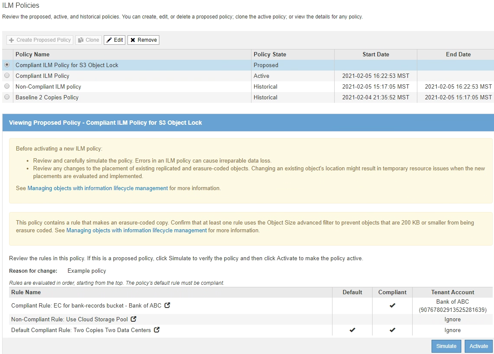

= S3 오브젝트 잠금이 활성화된 후 ILM 정책을 생성합니다
:allow-uri-read: 
:icons: font
:imagesdir: ../media/

[role="lead"]
전역 S3 개체 잠금 설정이 활성화된 경우 정책 생성 단계가 약간 다릅니다. ILM 정책이 S3 오브젝트 잠금이 설정된 버킷의 요구사항을 준수하는지 확인해야 합니다.

.필요한 것
* 를 사용하여 그리드 관리자에 로그인했습니다 xref:../admin/web-browser-requirements.adoc[지원되는 웹 브라우저].
* 특정 액세스 권한이 있습니다.
* StorageGRID 시스템에 대해 글로벌 S3 오브젝트 잠금 설정이 이미 활성화되어 있습니다.
+

NOTE: 전역 S3 오브젝트 잠금 설정이 활성화되지 않은 경우 의 일반 지침을 사용합니다 xref:creating-proposed-ilm-policy.adoc[제안된 ILM 정책 생성].

* 제안된 정책에 추가하려는 규정 준수 및 비준수 ILM 규칙을 만들었습니다. 필요에 따라 제안된 정책을 저장하고 규칙을 추가한 다음 제안된 정책을 편집하여 새 규칙을 추가할 수 있습니다. 을 참조하십시오xref:example-7-compliant-ilm-policy-for-s3-object-lock.adoc[예 7: S3 오브젝트 잠금에 대한 규정 준수 ILM 정책].
* 있습니다 xref:creating-default-ilm-rule.adoc[기본 ILM 규칙을 만들었습니다] 정책을 준수하는 경우.
* 선택적으로 비디오를 시청했습니다. https://["비디오: StorageGRID ILM 정책"^]
+
[link=https://netapp.hosted.panopto.com/Panopto/Pages/Viewer.aspx?id=c929e94e-353a-4375-b112-acc5013c81c7]
image::../media/video-screenshot-ilm-policies.png[비디오: StorageGRID ILM 정책]

.단계
. ILM * > * 정책 * 을 선택합니다.
+
ILM 정책 페이지가 나타납니다. 전역 S3 개체 잠금 설정이 활성화된 경우 ILM 정책 페이지에는 호환되는 ILM 규칙이 표시됩니다.

+
image::../media/ilm_policies_page_compliant.png[ILM 정책 페이지 준수]

. 이름 * 필드에 제안된 정책의 고유한 이름을 입력합니다.
+
최소 1자 이상 64자 이하여야 합니다.

. [변경 사유] * 필드에 새 제안 정책을 작성하는 이유를 입력합니다.
+
1자 이상 128자 이하여야 합니다.

. 정책에 규칙을 추가하려면 * 규칙 선택 * 을 선택합니다.
+
정의된 모든 규칙이 나열된 상태로 정책 규칙 선택 대화 상자가 나타납니다.

+
** 기본 규칙 선택 섹션에는 규정 준수 정책의 기본값으로 사용할 수 있는 규칙이 나열됩니다. 필터 또는 비현재 참조 시간을 사용하지 않는 규정 준수 규칙이 포함되어 있습니다.
** 다른 규칙 선택 섹션에는 이 정책에 대해 선택할 수 있는 다른 규정 준수 및 비준수 규칙이 나열됩니다.
+
image::../media/ilm_policy_select_rules_for_compliant_policy.png[ILM 정책 준수 정책에 대한 규칙 선택]

. 규칙 이름 또는 추가 세부 정보 아이콘을 선택합니다 image:../media/icon_nms_more_details.gif["자세한 정보 아이콘"] 를 눌러 해당 규칙의 설정을 봅니다.
. 기본 규칙 선택 * 섹션에서 제안된 정책에 대한 기본 규칙 하나를 선택합니다.
+
이 섹션의 표에는 규정을 준수하며 필터를 사용하지 않는 규칙만 나열되어 있습니다.

+

NOTE: 기본 규칙 선택 섹션에 규칙이 없으면 ILM 정책 페이지 및 를 종료해야 합니다 xref:creating-default-ilm-rule.adoc[기본 ILM 규칙을 생성합니다] 준수해야 합니다.

+

IMPORTANT: Make 2 Copies 재고 규칙을 정책의 기본 규칙으로 사용하지 마십시오. 2개 복제본 만들기 규칙은 모든 사이트를 포함하는 단일 스토리지 풀인 모든 스토리지 노드를 사용합니다. 이 규칙을 사용하는 경우 오브젝트의 여러 복사본이 동일한 사이트에 배치될 수 있습니다.

. 다른 규칙 선택 * 섹션에서 정책에 포함할 다른 규칙을 선택합니다.
+
.. 비규격 S3 버킷의 오브젝트에 대해 다른 "기본값" 규칙이 필요한 경우 필터를 사용하지 않는 비준수 규칙 하나를 선택할 수도 있습니다.
+
예를 들어, 클라우드 스토리지 풀 또는 아카이브 노드를 사용하여 S3 오브젝트 잠금이 활성화되지 않은 버킷에 오브젝트를 저장할 수 있습니다.

+

NOTE: 필터를 사용하지 않는 비준수 규칙을 하나만 선택할 수 있습니다. 하나의 규칙을 선택하는 즉시 * 선택 가능 * 열에 필터가 없는 다른 비준수 규칙에 대해 * 아니요 * 가 표시됩니다.

.. 정책에 사용할 다른 규정 준수 또는 비준수 규칙을 선택합니다.
+
다른 규칙에서는 하나 이상의 필터(테넌트 계정, 버킷 이름 또는 객체 크기와 같은 고급 필터)를 사용해야 합니다.

. 규칙 선택을 마치면 * 적용 * 을 선택합니다.
+
선택한 규칙이 나열됩니다. 기본 규칙은 끝에 있으며 다른 규칙은 그 위에 있습니다. 비준수 "기본값" 규칙도 선택한 경우 해당 규칙이 정책의 두 번째 대 마지막 규칙으로 추가됩니다.

+
이 예에서 마지막 규칙인 2개의 복사본 2개의 데이터 센터가 기본 규칙입니다. 즉, 이 규칙은 준수되며 필터가 없습니다. 두 번째, 마지막 규칙인 클라우드 스토리지 풀에도 필터가 없지만 규정을 준수하지 않습니다.

+
image::../media/ilm_policies_selected_rules_compliant.png[ILM 정책 선택한 규칙 준수]

. 기본 규칙이 아닌 규칙의 행을 끌어서 놓아 이러한 규칙이 평가되는 순서를 결정합니다.
+
기본 규칙 또는 비준수 "기본값" 규칙은 이동할 수 없습니다.

+

IMPORTANT: ILM 규칙이 올바른 순서로 되어 있는지 확인해야 합니다. 정책이 활성화되면 위에서 시작하여 나열된 순서대로 새 개체와 기존 개체가 평가됩니다.

. 필요에 따라 삭제 아이콘을 선택합니다 image:../media/icon_nms_delete_new.gif["삭제 아이콘"] 정책에서 원하지 않는 규칙을 삭제하려면 * 규칙 * 을 선택하고 규칙을 더 추가하려면 * 를 선택합니다.
. 완료되면 * Save * 를 선택합니다.
+
ILM 정책 페이지가 업데이트됩니다.

+
** 저장한 정책이 제안으로 표시됩니다. 제안된 정책에는 시작 및 종료 날짜가 없습니다.
** 시뮬레이션 * 및 * 활성화 * 버튼이 활성화됩니다.
+

. 로 이동합니다 xref:simulating-ilm-policy.adoc[ILM 정책을 시뮬레이션합니다].

