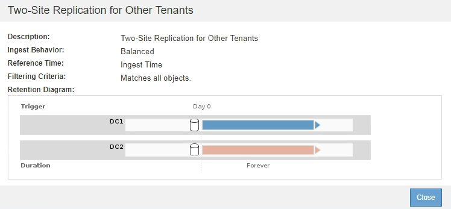

= 제안된 ILM 정책을 생성합니다
:icons: font
:imagesdir: ../media/

[role="lead"]
제안된 ILM 정책을 처음부터 새로 만들거나 동일한 규칙 집합으로 시작하려는 경우 현재 활성 정책을 복제할 수 있습니다.

NOTE: 전역 S3 오브젝트 잠금 설정이 활성화된 경우 다음 절차를 대신 사용하십시오. xref:creating-ilm-policy-after-s3-object-lock-is-enabled.adoc[S3 오브젝트 잠금이 활성화된 후 ILM 정책을 생성합니다].

.무엇을 &#8217;필요로 할거야
* 를 사용하여 그리드 관리자에 로그인했습니다 xref:../admin/web-browser-requirements.adoc[지원되는 웹 브라우저].
* 특정 액세스 권한이 있습니다.
* 제안된 정책에 추가할 ILM 규칙을 만들었습니다. 필요에 따라 제안된 정책을 저장하고 규칙을 추가한 다음 제안된 정책을 편집하여 새 규칙을 추가할 수 있습니다.
* 있습니다 xref:creating-default-ilm-rule.adoc[기본 ILM 규칙을 만들었습니다] 필터를 포함하지 않는 정책의 경우.
* 선택적으로 비디오를 시청했습니다. https://netapp.hosted.panopto.com/Panopto/Pages/Viewer.aspx?id=c929e94e-353a-4375-b112-acc5013c81c7["비디오: StorageGRID ILM 정책"^]
+
[link=https://netapp.hosted.panopto.com/Panopto/Pages/Viewer.aspx?id=c929e94e-353a-4375-b112-acc5013c81c7]
image::../media/video-screenshot-ilm-policies.png[비디오: StorageGRID ILM 정책]

제안된 ILM 정책을 생성하는 일반적인 이유는 다음과 같습니다.

* 새 사이트를 추가하고 새 ILM 규칙을 사용하여 해당 사이트에 개체를 배치해야 합니다.
* 사이트를 사용 중지하려는 경우 사이트를 참조하는 모든 규칙을 제거해야 합니다.
* 특별한 데이터 보호 요구 사항이 있는 새 테넌트를 추가했습니다.
* 클라우드 스토리지 풀을 사용하기 시작했습니다.

IMPORTANT: 테스트 시스템에서만 시스템의 기본 제공 정책인 Baseline 2 Copies 정책을 사용합니다. 이 정책의 복사본 2개 만들기 규칙은 모든 사이트가 포함된 모든 스토리지 노드 스토리지 풀을 사용합니다. StorageGRID 시스템에 사이트가 두 개 이상 있는 경우 한 개체의 복사본을 같은 사이트에 둘 수 있습니다.

.단계
. ILM * > * 정책 * 을 선택합니다.
+
ILM 정책 페이지가 나타납니다. 이 페이지에서는 제안, 활성 및 과거 정책의 목록을 검토할 수 있으며, 생성, 편집, 또는 제안된 정책을 제거하거나, 활성 정책을 복제하거나, 정책에 대한 세부 정보를 봅니다.

+
image::../media/ilm_policies_page.gif[ILM 정책 페이지]

. 제안된 ILM 정책을 생성할 방법을 결정합니다.
+
[cols="1a,2a"]
|===
| 옵션을 선택합니다 | 단계 

 a| 
이미 선택된 규칙이 없는 제안된 새 정책을 생성합니다
 a| 
.. 제안된 ILM 정책이 현재 존재하는 경우 해당 정책을 선택하고 * 제거 * 를 선택합니다.
+
제안된 정책이 이미 있는 경우 새 제안된 정책을 생성할 수 없습니다.

.. 제안된 정책 생성 * 을 선택합니다.

 a| 
활성 정책을 기반으로 제안된 정책을 생성합니다
 a| 
.. 제안된 ILM 정책이 현재 존재하는 경우 해당 정책을 선택하고 * 제거 * 를 선택합니다.
+
제안된 정책이 이미 있는 경우 활성 정책을 복제할 수 없습니다.

.. 테이블에서 활성 정책을 선택합니다.
.. 클론 * 을 선택합니다.

 a| 
기존의 제안된 정책을 편집합니다
 a| 
.. 테이블에서 제안된 정책을 선택합니다.
.. 편집 * 을 선택합니다.

|===
+
ILM 정책 구성 대화 상자가 나타납니다.

+
새 제안 정책을 작성하는 경우 모든 필드가 비어 있고 규칙이 선택되지 않습니다.

+
image::../media/ilm_policies_configure_ilm_policy.png[ILM 정책 ILM 정책 구성]

+
활성 정책을 복제하는 경우 * 이름 * 필드에 버전 번호(""v2"")가 추가된 활성 정책의 이름이 표시됩니다. 활성 정책에 사용된 규칙이 선택되고 현재 순서로 표시됩니다.

+
image::../media/ilm_policies_version.gif[ILM 정책 버전]

. 이름 * 필드에 제안된 정책의 고유한 이름을 입력합니다.
+
최소 1자 이상 64자 이하여야 합니다. 활성 정책을 복제하는 경우 현재 이름에 추가된 버전 번호를 사용하거나 새 이름을 입력할 수 있습니다.

. [변경 사유] * 필드에 새 제안 정책을 작성하는 이유를 입력합니다.
+
1자 이상 128자 이하여야 합니다.

. 정책에 규칙을 추가하려면 * 규칙 선택 * 을 선택합니다.
+
정의된 모든 규칙이 나열된 상태로 정책 규칙 선택 대화 상자가 나타납니다. 정책을 클론 생성하는 경우:

+
** 클론 생성 중인 정책에 사용되는 규칙이 선택됩니다.
** 클론 생성 중인 정책에서 기본 규칙이 아닌 필터가 없는 규칙을 사용한 경우 해당 규칙 중 하나만 제외하고 모두 제거하라는 메시지가 표시됩니다.
** 기본 규칙에서 필터나 비현재 참조 시간을 사용한 경우 새 기본 규칙을 선택하라는 메시지가 표시됩니다.
** 기본 규칙이 마지막 규칙이 아닌 경우 버튼을 사용하여 새 정책의 끝으로 규칙을 이동할 수 있습니다.
+
image::../media/ilm_policies_select_rules_for_policy.png[ILM 정책 정책에 대한 규칙을 선택합니다]

. 규칙 이름 또는 추가 세부 정보 아이콘을 선택합니다 image:../media/icon_nms_more_details.gif["자세한 정보 아이콘"] 를 눌러 해당 규칙의 설정을 봅니다.
+
이 예에서는 두 사이트에서 두 개의 복제된 복사본을 만드는 ILM 규칙의 세부 정보를 보여줍니다.

+

. 기본 규칙 선택 * 섹션에서 제안된 정책에 대한 기본 규칙 하나를 선택합니다.
+
기본 규칙은 정책의 다른 규칙과 일치하지 않는 모든 개체에 적용됩니다. 기본 규칙은 필터를 사용할 수 없으며 항상 마지막으로 평가됩니다.

+

NOTE: 기본 규칙 선택 섹션에 규칙이 없으면 ILM 정책 페이지 및 를 종료해야 합니다 xref:creating-default-ilm-rule.adoc[기본 ILM 규칙을 생성합니다].

+

IMPORTANT: Make 2 Copies 재고 규칙을 정책의 기본 규칙으로 사용하지 마십시오. 2개 복제본 만들기 규칙은 모든 사이트를 포함하는 단일 스토리지 풀인 모든 스토리지 노드를 사용합니다. StorageGRID 시스템에 사이트가 두 개 이상 있는 경우 한 개체의 복사본을 같은 사이트에 둘 수 있습니다.

. 다른 규칙 선택 * 섹션에서 정책에 포함할 다른 규칙을 선택합니다.
+
다른 규칙은 기본 규칙 전에 평가되며 하나 이상의 필터(테넌트 계정, 버킷 이름, 고급 필터 또는 현재 참조 시간)를 사용해야 합니다.

. 규칙 선택을 마치면 * 적용 * 을 선택합니다.
+
선택한 규칙이 나열됩니다. 기본 규칙은 끝에 있으며 다른 규칙은 그 위에 있습니다.

+
image::../media/ilm_policies_selected_rules.png[ILM 정책 선택한 규칙]

+
[NOTE]
====
기본 규칙에서 개체를 영구적으로 유지하지 않으면 경고가 나타납니다. 이 정책을 활성화할 때 버킷 수명 주기에 따라 개체를 더 오래 보존하지 않는 한 기본 규칙에 대한 배치 지침이 경과할 때 StorageGRID에서 개체를 삭제할 것인지 확인해야 합니다.

image::../media/ilm_policy_default_rule_not_forever.png[ILM 정책 기본 규칙은 영구적으로 사용할 수 없습니다]

====
. 기본 규칙이 아닌 규칙의 행을 끌어서 놓아 이러한 규칙이 평가되는 순서를 결정합니다.
+
기본 규칙을 이동할 수 없습니다.

+

IMPORTANT: ILM 규칙이 올바른 순서로 되어 있는지 확인해야 합니다. 정책이 활성화되면 위에서 시작하여 나열된 순서대로 새 개체와 기존 개체가 평가됩니다.

. 필요에 따라 삭제 아이콘을 선택합니다 image:../media/icon_nms_delete_new.gif["삭제 아이콘"] 정책에서 원하지 않는 규칙을 삭제하려면 * 규칙 선택 * 을 선택하여 규칙을 더 추가합니다.
. 완료되면 * Save * 를 선택합니다.
+
ILM 정책 페이지가 업데이트됩니다.

+
** 저장한 정책이 제안으로 표시됩니다. 제안된 정책에는 시작 및 종료 날짜가 없습니다.
** 시뮬레이션 * 및 * 활성화 * 버튼이 활성화됩니다.
+
image::../media/ilm_policy_proposed_policy_saved.png[ILM 정책 제안 정책이 저장되었습니다]

. 로 이동합니다 xref:simulating-ilm-policy.adoc[ILM 정책을 시뮬레이션합니다].

.관련 정보
* xref:what-ilm-policy-is.adoc[ILM 정책이란 무엇인가]
* xref:managing-objects-with-s3-object-lock.adoc[S3 오브젝트 잠금으로 오브젝트 관리]

