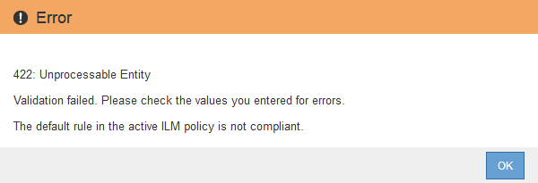

= S3 오브젝트 잠금을 전역적으로 활성화합니다
:allow-uri-read: 
:icons: font
:imagesdir: ../media/

[role="lead"]
오브젝트 데이터를 저장할 때 S3 테넌트 계정이 규정 요구사항을 준수해야 하는 경우 전체 StorageGRID 시스템에 대해 S3 오브젝트 잠금을 활성화해야 합니다. 글로벌 S3 오브젝트 잠금 설정을 활성화하면 모든 S3 테넌트 사용자가 S3 오브젝트 잠금을 통해 버킷과 오브젝트를 생성하고 관리할 수 있습니다.

.필요한 것
* 루트 액세스 권한이 있습니다.
* 를 사용하여 그리드 관리자에 로그인했습니다 xref:../admin/web-browser-requirements.adoc[지원되는 웹 브라우저].
* S3 오브젝트 잠금 워크플로우를 검토했으며 고려 사항을 이해해야 합니다.
* 활성 ILM 정책의 기본 규칙은 준수입니다.
+
** xref:creating-default-ilm-rule.adoc[기본 ILM 규칙을 생성합니다]
** xref:creating-ilm-policy.adoc[ILM 정책을 생성합니다]

.이 작업에 대해
그리드 관리자는 글로벌 S3 오브젝트 잠금 설정을 활성화하여 테넌트 사용자가 S3 오브젝트 잠금이 활성화된 새 버킷을 생성할 수 있도록 해야 합니다. 이 설정을 활성화한 후에는 비활성화할 수 없습니다.

NOTE: 이전 버전의 StorageGRID를 사용하여 글로벌 규정 준수 설정을 활성화한 경우 StorageGRID 11.6에서 S3 개체 잠금 설정이 활성화됩니다. StorageGRID를 계속 사용하여 기존 준수 버킷의 설정을 관리할 수 있지만 새로운 준수 버킷을 생성할 수는 없습니다. 을 참조하십시오 https://kb.netapp.com/Advice_and_Troubleshooting/Hybrid_Cloud_Infrastructure/StorageGRID/How_to_manage_legacy_Compliant_buckets_in_StorageGRID_11.5["NetApp 기술 자료: StorageGRID 11.5에서 레거시 준수 버킷을 관리하는 방법"^].

.단계
. 구성 * > * 시스템 * > * S3 오브젝트 잠금 * 을 선택합니다.
+
S3 오브젝트 잠금 설정 페이지가 나타납니다.

+
image::../media/s3_object_lock_global_setting.png[S3 오브젝트 잠금 전역 설정]

+
이전 버전의 StorageGRID를 사용하여 글로벌 규정 준수 설정을 활성화한 경우 다음 참고 사항이 페이지에 포함됩니다.

+
image::../media/s3_object_lock_global_setting_compliant_note.png[S3 오브젝트 잠금 글로벌 설정 준수 참고 사항]

. S3 오브젝트 잠금 활성화 * 를 선택합니다.
. Apply * 를 선택합니다.
+
S3 오브젝트 잠금을 사용하도록 설정한 후 해제할 수 없다는 확인 대화 상자가 나타납니다.

+
image::../media/s3_object_lock_global_setting_confirm.png[S3 오브젝트 잠금 전역 설정 확인]

. 전체 시스템에 대해 S3 오브젝트 잠금을 영구적으로 활성화하려면 * OK * 를 선택합니다.
+
OK * 를 선택한 경우:

+
** 활성 ILM 정책의 기본 규칙이 준수되면 S3 오브젝트 잠금이 전체 그리드에 대해 활성화되며 비활성화할 수 없습니다.
** 기본 규칙이 규정을 준수하지 않으면 규정 준수 규칙을 기본 규칙으로 포함하는 새 ILM 정책을 만들고 활성화해야 함을 나타내는 오류가 나타납니다. OK * 를 선택하고 새 제안된 정책을 생성하고 시뮬레이션한 후 활성화합니다.
+

.작업을 마친 후
전역 S3 오브젝트 잠금 설정을 활성화한 후 가 필요할 수 있습니다 xref:../ilm/creating-default-ilm-rule.adoc[기본 규칙을 만듭니다] 준수해야 합니다 xref:creating-ilm-policy-after-s3-object-lock-is-enabled.adoc[ILM 정책을 생성합니다] 준수해야 합니다. 설정을 활성화한 후 ILM 정책에 준수 기본 규칙과 비준수 기본 규칙이 모두 선택적으로 포함될 수 있습니다. 예를 들어, S3 오브젝트 잠금이 활성화되지 않은 버킷의 오브젝트에 대한 필터가 없는 규정을 준수하지 않는 규칙을 사용할 수 있습니다.

.관련 정보
* xref:managing-objects-with-s3-object-lock.adoc#comparing-s3-object-lock-to-legacy-compliance[S3 오브젝트 잠금을 레거시 규정 준수와 비교합니다]

