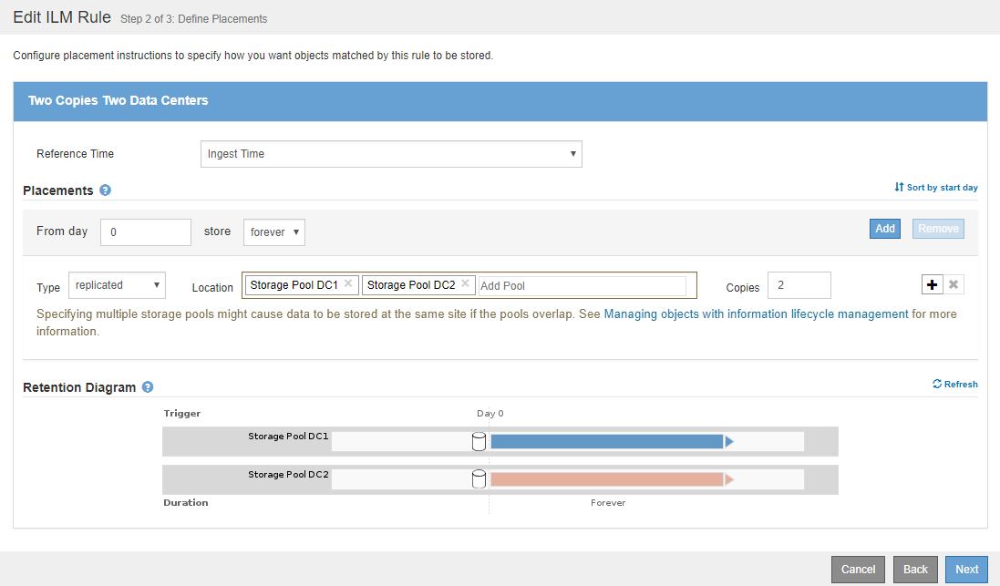

= 예 1: 오브젝트 스토리지에 대한 ILM 규칙 및 정책
:allow-uri-read: 
:icons: font
:imagesdir: ../media/

[role="lead"]
ILM 정책을 정의하여 개체 보호 및 보존 요구 사항을 충족할 때 다음 예제 규칙 및 정책을 출발점으로 사용할 수 있습니다.

CAUTION: 다음 ILM 규칙 및 정책은 예일 뿐입니다. ILM 규칙을 구성하는 방법은 여러 가지가 있습니다. 새 정책을 활성화하기 전에 제안된 정책을 시뮬레이션하여 콘텐츠가 손실로부터 보호되도록 의도한 대로 동작하는지 확인합니다.

== 예를 들어 ILM 규칙 1: 개체 데이터를 두 데이터 센터에 복사

이 ILM 규칙 예에서는 오브젝트 데이터를 두 데이터 센터의 스토리지 풀로 복사합니다.

[cols="1a,2a"]
|===
| 규칙 정의 | 예제 값 

 a| 
스토리지 풀
 a| 
스토리지 풀 DC1과 스토리지 풀 DC2라는 두 개의 스토리지 풀이 서로 다른 데이터 센터에 있습니다.

 a| 
규칙 이름
 a| 
2개의 복사본 2개의 데이터 센터

 a| 
참조 시간
 a| 
수집 시간

 a| 
콘텐츠 배치
 a| 
0일째, 복제된 복사본 두 개를 영구 보관합니다. 하나는 스토리지 풀 DC1이고 다른 하나는 스토리지 풀 DC2에 있습니다.

|===

== 예를 들어, ILM 규칙 2: 버킷 일치가 있는 삭제 코딩 프로필

이 ILM 규칙 예에서는 삭제 코딩 프로파일과 S3 버킷을 사용하여 오브젝트가 저장되는 위치 및 기간을 결정합니다.

[cols="1a,2a"]
|===
| 규칙 정의 | 예제 값 

 a| 
삭제 코딩 프로필
 a| 
* 3개의 데이터 센터에 걸쳐 단일 스토리지 풀(3개 사이트 모두)
* 6+3 삭제 코딩 방법을 사용합니다

 a| 
규칙 이름
 a| 
S3 버킷 재무 기록용 EC

 a| 
참조 시간
 a| 
수집 시간

 a| 
콘텐츠 배치
 a| 
S3 버킷의 오브젝트(finance-records)의 경우 삭제 코딩 프로필에 지정된 풀에서 삭제 코딩 복사본을 하나 생성합니다. 이 복사본을 영구적으로 유지하십시오.

|===
image:../media/ilm_rule_ec_for_s3_bucket_finance_records.png["예를 들어, ILM 규칙 2: 버킷 일치가 있는 삭제 코딩 프로필"]

== 예 1의 ILM 정책

StorageGRID 시스템을 사용하면 정교하고 복잡한 ILM 정책을 설계할 수 있지만 실제로는 대부분의 ILM 정책이 간단합니다.

다중 사이트 토폴로지에 대한 일반적인 ILM 정책에는 다음과 같은 ILM 규칙이 포함될 수 있습니다.

* 수집 시 6+3 삭제 코딩을 사용하여 S3 버킷에 속하는 모든 오브젝트를 3개의 데이터 센터에 '금융 기록'이라고 합니다.
* 개체가 첫 번째 ILM 규칙과 일치하지 않으면 정책의 기본 ILM 규칙, 두 개의 복사본 두 개의 데이터 센터를 사용하여 해당 개체의 복사본을 두 데이터 센터 DC1과 DC2에 저장합니다.
+
image::../media/policy_1_configured_policy.png[예 1의 ILM 정책]

