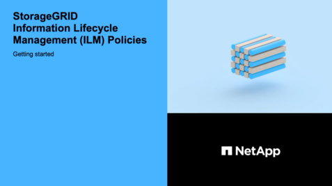

= ILM을 사용하여 개체 관리: 개요
:allow-uri-read: 
:icons: font
:imagesdir: ../media/

[role="lead"]
ILM(정보 수명 주기 관리) 규칙 및 정책을 구성하여 StorageGRID 시스템의 개체를 관리할 수 있습니다. ILM 규칙 및 정책은 StorageGRID이 개체 데이터의 복사본을 만들고 배포하는 방법과 시간이 지남에 따라 이러한 복사본을 관리하는 방법을 지시합니다.

== 참조하십시오

ILM 규칙 및 ILM 정책을 설계하고 구현하려면 신중한 계획이 필요합니다. 운영 요구사항, StorageGRID 시스템의 토폴로지, 오브젝트 보호 요구사항 및 사용 가능한 스토리지 유형을 이해해야 합니다. 그런 다음 여러 유형의 개체를 복사, 배포 및 저장할 방법을 결정해야 합니다.

다음 지침을 따르십시오.

* ILM이 개체 수명 전반에 걸쳐 작동하는 방식과 ILM 정책 및 규칙이 무엇인지 등 StorageGRID ILM에 대해 알아보십시오.
* 스토리지 풀, 삭제 코딩 프로필 및 ILM 규칙을 구성하는 방법에 대해 알아봅니다.
* 하나 이상의 사이트에서 오브젝트 데이터를 보호하는 ILM 정책을 만들고 활성화하는 방법을 알아보십시오.
* S3 오브젝트 잠금을 통해 오브젝트를 관리하는 방법에 대해 알아보십시오. S3 오브젝트 잠금은 특정 S3 버킷의 오브젝트가 지정된 시간 동안 삭제 또는 덮어쓰지 않도록 보장합니다.

== 자세한 정보

자세한 내용은 다음 비디오를 참조하십시오.

* https://netapp.hosted.panopto.com/Panopto/Pages/Viewer.aspx?id=beffbe9b-e95e-4a90-9560-acc5013c93d8["비디오: StorageGRID ILM 규칙: 시작하기"^]
+
[link=https://netapp.hosted.panopto.com/Panopto/Pages/Viewer.aspx?id=beffbe9b-e95e-4a90-9560-acc5013c93d8]
image::../media/video-screenshot-ilm-rules.png[비디오: StorageGRID ILM 규칙: 시작하기]

* https://netapp.hosted.panopto.com/Panopto/Pages/Viewer.aspx?id=c929e94e-353a-4375-b112-acc5013c81c7["비디오: StorageGRID ILM 정책"^]
+
[link=https://netapp.hosted.panopto.com/Panopto/Pages/Viewer.aspx?id=c929e94e-353a-4375-b112-acc5013c81c7]

