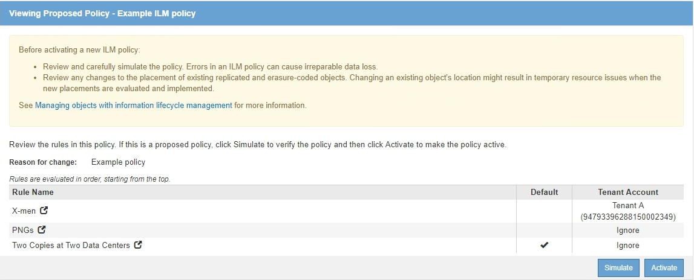

= ILM 정책을 시뮬레이션합니다
:allow-uri-read: 
:icons: font
:imagesdir: ../media/

[role="lead"]
정책을 활성화하고 운영 데이터에 적용하기 전에 테스트 개체에 대해 제안된 정책을 시뮬레이션해야 합니다. 시뮬레이션 창은 정책을 활성화하고 생산 환경의 데이터에 적용하기 전에 테스트를 위해 안전한 독립 실행형 환경을 제공합니다.

.필요한 것
* 를 사용하여 그리드 관리자에 로그인했습니다 xref:../admin/web-browser-requirements.adoc[지원되는 웹 브라우저].
* 특정 액세스 권한이 있습니다.
* 테스트할 각 개체의 S3 버킷/오브젝트 키 또는 Swift 컨테이너/오브젝트 이름을 알고 있으며, 이미 오브젝트를 수집했습니다.

.이 작업에 대해
제안된 정책을 테스트할 객체를 신중하게 선택해야 합니다. 정책을 철저히 시뮬레이션하려면 각 규칙에서 각 필터에 대해 하나 이상의 개체를 테스트해야 합니다.

예를 들어, 정책에 버킷 A의 오브젝트와 버킷 B의 오브젝트와 일치하는 다른 규칙이 포함된 경우, 정책을 철저히 테스트하기 위해 버킷 A에서 하나 이상의 오브젝트와 버킷 B에서 한 개의 오브젝트를 선택해야 합니다. 또한 기본 규칙을 테스트하려면 다른 버킷에서 하나 이상의 오브젝트를 선택해야 합니다.

정책을 시뮬레이션할 때 다음과 같은 고려 사항이 적용됩니다.

* 정책을 변경한 후 제안된 정책을 저장합니다. 그런 다음 저장된 제안 정책의 동작을 시뮬레이션합니다.
* 정책을 시뮬레이션하면 정책의 ILM 규칙이 테스트 개체를 필터링하여 각 개체에 적용된 규칙을 확인할 수 있습니다. 그러나 오브젝트 복사본은 만들지 않고 오브젝트는 배치되지 않습니다. 시뮬레이션을 실행해도 데이터, 규칙 또는 정책은 어떠한 방식으로도 수정되지 않습니다.
* Simulation 페이지는 ILM 정책 페이지를 닫거나, 탐색하거나, 새로 고칠 때까지 테스트한 개체를 유지합니다.
* Simulation은 일치하는 규칙의 이름을 반환합니다. 적용되는 스토리지 풀 또는 삭제 코딩 프로필을 확인하려면 규칙 이름 또는 추가 세부 정보 아이콘을 선택하여 보존 다이어그램을 볼 수 있습니다 image:../media/icon_nms_more_details.gif["자세한 정보 아이콘"].
* S3 버전 관리가 활성화된 경우 정책은 현재 버전의 오브젝트에서만 시뮬레이션됩니다.

.단계
. 규칙을 선택 및 정렬하고 제안된 정책을 저장합니다.
+
이 예제의 정책에는 다음 세 가지 규칙이 있습니다.

+
[cols="1a,1a,1a,1a"]
|===
| 규칙 이름 | 필터 | 사본 유형 | 보존 

 a| 
X - 남성
 a| 
** 테넌트 A
** 사용자 메타데이터(시리즈 = x-MEN)

 a| 
2개의 데이터 센터에 2개의 복사본 생성
 a| 
2년

 a| 
PNG
 a| 
키는 .png로 끝납니다
 a| 
2개의 데이터 센터에 2개의 복사본 생성
 a| 
5년

 a| 
2개의 복사본 2개의 데이터 센터
 a| 
_없음_
 a| 
2개의 데이터 센터에 2개의 복사본 생성
 a| 
영원히

|===
+

. S3, Swift 클라이언트 또는 를 사용합니다 xref:../tenant/use-s3-console.adoc[Experimental S3 Console을 선택합니다]각 테넌트의 테넌트 관리자에서 사용할 수 있는 에서는 각 규칙을 테스트하는 데 필요한 객체를 수집해야 합니다.
. 시뮬레이션 * 을 선택합니다.
+
Simulation ILM 정책 대화 상자가 나타납니다.

. 오브젝트 * 필드에 테스트 오브젝트의 S3 버킷/오브젝트 키 또는 Swift 컨테이너/오브젝트 이름을 입력하고 * 시뮬레이션 * 을 선택합니다.
+
[NOTE]
====
수집되지 않은 개체를 지정하면 메시지가 나타납니다.

image::../media/object_not_available_for_simulation.gif[메시지 - 누락된 객체를 지정하는 경우]

====
. Simulation Results * 에서 각 개체가 올바른 규칙과 일치하는지 확인합니다.
+
이 예에서 'Havok.png'와 'Warpath.jpg` 객체가 X-MEN 규칙에 의해 올바르게 일치했습니다. Series=x-Men의 사용자 메타데이터를 포함하지 않는 FullSteam.png의 객체는 X-MEN 규칙에 맞지 않지만 PNG 규칙에 의해 올바르게 일치되었습니다. 세 개의 개체가 모두 다른 규칙에 일치했기 때문에 기본 규칙이 사용되지 않았습니다.

+
image::../media/ilm_policy_simulation_results.gif[시뮬레이션 결과]

== 예 1: 제안된 ILM 정책을 시뮬레이션할 때 규칙을 확인합니다

이 예제에서는 제안된 정책을 시뮬레이션할 때 규칙을 확인하는 방법을 보여 줍니다.

이 예제에서 * 예제 ILM 정책 * 은 두 개의 버킷에 있는 인제스트된 오브젝트에 대해 시뮬레이션되고 있습니다. 이 정책은 다음과 같은 세 가지 규칙을 포함합니다.

* 첫 번째 규칙 * 2개 복사본, 버킷 - A * 의 경우 2년, 버킷 - a의 오브젝트에만 적용됩니다
* 두 번째 규칙인 * EC objects > 1MB * 는 1MB 이상의 객체에서 필터를 제외한 모든 버킷에 적용됩니다.
* 세 번째 규칙 * 두 개의 복사본, 두 개의 데이터 센터 * 가 기본 규칙입니다. 필터는 필터를 포함하지 않으며 비현재 참조 시간을 사용하지 않습니다.

image::../media/saved_policy_for_simulation.png[Simulation에 대한 저장된 정책]

.단계
. 규칙을 추가하고 정책을 저장한 후 * Simulate * 를 선택합니다.
+
ILM 정책 시뮬레이션 대화 상자가 나타납니다.

. 오브젝트 * 필드에 테스트 오브젝트의 S3 버킷/오브젝트 키 또는 Swift 컨테이너/오브젝트 이름을 입력하고 * 시뮬레이션 * 을 선택합니다.
+
Simulation 결과가 나타나고 정책의 어떤 규칙이 테스트한 각 개체와 일치하는지를 보여줍니다.

+
image::../media/simulate_policy_screen.png[정책 시뮬레이션 화면]

. 각 객체가 올바른 규칙에 일치하는지 확인합니다.
+
이 예에서

+
.. bucket-A/bucket-a object.pdf는 bucket-A의 오브젝트를 필터링하는 첫 번째 규칙과 정확하게 일치했습니다.
.. bucket-b/test object greater than 1 MB.pdf는 bucket-b에 들어 있어 첫 번째 규칙과 일치하지 않습니다. 대신 1MB보다 큰 객체를 필터링하는 두 번째 규칙에 의해 올바르게 일치되었습니다.
.. bucket-b/test object less than 1 MB.pdf가 처음 두 개의 규칙에 있는 필터와 일치하지 않아 필터가 없는 기본 규칙에 따라 배치됩니다.

== 예 2: 제안된 ILM 정책을 시뮬레이션할 때 규칙 순서 바꾸기

이 예제에서는 정책을 시뮬레이션할 때 결과를 변경하기 위해 규칙의 순서를 변경하는 방법을 보여 줍니다.

이 예에서는 * Demo * 정책을 시뮬레이션하고 있습니다. 이 정책은 시리즈 = x-men 사용자 메타데이터가 있는 개체를 찾기 위해 다음과 같은 세 가지 규칙을 포함합니다.

* 첫 번째 규칙인 * PNG * 는 '.png'로 끝나는 키 이름을 필터링합니다.
* 두 번째 규칙 * X-Men * 은 테넌트 A의 객체와 시리즈 = x-멘의 사용자 메타데이터에만 적용됩니다.
* 마지막 규칙인 * Two 는 두 데이터 센터 * 를 복사합니다. 이 규칙은 처음 두 규칙과 일치하지 않는 모든 개체와 일치합니다.

image::../media/simulate_reorder_rules_pngs_rule.png[예 2: 제안된 ILM 정책을 시뮬레이션할 때 규칙 재정렬]

.단계
. 규칙을 추가하고 정책을 저장한 후 * Simulate * 를 선택합니다.
. 오브젝트 * 필드에 테스트 오브젝트의 S3 버킷/오브젝트 키 또는 Swift 컨테이너/오브젝트 이름을 입력하고 * 시뮬레이션 * 을 선택합니다.
+
Simulation 결과가 나타나면서 'Havok.png' 객체가 * PNG * 규칙에 일치했음을 나타냅니다.

+
image::../media/simulate_reorder_rules_pngs_result.gif[예 2: 제안된 ILM 정책을 시뮬레이션할 때 규칙 재정렬]

+
그러나 하브록.png의 대상이 테스트한다는 규칙은 * X-MEN * 규칙이었습니다.

. 문제를 해결하려면 규칙을 다시 정렬하십시오.
+
.. ILM 정책 시뮬레이션 페이지를 닫으려면 * 마침 * 을 선택합니다.
.. 정책을 편집하려면 * 편집 * 을 선택합니다.
.. X-MEN * 규칙을 목록의 맨 위로 끕니다.
+
image::../media/simulate_reorder_rules_correct_rule.png[시뮬레이션 - 규칙 순서 재지정 - 규칙 수정]

.. 저장 * 을 선택합니다.

. 시뮬레이션 * 을 선택합니다.
+
이전에 테스트한 객체는 업데이트된 정책에 대해 재평가되고 새 시뮬레이션 결과가 표시됩니다. 이 예에서 Rule Matched 열은 'Havok.png' 객체가 예상대로 X-Men 메타데이터 규칙과 일치한다는 것을 보여줍니다. 이전 일치 열은 PNG 규칙이 이전 시뮬레이션에서 개체와 일치했음을 나타냅니다.

+
image::../media/simulate_reorder_rules_correct_result.gif[예 2: 제안된 ILM 정책을 시뮬레이션할 때 규칙 재정렬]

+

NOTE: 정책 구성 페이지에 있는 경우 테스트 개체의 이름을 다시 입력할 필요 없이 변경 후 정책을 다시 시뮬레이션할 수 있습니다.

== 예 3: 제안된 ILM 정책을 시뮬레이션할 때 규칙을 수정합니다

이 예제에서는 정책을 시뮬레이션하고 정책의 규칙을 정정하고 시뮬레이션을 계속하는 방법을 보여 줍니다.

이 예에서는 * Demo * 정책을 시뮬레이션하고 있습니다. 이 정책은 시리즈=X-MEN 사용자 메타데이터가 있는 객체를 찾는 데 목적이 있습니다. 그러나 Beast.jpg` 개체에 대해 이 정책을 시뮬레이션하는 동안 예기치 않은 결과가 발생했습니다. 이 개체는 X-Men 메타데이터 규칙을 일치시키는 대신 기본 규칙과 일치하며 두 개의 데이터 센터를 복제합니다.

image::../media/simulate_results_for_object_wrong_metadata.png[예 3: 제안된 ILM 정책을 시뮬레이션할 때 규칙 수정]

테스트 객체가 정책의 예상 규칙과 일치하지 않으면 정책의 각 규칙을 검사하고 오류를 수정해야 합니다.

.단계
. 정책의 각 규칙에 대해 규칙 이름 또는 자세한 정보 아이콘을 선택하여 규칙 설정을 확인합니다 image:../media/icon_nms_more_details.gif["자세한 정보 아이콘"] 규칙이 표시되는 대화 상자
. 규칙의 테넌트 계정, 참조 시간 및 필터링 기준을 검토합니다.
+
이 예제에서 X-MEN 규칙의 메타데이터에는 오류가 포함되어 있습니다. 메타데이터의 값은 "x-men" 대신 "x-men1"로 입력되었습니다.

+
image::../media/simulate_rules_select_rule_popup_with_wrong_metadata.png[예 3: 제안된 ILM 정책을 시뮬레이션할 때 규칙 수정]

. 오류를 해결하려면 다음과 같이 규칙을 수정하십시오.
+
** 규칙이 제안된 정책의 일부인 경우 규칙을 복제하거나 정책에서 규칙을 제거한 다음 편집할 수 있습니다.
** 규칙이 활성 정책의 일부인 경우 규칙을 복제해야 합니다. 활성 정책에서 규칙을 편집하거나 제거할 수 없습니다.
+
[cols="1a,3a"]
|===
| 옵션을 선택합니다 | 설명 

 a| 
규칙의 클론을 생성합니다
 a| 
... ILM * > * 규칙 * 을 선택합니다.
... 잘못된 규칙을 선택하고 * Clone * 을 선택합니다.
... 잘못된 정보를 변경하고 * Save * 를 선택합니다.
... ILM * > * 정책 * 을 선택합니다.
... 제안된 정책을 선택하고 * Edit * 를 선택합니다.
... 규칙 선택 * 을 선택합니다.
... 새 규칙의 확인란을 선택하고 원래 규칙의 확인란을 선택 취소한 다음 * 적용 * 을 선택합니다.
... 저장 * 을 선택합니다.

 a| 
규칙을 편집합니다
 a| 
... 제안된 정책을 선택하고 * Edit * 를 선택합니다.
... 삭제 아이콘을 선택합니다 image:../media/icon_nms_delete_new.gif["삭제 아이콘"] 잘못된 규칙을 제거하려면 * 저장 * 을 선택합니다.
... ILM * > * 규칙 * 을 선택합니다.
... 잘못된 규칙을 선택하고 * 편집 * 을 선택합니다.
... 잘못된 정보를 변경하고 * Save * 를 선택합니다.
... ILM * > * 정책 * 을 선택합니다.
... 제안된 정책을 선택하고 * Edit * 를 선택합니다.
... 수정된 규칙을 선택하고 * Apply * 를 선택한 다음 * Save * 를 선택합니다.

|===

. 시뮬레이션을 다시 수행합니다.
+

NOTE: 규칙을 편집하기 위해 ILM 정책 페이지에서 탐색했기 때문에 이전에 시뮬레이션에 입력한 개체가 더 이상 표시되지 않습니다. 오브젝트의 이름을 다시 입력해야 합니다.

+
이 예에서 수정된 X-MEN 규칙은 이제 '시리즈=X-MEN' 사용자 메타데이터를 기반으로 하는 Beast.jpg` 객체와 일치합니다.

+
image::../media/simulate_results_for_object_corrected_metadata.gif[예 3: 제안된 ILM 정책을 시뮬레이션할 때 규칙 수정]

