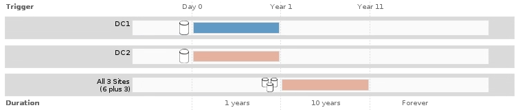

= 단계 2/3: 배치 정의
:allow-uri-read: 
:icons: font
:imagesdir: ../media/

[role="lead"]
ILM 규칙 생성 마법사의 2단계(배치 정의)를 통해 개체 저장 기간, 복사본 유형(복제되거나 삭제 코딩), 스토리지 위치 및 복사본 수를 결정하는 배치 지침을 정의할 수 있습니다.

.이 작업에 대해
ILM 규칙에는 하나 이상의 배치 지침이 포함될 수 있습니다. 각 배치 지침은 단일 기간에 적용됩니다. 두 개 이상의 명령을 사용하는 경우 기간은 연속적이어야 하며, 적어도 하나의 명령은 0일째부터 시작해야 합니다. 지침은 계속 진행할 수 있으며, 더 이상 오브젝트 복사본이 필요하지 않을 때까지 계속됩니다.

다른 유형의 사본을 만들거나 해당 기간 동안 다른 위치를 사용하려는 경우 각 배치 지침에는 여러 줄이 있을 수 있습니다.

이 ILM 규칙 예에서는 첫 해에 두 개의 복제된 복사본을 만듭니다. 각 복제본은 다른 사이트의 스토리지 풀에 저장됩니다. 1년 후에는 2+1 삭제 코딩 복사본을 만들어 하나의 사이트에만 저장합니다.

image::../media/ilm_create_ilm_rule_wizard_2.png[ILM 규칙 생성 마법사 2페이지]

.단계
. 참조 시간 * 에서 배치 지침의 시작 시간을 계산할 때 사용할 시간 유형을 선택합니다.
+
[cols="1a,2a"]
|===
| 옵션을 선택합니다 | 설명 

 a| 
수집 시간
 a| 
객체가 수집된 시간입니다.

 a| 
마지막 액세스 시간입니다
 a| 
개체를 마지막으로 검색한 시간(읽기 또는 보기)

* 참고: * 이 옵션을 사용하려면 S3 버킷 또는 Swift 컨테이너에 대해 마지막 액세스 시간에 대한 업데이트를 활성화해야 합니다. 을 참조하십시오 xref:using-last-access-time-in-ilm-rules.adoc[ILM 규칙에서 마지막 액세스 시간을 사용합니다].

 a| 
현재 시간이 아닙니다
 a| 
새 버전이 수집되어 현재 버전으로 대체되었기 때문에 개체 버전이 최신 버전이 아닌 시간입니다.

* 참고: * 비현재 시간은 버전 관리가 활성화된 버킷의 S3 오브젝트에만 적용됩니다.

이 옵션을 사용하면 버전이 아닌 개체 버전을 필터링하여 버전이 지정된 개체의 스토리지 영향을 줄일 수 있습니다. 을 참조하십시오 xref:example-4-ilm-rules-and-policy-for-s3-versioned-objects.adoc[예 4: S3 버전 오브젝트에 대한 ILM 규칙 및 정책].

 a| 
사용자 정의 생성 시간입니다
 a| 
사용자 정의 메타데이터에 지정된 시간입니다.

|===
+

NOTE: 호환 규칙을 만들려면 * Ingest Time * 을 선택해야 합니다.

. Placements * 섹션에서 시작 시간과 첫 번째 기간의 기간을 선택합니다.
+
예를 들어 첫 해의 개체를 저장할 위치를 지정할 수 있습니다("365일의 경우 0일"). 적어도 하나의 명령은 0일에 시작해야 합니다.

. 복제된 복사본을 생성하려면 다음을 수행합니다.
+
.. Type * 드롭다운 목록에서 * replicated * 를 선택합니다.
.. Location * 필드에서 추가하려는 각 스토리지 풀에 대해 * Add Pool * 을 선택합니다.
+
* 스토리지 풀을 하나만 지정하는 경우 * StorageGRID는 지정된 스토리지 노드에 복제된 객체 복사본을 하나만 저장할 수 있습니다. 그리드에 스토리지 노드 3개가 포함된 경우 복제본 수로 4를 선택하면 각 스토리지 노드에 대해 복제본 3개만 만들어집니다.

+

NOTE: ILM 규칙을 완전히 적용할 수 없음을 나타내기 위해 * ILM 배치 달성 안 됨 * 경고가 트리거됩니다.

+
* 둘 이상의 스토리지 풀을 지정하는 경우 * 다음 규칙을 염두에 두십시오.

+
*** 복제본 수는 스토리지 풀 수보다 클 수 없습니다.
*** 복제본 수가 스토리지 풀 수와 같으면 객체 복제본 하나가 각 스토리지 풀에 저장됩니다.
*** 복제본 수가 스토리지 풀 수보다 적은 경우 하나의 복제본이 수집 사이트에 저장된 다음 나머지 복제본을 분산하여 풀 간에 디스크 사용량을 균형 있게 유지하는 한편, 어느 사이트에서든 객체의 복제본을 두 개 이상 확보하지 못하도록 합니다.
*** 스토리지 풀이 겹칠 경우(동일한 스토리지 노드 포함) 개체의 모든 복제본이 하나의 사이트에만 저장될 수 있습니다. 따라서 기본 모든 스토리지 노드 스토리지 풀 및 다른 스토리지 풀을 지정하지 마십시오.
+
image::../media/ilm_rule_with_multiple_storage_pools.png[여러 스토리지 풀에 대한 배치 지침]

.. 복사할 매수를 선택합니다.
+
매수를 1로 변경하면 경고가 나타납니다. 특정 기간 동안 복제된 복사본을 하나만 생성하는 ILM 규칙은 데이터가 영구적으로 손실될 위험이 있습니다. 을 참조하십시오 xref:why-you-should-not-use-single-copy-replication.adoc[단일 복사본 복제를 사용하지 않아야 하는 이유].

+
image::../media/ilm_create_ilm_rule_warning_for_1_copy.png[1개의 복사본에 대한 ILM 규칙 2페이지 경고를 생성합니다]

+
이러한 위험을 방지하려면 다음 중 하나 이상을 수행하십시오.

+
*** 해당 기간의 사본 수를 늘립니다.
*** 더하기 기호 아이콘을 선택합니다 image:../media/icon_plus_sign_black_on_white.gif["화이트 색상에는 검정색 서명도 있습니다"] 를 눌러 해당 기간 동안 추가 사본을 생성합니다. 그런 다음 다른 스토리지 풀 또는 클라우드 스토리지 풀을 선택합니다.
*** 유형 에 대해 * 복제된 * 대신 * 삭제 코딩 * 을 선택합니다. 이 규칙이 모든 기간에 대해 여러 복사본을 이미 생성한 경우 이 경고를 무시해도 됩니다.

.. 스토리지 풀을 하나만 지정한 경우에는 * 임시 위치 * 필드를 무시하십시오.
+

NOTE: 임시 위치는 더 이상 사용되지 않으며 향후 릴리즈에서 제거될 예정입니다. 을 참조하십시오 xref:using-storage-pool-as-temporary-location-deprecated.adoc[스토리지 풀을 임시 위치로 사용(더 이상 사용 안 함)].

. 삭제 코딩 복사본을 만들려면:
+
.. 유형 * 드롭다운 목록에서 * 삭제 코딩 * 을 선택합니다.
+
인쇄 매수가 1로 변경됩니다. 규칙에 200KB 이하의 객체를 무시하는 고급 필터가 없는 경우 경고가 표시됩니다.

+
image::../media/ilm_rule_warning_for_ec_size.png[EC 크기에 대한 ILM 규칙 경고]

+

IMPORTANT: 삭제 코딩은 1MB 이상의 오브젝트에 가장 적합합니다. 매우 작은 삭제 코딩 조각을 관리해야 하는 오버헤드를 방지하기 위해 200KB 미만의 오브젝트에 삭제 코딩을 사용하지 마십시오.

.. 개체 크기 경고가 나타나면 * Back * 을 선택하여 1단계로 돌아갑니다. 그런 다음 * 고급 필터링 * 을 선택하고 개체 크기(MB) 필터를 0.2보다 큰 값으로 설정합니다.
.. 저장 위치를 선택합니다.
+
삭제 코딩 복사본의 스토리지 위치에는 스토리지 풀의 이름, 삭제 코딩 프로필 이름이 포함됩니다.

+
image::../media/storage_pool_and_erasure_coding_profile.png[스토리지 풀 및 EC 프로파일 이름입니다]

. 필요에 따라 다른 기간을 추가하거나 다른 위치에 추가 사본을 생성할 수 있습니다.
+
** 더하기 아이콘을 선택하여 동일한 기간 동안 다른 위치에 추가 사본을 생성합니다.
** 배치 지침에 다른 기간을 추가하려면 * 추가 * 를 선택합니다.
+

NOTE: 최종 기간이 * Forever * 로 끝나는 경우를 제외하고 최종 기간 종료 시 객체가 자동으로 삭제됩니다.

. 클라우드 스토리지 풀에 오브젝트를 저장하려면 다음을 수행합니다.
+
.. Type * 드롭다운 목록에서 * replicated * 를 선택합니다.
.. Location * 필드에서 * Add Pool * 을 선택합니다. 그런 다음 클라우드 스토리지 풀을 선택합니다.
+
image::../media/ilm_cloud_storage_pool.gif[배치 지침에 Cloud Storage Pool 추가]

+
클라우드 스토리지 풀을 사용할 때는 다음 규칙을 염두에 두십시오.

+
*** 단일 배치 지침에서는 여러 클라우드 스토리지 풀을 선택할 수 없습니다. 마찬가지로, 동일한 배치 지침에서는 클라우드 스토리지 풀과 스토리지 풀을 선택할 수 없습니다.
+
image::../media/ilm_cloud_storage_pool_error.gif[ILM 규칙 > 클라우드 스토리지 풀 오류입니다]

*** 특정 Cloud Storage Pool에서는 오브젝트 복사본을 하나만 저장할 수 있습니다. Copies * 를 2개 이상으로 설정하면 오류 메시지가 나타납니다.
+
image::../media/ilm_cloud_storage_pool_error_one_copy.gif[ILM 규칙: 두 개 이상의 복제본이 있는 경우 클라우드 스토리지 풀 오류입니다]

*** 클라우드 스토리지 풀에 동시에 둘 이상의 오브젝트 복사본을 저장할 수 없습니다. Cloud Storage Pool을 사용하는 여러 배치에서 날짜가 중복되거나 같은 배치의 여러 라인이 Cloud Storage Pool을 사용하는 경우 오류 메시지가 나타납니다.
+
image::../media/ilm_rule_cloud_storage_pool_error_overlapping_dates.png[ILM 규칙 클라우드 스토리지 풀 오류가 겹치는 날짜]

*** StorageGRID에서 오브젝트를 복제 또는 삭제 코딩 복사본으로 저장하는 동시에 클라우드 스토리지 풀에 오브젝트를 저장할 수 있습니다. 그러나 이 예제에서 볼 수 있듯이, 각 위치에 대한 사본의 수와 유형을 지정할 수 있도록 해당 기간의 배치 지침에 두 줄 이상을 포함해야 합니다.
+
image::../media/ilm_cloud_storage_pool_multiple_locations.png[ILM 규칙 > 클라우드 스토리지 풀 및 기타 위치]

. 보존 다이어그램을 업데이트하고 배치 지침을 확인하려면 * Refresh * 를 선택합니다.
+
다이어그램의 각 줄은 개체 복사본을 배치할 위치와 시기를 보여 줍니다. 복사 유형은 다음 아이콘 중 하나로 표시됩니다.

+
[cols="1a,2a"]
|===

 a| 
image:../media/icon_nms_replicated.gif["복제 복사본 아이콘"]
 a| 
복제된 복사본입니다

 a| 
image:../media/icon_nms_erasure_coded.gif["삭제 코딩 복사본을 위한 아이콘입니다"]
 a| 
삭제 코딩 복사본

 a| 
image:../media/icon_cloud_storage_pool.gif["Cloud Storage Pool 아이콘"]
 a| 
Cloud Storage Pool 복사본

|===
+
이 예에서는 복제된 복사본 2개가 1년 동안 2개의 스토리지 풀(DC1 및 DC2)에 저장됩니다. 그런 다음, 삭제 코딩 복사본을 3개의 사이트에서 6+3 삭제 코딩 체계를 사용하여 10년 더 절약할 수 있습니다. 11년이 지나면 StorageGRID에서 객체가 삭제됩니다.

+

. 다음 * 을 선택합니다.
+
3단계(Ingest 동작 정의)가 나타납니다.

.관련 정보
* xref:what-ilm-rule-is.adoc[ILM 규칙이란 무엇입니까]
* xref:managing-objects-with-s3-object-lock.adoc[S3 오브젝트 잠금으로 오브젝트 관리]
* xref:step-3-of-3-define-ingest-behavior.adoc[3단계 중 3단계: 수집 동작 정의]

