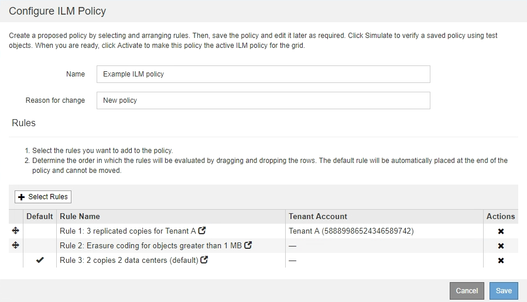

= ILM 정책이란 무엇인가
:icons: font
:imagesdir: ../media/

[role="lead"]
ILM(정보 수명 주기 관리) 정책은 StorageGRID 시스템이 시간 경과에 따라 오브젝트 데이터를 관리하는 방법을 결정하는 일련의 정렬된 ILM 규칙 세트입니다.

== ILM 정책은 개체를 어떻게 평가합니까?

StorageGRID 시스템에 대한 활성 ILM 정책은 모든 개체의 배치, 기간 및 데이터 보호를 제어합니다.

클라이언트가 개체를 StorageGRID에 저장하면 활성 정책에서 정렬된 ILM 규칙 집합에 대해 다음과 같이 개체가 평가됩니다.

. 정책의 첫 번째 규칙에 대한 필터가 개체와 일치하면 해당 규칙의 수집 동작에 따라 개체가 수집되고 해당 규칙의 배치 지침에 따라 저장됩니다.
. 첫 번째 규칙의 필터가 개체와 일치하지 않으면 일치하는 항목이 될 때까지 해당 개체가 정책의 다음 각 규칙에 대해 평가됩니다.
. 개체와 일치하는 규칙이 없으면 정책의 기본 규칙에 대한 수집 동작 및 배치 지침이 적용됩니다. 기본 규칙은 정책의 마지막 규칙입니다. 기본 규칙은 모든 테넌트, 모든 버킷 및 모든 오브젝트 버전에 적용되며 고급 필터를 사용할 수 없습니다.

== ILM 정책의 예

이 ILM 정책은 세 가지 ILM 규칙을 사용합니다.

이 예제에서 규칙 1은 테넌트 A에 속하는 모든 객체를 일치시킵니다 이러한 오브젝트는 3개의 사이트에 3개의 복제된 복사본으로 저장됩니다. 다른 테넌트에 속한 개체는 규칙 1에 의해 일치하지 않으므로 규칙 2에 대해 평가됩니다.

규칙 2는 다른 테넌트의 모든 객체를 일치하지만 1MB 이상인 경우에만 일치합니다. 이러한 큰 오브젝트는 3개의 사이트에서 6+3 삭제 코딩을 사용하여 저장됩니다. 규칙 2가 1MB 이하의 객체와 일치하지 않으므로 규칙 3에 대해 이러한 객체가 평가됩니다.

규칙 3은 정책의 마지막 기본 규칙이며 필터를 사용하지 않습니다. 규칙 3은 규칙 1 또는 규칙 2(1MB 이하의 테넌트 A에 속하지 않는 객체)에 의해 일치하지 않는 모든 객체의 복제된 복제본을 두 개 만듭니다.

image::../media/ilm_policy_and_rules.png[ILM 정책 및 규칙]

== 제안 정책, 활성 정책 및 기간별 정책이란 무엇입니까?

모든 StorageGRID 시스템에는 하나의 활성 ILM 정책이 있어야 합니다. StorageGRID 시스템에는 한 가지 제안된 ILM 정책과 수많은 기간별 정책도 포함될 수 있습니다.

ILM 정책을 처음 만들 때는 하나 이상의 ILM 규칙을 선택하고 특정 순서로 배열하여 제안된 정책을 만듭니다. 제안된 정책의 동작을 확인하기 위해 제안된 정책을 시뮬레이션한 후에는 이를 활성화하여 활성 정책을 생성합니다.

새로운 ILM 정책을 활성화하면 StorageGRID은 해당 정책을 사용하여 기존 오브젝트 및 새로 수집된 오브젝트를 포함한 모든 오브젝트를 관리합니다. 새 정책의 ILM 규칙을 구현할 때 기존 개체를 새 위치로 이동할 수 있습니다.

제안된 정책을 활성화하면 이전에 활성화된 정책이 기간별 정책이 됩니다. 내역 ILM 정책을 삭제할 수 없습니다.

image::../media/ilm_policies_proposed_active_historical.png[ILM 정책에 대한 개념적 이미지]

xref:creating-ilm-policy.adoc[ILM 정책을 생성합니다]
