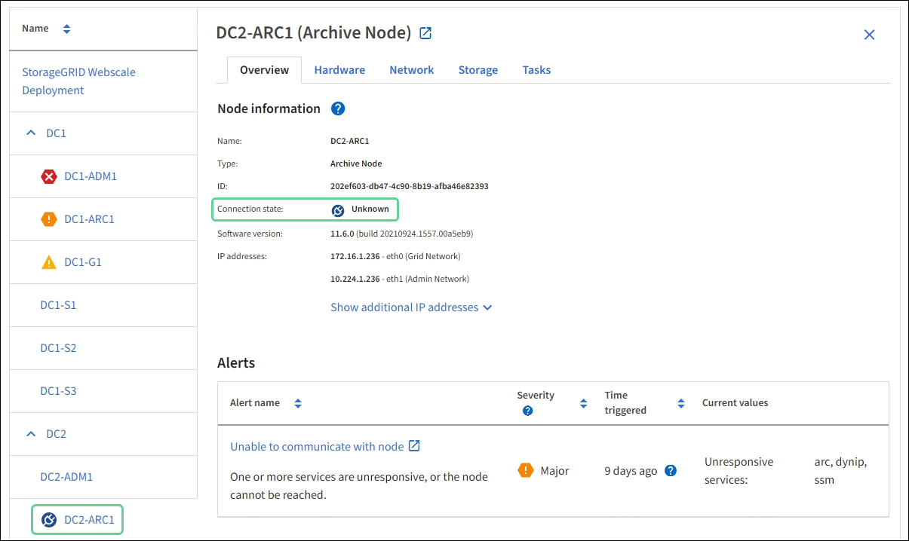

= 노드 연결 상태를 모니터링합니다
:icons: font
:imagesdir: ../media/

[role="lead"]
하나 이상의 노드가 그리드에서 분리되면 중요한 StorageGRID 작업이 영향을 받을 수 있습니다. 노드 연결 상태를 모니터링하고 문제를 즉시 해결해야 합니다.

.무엇을 &#8217;필요로 할거야
* 를 사용하여 그리드 관리자에 로그인해야 합니다 xref:../admin/web-browser-requirements.adoc[지원되는 웹 브라우저].

노드는 다음 세 가지 연결 상태 중 하나일 수 있습니다.

* * 연결되지 않음 - 알 수 없음 * image:../media/icon_alarm_blue_unknown.png["파란색 물음표 아이콘"]: 알 수 없는 이유로 노드가 그리드에 연결되어 있지 않습니다. 예를 들어, 노드 간 네트워크 연결이 끊어지거나 전원이 꺼졌습니다. 노드 * 와 통신할 수 없음 알림도 트리거될 수 있습니다. 다른 알림도 활성 상태일 수 있습니다. 이 상황은 즉각적인 주의가 필요합니다.
+

NOTE: 관리되는 종료 작업 중에 노드가 알 수 없음으로 나타날 수 있습니다. 이러한 경우 알 수 없음 상태를 무시할 수 있습니다.

* * 연결되지 않음 - 관리 중단 * image:../media/icon_alarm_gray_administratively_down.png["회색 물음표 아이콘"]: 노드가 예상 이유로 그리드에 연결되어 있지 않습니다. 예를 들어, 노드의 노드 또는 서비스가 정상적으로 종료되었거나 노드가 재부팅 중이거나 소프트웨어가 업그레이드 중입니다. 하나 이상의 경고가 활성 상태일 수도 있습니다.
* * 연결됨 * image:../media/icon_alert_green_checkmark.png["아이콘 경고 녹색 확인 표시"]: 노드가 그리드에 연결되어 있습니다.

.단계
. 대시보드의 상태 패널에 파란색 또는 회색 아이콘이 나타나면 아이콘을 클릭하거나 * Grid details * 를 클릭합니다. (파란색 또는 회색 아이콘과 * Grid details * 링크는 그리드에서 하나 이상의 노드가 분리된 경우에만 나타납니다.)
+
노드 트리의 첫 번째 파란색 노드에 대한 개요 페이지가 나타납니다. 파란색 노드가 없으면 트리의 첫 번째 회색 노드에 대한 개요 페이지가 나타납니다.

+
이 예에서는 DC1-S3라는 스토리지 노드에 파란색 아이콘이 있습니다. 노드 정보 패널의 * 연결 상태 * 는 * 알 수 없음 * 이고 * 노드 * 와 통신할 수 없음 경고가 활성화됩니다. 이 알림은 하나 이상의 서비스가 응답하지 않거나 노드에 연결할 수 없음을 나타냅니다.

+

. 노드에 파란색 아이콘이 있는 경우 다음 단계를 수행하십시오.
+
.. 표에서 각 경고를 선택하고 권장 조치를 따릅니다.
+
예를 들어, 노드의 호스트를 중지하거나 다시 시작한 서비스를 다시 시작해야 할 수 있습니다.

.. 노드를 다시 온라인 상태로 전환할 수 없는 경우 기술 지원 팀에 문의하십시오.

. 노드에 회색 아이콘이 있는 경우 다음 단계를 수행합니다.
+
회색 노드는 유지보수 절차 중에 예상되며 하나 이상의 경고와 연결될 수 있습니다. 이 문제의 근원적 근거를 토대로 이러한 "관리적 중단" 노드는 대개 아무런 개입 없이 온라인 상태로 돌아갑니다.

+
.. Alerts 섹션을 검토하고 이 노드에 영향을 주는 알림이 있는지 확인합니다.
.. 하나 이상의 경고가 활성화된 경우 표에서 각 경고를 선택하고 권장 조치를 따릅니다.
.. 노드를 다시 온라인 상태로 전환할 수 없는 경우 기술 지원 팀에 문의하십시오.

xref:alerts-reference.adoc[경고 참조]

xref:../maintain/index.adoc[복구 및 유지 관리]
