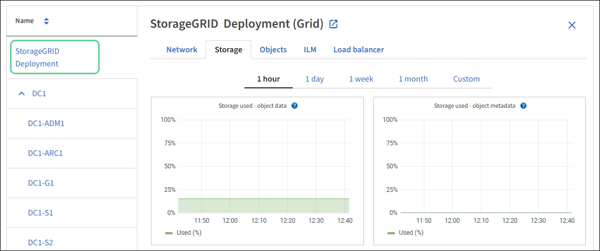

= 노드 페이지를 봅니다
:icons: font
:imagesdir: ../media/

[role="lead"]
대시보드에서 제공하는 것보다 StorageGRID 시스템에 대한 자세한 정보가 필요한 경우 노드 페이지를 사용하여 전체 그리드, 그리드의 각 사이트 및 사이트의 각 노드에 대한 메트릭을 볼 수 있습니다.

image::../media/nodes_table.png[노드 메뉴]

노드 테이블에는 StorageGRID 시스템의 모든 사이트 및 노드가 나열됩니다. 각 노드에 대한 요약 정보가 표시됩니다. 노드에 활성 경고가 있는 경우 노드 이름 옆에 아이콘이 표시됩니다. 노드가 연결되어 있고 활성 경고가 없는 경우 아이콘이 표시되지 않습니다.

== 연결 상태 아이콘

* * 연결되지 않음 - 알 수 없음 * image:../media/icon_alarm_blue_unknown.png["파란색 물음표 아이콘"]: 알 수 없는 이유로 노드가 그리드에 연결되어 있지 않습니다. 예를 들어, 노드 간 네트워크 연결이 끊어지거나 전원이 꺼졌습니다. 노드 * 와 통신할 수 없음 알림도 트리거될 수 있습니다. 다른 알림도 활성 상태일 수 있습니다. 이 상황은 즉각적인 주의가 필요합니다.
+

NOTE: 관리되는 종료 작업 중에 노드가 알 수 없음으로 나타날 수 있습니다. 이러한 경우 알 수 없음 상태를 무시할 수 있습니다.

* * 연결되지 않음 - 관리 중단 * image:../media/icon_alarm_gray_administratively_down.png["회색 물음표 아이콘"]: 노드가 예상 이유로 그리드에 연결되어 있지 않습니다. 예를 들어, 노드의 노드 또는 서비스가 정상적으로 종료되었거나 노드가 재부팅 중이거나 소프트웨어가 업그레이드 중입니다. 하나 이상의 경고가 활성 상태일 수도 있습니다.

노드가 그리드에서 분리되면 기본 경고가 있을 수 있지만 ""연결되지 않음" 아이콘만 나타납니다. 노드의 활성 알림을 보려면 노드를 선택합니다.

== 경고 아이콘

노드에 대한 활성 경고가 있는 경우 노드 이름 옆에 다음 아이콘 중 하나가 표시됩니다.

* * 심각 * image:../media/icon_alert_red_critical.png["아이콘 경고 빨간색 위험"]: StorageGRID 노드나 서비스의 정상적인 작동을 중지해 온 비정상적인 조건이 존재합니다. 기본 문제를 즉시 해결해야 합니다. 문제가 해결되지 않으면 서비스가 중단되거나 데이터가 손실될 수 있습니다.
* * 주 * image:../media/icon_alert_orange_major.png["아이콘 경고 주황색 주"]: 현재 작업에 영향을 미치거나 위험 경고에 대한 임계값에 근접한 비정상적인 상태가 존재합니다. StorageGRID 노드나 서비스의 정상 작동을 비정상적인 상태로 중지하지 않도록 주요 경고를 조사하고 모든 기본 문제를 해결해야 합니다.
* * 보조 * image:../media/icon_alert_yellow_minor.png["아이콘 경고 노란색이 경미합니다"]: 시스템이 정상적으로 작동하지만 시스템이 계속 작동할 경우 시스템 기능에 영향을 줄 수 있는 비정상적인 상태가 존재합니다. 보다 심각한 문제를 초래하지 않도록 자체적으로 명확하지 않은 사소한 경고를 모니터링하고 해결해야 합니다.

== 시스템, 사이트 또는 노드에 대한 세부 정보 보기

사용 가능한 정보를 보려면 다음과 같이 그리드, 사이트 또는 노드의 이름을 선택합니다.

* 전체 StorageGRID 시스템에 대한 통계 요약을 보려면 그리드 이름을 선택합니다.
* 특정 데이터 센터 사이트를 선택하면 해당 사이트의 모든 노드에 대한 통계 요약을 볼 수 있습니다.
* 특정 노드를 선택하여 해당 노드에 대한 세부 정보를 봅니다.

