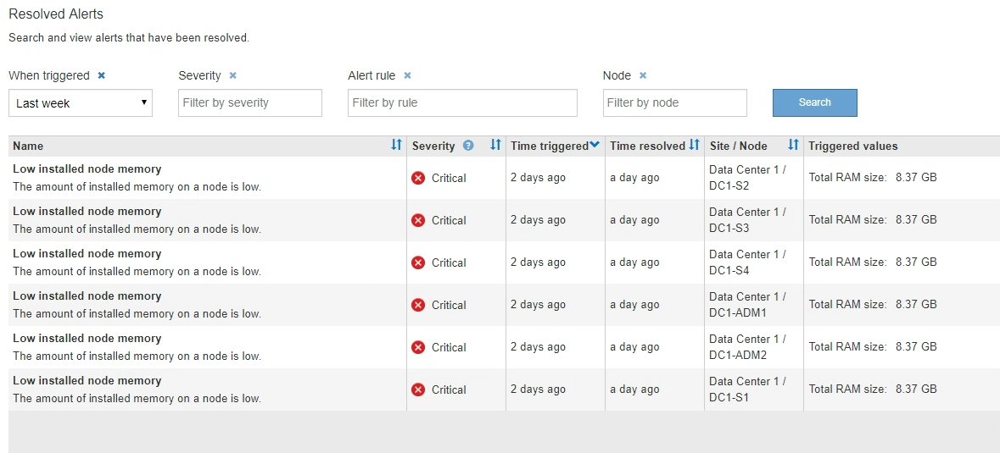

= 해결된 경고를 봅니다
:allow-uri-read: 
:icons: font
:imagesdir: ../media/

[role="lead"]
해결된 알림의 기록을 검색하고 볼 수 있습니다.

.필요한 것
* 를 사용하여 그리드 관리자에 로그인해야 합니다 xref:../admin/web-browser-requirements.adoc[지원되는 웹 브라우저].

.단계
. 해결된 알림을 보려면 다음 중 하나를 수행합니다.
+
** 대시보드의 상태 패널에서 * Recently Resolved alerts * 를 클릭합니다.
+
최근 해결된 경고 * 링크는 지난 주 동안 하나 이상의 경고가 트리거되어 현재 해결된 경우에만 나타납니다.

** alerts * > * Resolved * 를 선택합니다. 해결된 경고 페이지가 나타납니다. 기본적으로 지난 주에 트리거된 해결된 알림이 표시되고 가장 최근에 트리거된 알림이 먼저 표시됩니다. 이 페이지의 경고는 이전에 현재 알림 페이지 또는 이메일 알림에 표시되었습니다.
+

. 표의 정보를 검토합니다.
+
|===
| 열 머리글 | 설명 

 a| 
이름
 a| 
알림의 이름과 설명입니다.

 a| 
심각도입니다
 a| 
알림의 심각도입니다.

** * 심각 * image:../media/icon_alert_red_critical.png["아이콘 경고 빨간색 위험"]: StorageGRID 노드나 서비스의 정상적인 작동을 중지해 온 비정상적인 조건이 존재합니다. 기본 문제를 즉시 해결해야 합니다. 문제가 해결되지 않으면 서비스가 중단되거나 데이터가 손실될 수 있습니다.
** * 주 * image:../media/icon_alert_orange_major.png["아이콘 경고 주황색 주"]: 현재 작업에 영향을 미치거나 위험 경고에 대한 임계값에 근접한 비정상적인 상태가 존재합니다. StorageGRID 노드나 서비스의 정상 작동을 비정상적인 상태로 중지하지 않도록 주요 경고를 조사하고 모든 기본 문제를 해결해야 합니다.
** * 보조 * image:../media/icon_alert_yellow_minor.png["아이콘 경고 노란색이 경미합니다"]: 시스템이 정상적으로 작동하지만 시스템이 계속 작동할 경우 시스템 기능에 영향을 줄 수 있는 비정상적인 상태가 존재합니다. 보다 심각한 문제를 초래하지 않도록 자체적으로 명확하지 않은 사소한 경고를 모니터링하고 해결해야 합니다.

 a| 
시간 트리거됨
 a| 
알림이 트리거된 지 얼마 전입니다.

 a| 
시간이 해결되었습니다
 a| 
알림이 해결된 지 얼마 전입니다.

 a| 
사이트/노드
 a| 
알림이 발생한 사이트 및 노드의 이름입니다.

 a| 
트리거된 값
 a| 
알림이 트리거된 메트릭 값입니다. 일부 경고의 경우 경고를 이해하고 조사하는 데 도움이 되는 추가 값이 표시됩니다. 예를 들어 * Low object data storage * 알림에 표시되는 값에는 사용된 디스크 공간의 비율, 총 디스크 공간 및 사용된 디스크 공간의 양이 포함됩니다.

|===
. 해결된 알림의 전체 목록을 정렬하려면 위쪽/아래쪽 화살표를 클릭합니다 image:../media/icon_alert_sort_column.png["정렬 화살표 아이콘"] 각 열 머리글에서.
+
예를 들어, 특정 노드에 영향을 미치는 경고를 보려면 * 사이트/노드 * 별로 해결된 경고를 정렬할 수 있습니다.

. 필요에 따라 테이블 상단의 드롭다운 메뉴를 사용하여 해결된 경고 목록을 필터링합니다.
+
.. 트리거된 시간 * 드롭다운 메뉴에서 기간을 선택하여 트리거된 기간에 따라 해결된 경고를 표시합니다.
+
다음 기간 내에 트리거된 알림을 검색할 수 있습니다.

+
*** 지난 시간
*** 마지막 날
*** 지난 주(기본 보기)
*** 지난 달
*** 모든 기간
*** 사용자 지정(기간의 시작 날짜와 종료 날짜를 지정할 수 있음)

.. 심각도* 드롭다운 메뉴에서 하나 이상의 심각도를 선택하여 특정 심각도에 대한 해결된 경고를 필터링합니다.
.. 경고 규칙 * 드롭다운 메뉴에서 하나 이상의 기본 또는 사용자 지정 경고 규칙을 선택하여 특정 경고 규칙과 관련된 해결된 경고를 필터링합니다.
.. 노드 * 드롭다운 메뉴에서 하나 이상의 노드를 선택하여 특정 노드와 관련된 해결된 경고를 필터링합니다.
.. 검색 * 을 클릭합니다.

. 해결된 특정 경고에 대한 세부 정보를 보려면 테이블에서 경고를 선택합니다.
+
경고에 대한 대화 상자가 나타납니다. 을 참조하십시오 xref:viewing-specific-alert.adoc[특정 경고를 봅니다].

