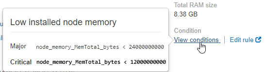

= 특정 경고를 봅니다
:allow-uri-read: 
:icons: font
:imagesdir: ../media/

[role="lead"]
현재 StorageGRID 시스템에 영향을 미치는 알림 또는 해결된 알림에 대한 자세한 정보를 볼 수 있습니다. 세부 정보에는 권장 수정 조치, 알림이 트리거된 시간, 이 경고와 관련된 메트릭의 현재 값이 포함됩니다.

필요에 따라 할 수 있습니다 xref:silencing-alert-notifications.adoc[현재 경고를 해제합니다] 또는 xref:editing-alert-rules.adoc[알림 규칙을 업데이트합니다].

.무엇을 &#8217;필요로 할거야
* 를 사용하여 그리드 관리자에 로그인했습니다 xref:../admin/web-browser-requirements.adoc[지원되는 웹 브라우저].

.단계
. 현재 또는 해결된 알림을 표시할지 여부에 따라 다음 중 하나를 수행합니다.
+
[cols="1a,2a"]
|===
| 열 머리글 | 설명 

 a| 
현재 경고
 a| 
** 대시보드의 상태 패널에서 * Current alerts * 링크를 클릭합니다. 이 링크는 현재 하나 이상의 경고가 활성화된 경우에만 나타납니다. 현재 경고가 없거나 모든 현재 경고가 해제된 경우 이 링크가 표시되지 않습니다.
** alerts * > * current * 를 선택합니다.
** nodes * 페이지에서 경고 아이콘이 있는 노드의 * Overview * 탭을 선택합니다. 그런 다음 알림 섹션에서 알림 이름을 클릭합니다.

 a| 
해결된 경고
 a| 
** 대시보드의 상태 패널에서 * Recently Resolved alerts * 링크를 클릭합니다. (이 링크는 지난 주 동안 하나 이상의 경고가 트리거되어 현재 해결된 경우에만 나타납니다. 지난 주에 트리거되어 해결된 알림이 없으면 이 링크가 표시되지 않습니다.)
** alerts * > * Resolved * 를 선택합니다.

|===
. 필요에 따라 알림 그룹을 확장한 다음 확인할 알림을 선택합니다.
+

NOTE: 알림 그룹의 제목이 아닌 알림을 선택합니다.

+
image::../media/alerts_page_select_alert.png[경고 페이지 경고를 선택합니다]

+
선택한 알림에 대한 세부 정보를 제공하는 대화 상자가 나타납니다.

+
image::../media/alerts_page_details_modal.png[경고 페이지 세부 정보 모달]

. 경고 세부 정보를 검토합니다.
+
[cols="1a,2a"]
|===
| 정보 | 설명 

 a| 
제목 _
 a| 
알림의 이름입니다.

 a| 
_첫 번째 단락 _
 a| 
알림에 대한 설명입니다.

 a| 
권장 조치
 a| 
이 알림에 대한 권장 조치입니다.

 a| 
시간 트리거됨
 a| 
현지 시간 및 UTC에서 알림이 트리거된 날짜 및 시간입니다.

 a| 
시간이 해결되었습니다
 a| 
해결된 알림의 경우 현지 시간 및 UTC에서 알림이 해결된 날짜 및 시간입니다.

 a| 
상태
 a| 
알림의 상태: 활성, 해제 또는 해결됨

 a| 
사이트/노드
 a| 
알림의 영향을 받는 사이트 및 노드의 이름입니다.

 a| 
심각도입니다
 a| 
알림의 심각도입니다.

** * 심각 * image:../media/icon_alert_red_critical.png["아이콘 경고 빨간색 위험"]: StorageGRID 노드나 서비스의 정상적인 작동을 중지해 온 비정상적인 조건이 존재합니다. 기본 문제를 즉시 해결해야 합니다. 문제가 해결되지 않으면 서비스가 중단되거나 데이터가 손실될 수 있습니다.
** * 주 * image:../media/icon_alert_orange_major.png["아이콘 경고 주황색 주"]: 현재 작업에 영향을 미치거나 위험 경고에 대한 임계값에 근접한 비정상적인 상태가 존재합니다. StorageGRID 노드나 서비스의 정상 작동을 비정상적인 상태로 중지하지 않도록 주요 경고를 조사하고 모든 기본 문제를 해결해야 합니다.
** * 보조 * image:../media/icon_alert_yellow_minor.png["아이콘 경고 노란색이 경미합니다"]: 시스템이 정상적으로 작동하지만 시스템이 계속 작동할 경우 시스템 기능에 영향을 줄 수 있는 비정상적인 상태가 존재합니다. 보다 심각한 문제를 초래하지 않도록 자체적으로 명확하지 않은 사소한 경고를 모니터링하고 해결해야 합니다.

 a| 
_데이터 값 _
 a| 
이 알림에 대한 메트릭의 현재 값입니다. 일부 경고의 경우 경고를 이해하고 조사하는 데 도움이 되는 추가 값이 표시됩니다. 예를 들어, * Low Metadata Storage * 경고에 대해 표시되는 값에는 사용된 디스크 공간의 비율, 총 디스크 공간 및 사용된 디스크 공간의 양이 포함됩니다.

|===
. 선택적으로 * 이 경고 해제 * 를 클릭하여 이 경고가 트리거되도록 한 경고 규칙을 해제합니다.
+
알림 규칙을 해제하려면 알림 관리 또는 루트 액세스 권한이 있어야 합니다.

+

IMPORTANT: 경고 규칙을 해제할 때는 주의하십시오. 경고 규칙이 해제된 경우 중요한 작업이 완료되지 못하도록 하기 전까지는 기본 문제를 감지하지 못할 수 있습니다.

. 알림 규칙의 현재 조건을 보려면:
+
.. 경고 세부 정보에서 * 조건 보기 * 를 클릭합니다.
+
정의된 각 심각도에 대한 Prometheus 표현식이 나열된 팝업이 나타납니다.

+

.. 팝업을 닫으려면 팝업 외부의 아무 곳이나 클릭합니다.

. 필요에 따라 * 규칙 편집 * 을 클릭하여 이 경고가 트리거되도록 한 경고 규칙을 편집합니다.
+
알림 규칙을 편집하려면 알림 관리 또는 루트 액세스 권한이 있어야 합니다.

+

IMPORTANT: 알림 규칙을 편집하기로 결정할 때는 주의해야 합니다. 트리거 값을 변경하는 경우 중요한 작업이 완료되지 못할 때까지 기본 문제를 감지하지 못할 수 있습니다.

. 경고 세부 정보를 닫으려면 * 닫기 * 를 클릭합니다.

