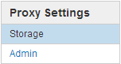

= 보안 설정을 구성합니다
:allow-uri-read: 
:icons: font
:imagesdir: ../media/

[role="lead"]
그리드 관리자에서 다양한 보안 설정을 구성하여 StorageGRID 시스템을 보호할 수 있습니다.

== 인증서

StorageGRID는 두 가지 유형의 보안 인증서를 사용합니다.

* HTTPS 연결을 사용할 때는 서버 인증서가 필요합니다. 서버 인증서는 클라이언트와 서버 간의 보안 연결을 설정하고, 클라이언트에 대한 서버 ID를 인증하고, 데이터에 대한 보안 통신 경로를 제공하는 데 사용됩니다. 서버와 클라이언트마다 인증서의 복사본이 있습니다.
* 클라이언트 인증서는 서버에 대한 클라이언트 또는 사용자 ID를 인증하여 암호만 사용하는 것보다 더 안전한 인증을 제공합니다. 클라이언트 인증서는 데이터를 암호화하지 않습니다.

구성 * > * 보안 * > * 인증서 * 페이지에서 모든 StorageGRID 인증서를 볼 수 있습니다.

== 키 관리 서버

하나 이상의 외부 키 관리 서버(KMS)를 구성하여 StorageGRID 서비스 및 스토리지 어플라이언스에 암호화 키를 제공할 수 있습니다. 각 KMS 또는 KMS 클러스터는 KMIP(Key Management Interoperability Protocol)를 사용하여 관련 StorageGRID 사이트의 어플라이언스 노드에 암호화 키를 제공합니다. 키 관리 서버를 사용하면 어플라이언스가 데이터 센터에서 제거되더라도 StorageGRID 데이터를 보호할 수 있습니다. 어플라이언스 볼륨이 암호화된 후에는 노드에서 KMS와 통신할 수 없는 한 어플라이언스의 데이터에 액세스할 수 없습니다.

NOTE: 암호화 키 관리를 사용하려면 어플라이언스를 그리드에 추가하기 전에 설치 중에 각 어플라이언스에 대해 * 노드 암호화 * 설정을 활성화해야 합니다.

== 프록시 설정

S3 플랫폼 서비스 또는 클라우드 스토리지 풀을 사용하는 경우 스토리지 노드와 외부 S3 엔드포인트 간에 투명하지 않은 프록시 서버를 구성할 수 있습니다. HTTPS 또는 HTTP를 사용하여 AutoSupport 메시지를 보내는 경우 관리자 노드와 기술 지원 간에 투명하지 않은 프록시 서버를 구성할 수 있습니다.

== 신뢰할 수 없는 클라이언트 네트워크

클라이언트 네트워크를 사용하는 경우 각 노드의 클라이언트 네트워크를 신뢰할 수 없도록 지정하여 악의적인 공격으로부터 StorageGRID를 보호할 수 있습니다. 노드의 클라이언트 네트워크를 신뢰할 수 없는 경우 노드는 로드 밸런서 끝점으로 명시적으로 구성된 포트의 인바운드 연결만 허용합니다.

예를 들어, 게이트웨이 노드가 HTTPS S3 요청을 제외한 클라이언트 네트워크의 모든 인바운드 트래픽을 거부하도록 할 수 있습니다. 또는 클라이언트 네트워크의 해당 스토리지 노드에 대한 인바운드 연결을 방지하면서 스토리지 노드에서 아웃바운드 S3 플랫폼 서비스 트래픽을 활성화할 수 있습니다.

.관련 정보
* xref:../admin/index.adoc[StorageGRID 관리]
* xref:managing-tenants-and-client-connections.adoc[테넌트 및 클라이언트 연결을 관리합니다]

