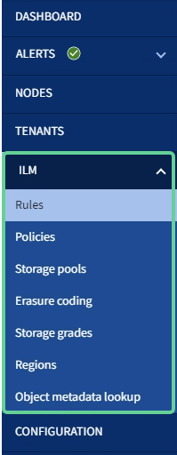

= Grid Manager를 살펴봅니다
:icons: font
:imagesdir: ../media/

[role="lead"]
그리드 관리자는 StorageGRID 시스템을 구성, 관리 및 모니터링할 수 있는 브라우저 기반 그래픽 인터페이스입니다.

Grid Manager에 로그인하면 관리 노드에 연결됩니다. 각 StorageGRID 시스템에는 1개의 기본 관리 노드와 1차 관리자가 아닌 노드 수가 포함되어 있습니다. 모든 관리 노드에 연결할 수 있으며 각 관리 노드에는 StorageGRID 시스템의 유사한 보기가 표시됩니다.

를 사용하여 그리드 관리자에 액세스할 수 있습니다 xref:../admin/web-browser-requirements.adoc[지원되는 웹 브라우저].

== Grid Manager 대시보드

그리드 관리자에 처음 로그인할 때 대시보드를 사용하여 시스템 활동을 한 눈에 모니터링할 수 있습니다.

대시보드에는 시스템 상태, 스토리지 사용, ILM 프로세스 및 S3 및 Swift 작업에 대한 요약 정보가 포함되어 있습니다.

image::../media/grid_manager_dashboard.png[그리드 관리자의 대시보드]

각 패널의 정보에 대한 설명을 보려면 도움말 아이콘을 클릭하십시오 image:../media/icon_nms_question.png["물음표 아이콘"] 해당 패널용.

.자세한 정보
* xref:../monitor/index.adoc[모니터링하고 문제를 해결합니다]

== 검색 필드

머리글 표시줄의 * 검색 * 필드를 사용하면 그리드 관리자 내의 특정 페이지로 빠르게 이동할 수 있습니다. 예를 들어, KMS(키 관리 서버) 페이지에 액세스하기 위해 * km * 를 입력할 수 있습니다. * 검색 * 을 사용하여 Grid Manager의 측면 표시줄 및 구성, 유지 관리 및 지원 메뉴에서 항목을 찾을 수 있습니다.

== 알림 메뉴

경고 메뉴는 StorageGRID 작동 중에 발생할 수 있는 문제를 감지, 평가 및 해결하는 사용하기 쉬운 인터페이스를 제공합니다.

image::../media/alerts_menu.png[경고 메뉴]

경고 메뉴에서 다음을 수행할 수 있습니다.

* 현재 경고를 검토합니다
* 해결된 경고를 검토합니다
* 알림 알림을 표시하지 않도록 설정을 구성합니다
* 알림을 트리거하는 조건에 대한 경고 규칙을 정의합니다
* 경고 알림을 위한 e-메일 서버를 구성합니다

.자세한 정보
* xref:monitoring-and-managing-alerts.adoc[경고를 모니터링하고 관리합니다]
* xref:../monitor/index.adoc[모니터링하고 문제를 해결합니다]

== 노드 페이지

노드 페이지에는 전체 그리드, 그리드의 각 사이트 및 사이트의 각 노드에 대한 정보가 표시됩니다.

노드 홈 페이지에는 전체 그리드에 대한 결합된 메트릭이 표시됩니다. 특정 사이트 또는 노드에 대한 정보를 보려면 사이트 또는 노드를 선택합니다.

image::../media/nodes_menu.png[노드 페이지 메인]

.자세한 정보
* xref:viewing-nodes-page.adoc[노드 페이지를 봅니다]
* xref:../monitor/index.adoc[모니터링하고 문제를 해결합니다]

== Tenants 페이지

Tenants 페이지에서는 StorageGRID 시스템의 스토리지 테넌트 계정을 만들고 모니터링할 수 있습니다. 객체를 저장 및 검색할 수 있는 사람과 객체를 사용할 수 있는 기능을 지정하려면 하나 이상의 테넌트 계정을 생성해야 합니다.

또한 테넌트 페이지에는 사용된 스토리지 양과 객체 수를 비롯한 각 테넌트의 사용 세부 정보도 제공됩니다. 테넌트를 생성할 때 할당량을 설정하면 해당 할당량이 얼마나 사용되었는지 확인할 수 있습니다.

image::../media/tenants_menu_and_page.png[Tenants 메뉴 및 페이지]

.자세한 정보
* xref:managing-tenants-and-client-connections.adoc[테넌트 및 클라이언트 연결을 관리합니다]
* xref:../admin/index.adoc[StorageGRID 관리]
* xref:../tenant/index.adoc[테넌트 계정을 사용합니다]

== ILM 메뉴

ILM 메뉴를 사용하여 데이터 내구성 및 가용성에 대한 정보 수명 주기 관리(ILM) 규칙 및 정책을 구성할 수 있습니다. 개체 식별자를 입력하여 해당 개체의 메타데이터를 볼 수도 있습니다.

.자세한 정보
* xref:using-information-lifecycle-management.adoc[정보 수명 주기 관리를 사용합니다]
* xref:../ilm/index.adoc[ILM을 사용하여 개체를 관리합니다]

== 구성 메뉴

구성 메뉴를 사용하여 네트워크 설정, 보안 설정, 시스템 설정, 모니터링 옵션 및 액세스 제어 옵션을 지정할 수 있습니다.

image::../media/configuration_menu.png[구성 메뉴]

.자세한 정보
* xref:configuring-network-settings.adoc[네트워크 설정을 구성합니다]
* xref:managing-tenants-and-client-connections.adoc[테넌트 및 클라이언트 연결을 관리합니다]
* xref:reviewing-audit-messages.adoc[감사 메시지를 검토합니다]
* xref:controlling-storagegrid-access.adoc[StorageGRID 액세스를 제어합니다]
* xref:../admin/index.adoc[StorageGRID 관리]
* xref:../monitor/index.adoc[모니터링하고 문제를 해결합니다]
* xref:../audit/index.adoc[감사 로그를 검토합니다]

== 유지 관리 메뉴

유지 관리 메뉴를 사용하면 유지 관리 작업, 시스템 유지 관리 및 네트워크 유지 관리를 수행할 수 있습니다.

image::../media/maintenance_menu.png[유지관리 메뉴 및 페이지]

=== 작업

유지보수 태스크는 다음과 같습니다.

* 사용되지 않는 그리드 노드 및 사이트를 제거하는 운영 중단
* 새 그리드 노드와 사이트를 추가하기 위한 확장 작업.
* 장애가 발생한 노드를 교체하고 데이터를 복원하는 복구 작업
* 개체 존재 여부를 점검하여 개체 데이터의 존재 여부를 확인합니다(정확성은 아님).

=== 시스템

수행할 수 있는 시스템 유지보수 작업은 다음과 같습니다.

* 현재 StorageGRID 라이센스에 대한 세부 정보 검토 또는 새 라이센스 업로드
* 복구 패키지 생성.
* 선택한 어플라이언스에서 SANtricity OS 소프트웨어에 대한 소프트웨어 업그레이드, 핫픽스 및 업데이트를 포함한 StorageGRID 소프트웨어 업데이트 수행

=== 네트워크

수행할 수 있는 네트워크 유지 보수 작업은 다음과 같습니다.

* DNS 서버에 대한 정보 편집
* 그리드 네트워크에서 사용되는 서브넷을 구성합니다.
* NTP 서버에 대한 정보 편집

.자세한 정보
* xref:performing-maintenance-procedures.adoc[유지 관리를 수행합니다]
* xref:downloading-recovery-package.adoc[복구 패키지를 다운로드합니다]
* xref:../expand/index.adoc[그리드를 확장합니다]
* xref:../upgrade/index.adoc[소프트웨어 업그레이드]
* xref:../maintain/index.adoc[복구 및 유지 관리]
* xref:../sg6000/index.adoc[SG6000 스토리지 어플라이언스]
* xref:../sg5700/index.adoc[SG5700 스토리지 어플라이언스]
* xref:../sg5600/index.adoc[SG5600 스토리지 어플라이언스]

== 지원 메뉴

지원 메뉴는 기술 지원 부서에서 시스템을 분석하고 문제를 해결하는 데 도움이 되는 옵션을 제공합니다. Support(지원) 메뉴에는 Tools(도구) 및 Alarms(알람)(레거시)의 두 가지 부분이 있습니다.

image::../media/support_menu.png[지원 메뉴]

=== 도구

지원 메뉴의 도구 섹션에서 다음을 수행할 수 있습니다.

* AutoSupport를 활성화합니다.
* 그리드의 현재 상태에 대해 일련의 진단 점검을 수행합니다.
* 그리드 토폴로지 트리에 액세스하여 그리드 노드, 서비스 및 속성에 대한 자세한 정보를 볼 수 있습니다.
* 로그 파일 및 시스템 데이터를 검색합니다.
* 자세한 메트릭 및 차트를 검토하십시오.
+

IMPORTANT: 메트릭* 옵션에서 사용할 수 있는 도구는 기술 지원 부서에서 사용하도록 설계되었습니다. 이러한 도구 내의 일부 기능 및 메뉴 항목은 의도적으로 작동하지 않습니다.

=== 알람(레거시)

지원 메뉴의 알람(레거시) 섹션에서 현재 알람, 과거 알람 및 전체 알람을 검토하고 사용자 지정 이벤트를 설정하며 레거시 알람 및 AutoSupport에 대한 이메일 알림을 설정할 수 있습니다.

NOTE: 기존 알람 시스템은 계속 지원되지만, 알림 시스템은 상당한 이점을 제공하며 사용이 간편합니다.

.자세한 정보
* xref:storagegrid-architecture-and-network-topology.adoc[StorageGRID 아키텍처 및 네트워크 토폴로지]
* xref:viewing-nodes-page.adoc[StorageGRID 속성]
* xref:using-storagegrid-support-options.adoc[StorageGRID 지원 옵션을 사용합니다]
* xref:../admin/index.adoc[StorageGRID 관리]
* xref:../monitor/index.adoc[모니터링하고 문제를 해결합니다]

== 도움말 메뉴

Help(도움말) 옵션을 사용하면 현재 릴리스 및 API 설명서에 대한 StorageGRID 설명서 센터에 액세스할 수 있습니다. 현재 설치되어 있는 StorageGRID 버전을 확인할 수도 있습니다.

image::../media/help_menu.png[도움말 메뉴]

.자세한 정보
* xref:../admin/index.adoc[StorageGRID 관리]

