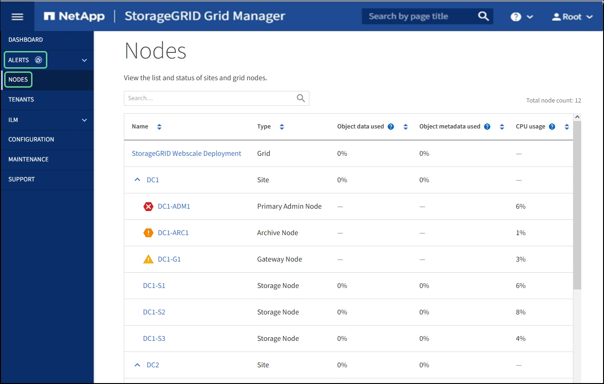

= 노드 페이지를 봅니다
:allow-uri-read: 
:icons: font
:imagesdir: ../media/

[role="lead"]
대시보드에서 제공하는 것보다 StorageGRID 시스템에 대한 자세한 정보가 필요한 경우 노드 페이지를 사용하여 전체 그리드, 그리드의 각 사이트 및 사이트의 각 노드에 대한 메트릭을 볼 수 있습니다.

노드 테이블에는 StorageGRID 시스템의 모든 사이트 및 노드가 나열됩니다. 각 노드에 대한 요약 정보가 표시됩니다. 노드에 활성 경고가 있는 경우 노드 이름 옆에 아이콘이 표시됩니다. 노드가 연결되어 있고 활성 경고가 없는 경우 아이콘이 표시되지 않습니다.

== 연결 상태 아이콘

* * 연결되지 않음 - 알 수 없음 * image:../media/icon_alarm_blue_unknown.png["파란색 물음표 아이콘"]: 알 수 없는 이유로 노드가 그리드에 연결되어 있지 않습니다. 예를 들어, 노드 간 네트워크 연결이 끊어지거나 전원이 꺼졌습니다. 노드 * 와 통신할 수 없음 알림도 트리거될 수 있습니다. 다른 알림도 활성 상태일 수 있습니다. 이 상황은 즉각적인 주의가 필요합니다.
+

NOTE: 관리되는 종료 작업 중에 노드가 알 수 없음으로 나타날 수 있습니다. 이러한 경우 알 수 없음 상태를 무시할 수 있습니다.

* * 연결되지 않음 - 관리 중단 * image:../media/icon_alarm_gray_administratively_down.png["회색 물음표 아이콘"]: 노드가 예상 이유로 그리드에 연결되어 있지 않습니다. 예를 들어, 노드의 노드 또는 서비스가 정상적으로 종료되었거나 노드가 재부팅 중이거나 소프트웨어가 업그레이드 중입니다. 하나 이상의 경고가 활성 상태일 수도 있습니다.

노드가 그리드에서 분리되면 기본 경고가 있을 수 있지만 ""연결되지 않음" 아이콘만 나타납니다. 노드의 활성 알림을 보려면 노드를 선택합니다.

== 경고 아이콘

노드에 대한 활성 경고가 있는 경우 노드 이름 옆에 다음 아이콘 중 하나가 표시됩니다.

* * 심각 * image:../media/icon_alert_red_critical.png["아이콘 경고 빨간색 위험"]: StorageGRID 노드나 서비스의 정상적인 작동을 중지해 온 비정상적인 조건이 존재합니다. 기본 문제를 즉시 해결해야 합니다. 문제가 해결되지 않으면 서비스가 중단되거나 데이터가 손실될 수 있습니다.
* * 주 * image:../media/icon_alert_orange_major.png["아이콘 경고 주황색 주"]: 현재 작업에 영향을 미치거나 위험 경고에 대한 임계값에 근접한 비정상적인 상태가 존재합니다. StorageGRID 노드나 서비스의 정상 작동을 비정상적인 상태로 중지하지 않도록 주요 경고를 조사하고 모든 기본 문제를 해결해야 합니다.
* * 보조 * image:../media/icon_alert_yellow_minor.png["아이콘 경고 노란색이 경미합니다"]: 시스템이 정상적으로 작동하지만 시스템이 계속 작동할 경우 시스템 기능에 영향을 줄 수 있는 비정상적인 상태가 존재합니다. 보다 심각한 문제를 초래하지 않도록 자체적으로 명확하지 않은 사소한 경고를 모니터링하고 해결해야 합니다.

== 시스템, 사이트 또는 노드에 대한 세부 정보입니다

사용 가능한 정보를 보려면 다음과 같이 그리드, 사이트 또는 노드의 이름을 선택합니다.

* 전체 StorageGRID 시스템에 대한 통계 요약을 보려면 그리드 이름을 선택합니다. (스크린샷은 StorageGRID 배포라는 시스템을 보여 줍니다.)
* 특정 데이터 센터 사이트를 선택하면 해당 사이트의 모든 노드에 대한 통계 요약을 볼 수 있습니다.
* 특정 노드를 선택하여 해당 노드에 대한 세부 정보를 봅니다.

== 노드 페이지의 탭입니다

노드 페이지 맨 위의 탭은 왼쪽의 트리에서 선택한 항목을 기반으로 합니다.

[cols="1a,2a,1a"]
|===
| 탭 이름 | 설명 | 에 포함 

 a| 
개요
 a| 
* 각 노드에 대한 기본 정보를 제공합니다.
* 노드에 영향을 주는 활성 경고를 표시합니다.

 a| 
모든 노드

 a| 
하드웨어
 a| 
* 각 노드의 CPU 사용률 및 메모리 사용량을 표시합니다
* 어플라이언스 노드의 경우 에 추가 하드웨어 정보가 나와 있습니다.

 a| 
모든 노드

 a| 
네트워크
 a| 
네트워크 인터페이스를 통해 수신 및 전송된 네트워크 트래픽을 보여 주는 그래프를 표시합니다. 단일 노드의 보기에는 노드에 대한 추가 정보가 표시됩니다.
 a| 
모든 노드, 각 사이트 및 전체 그리드

 a| 
스토리지
 a| 
* 각 노드의 디스크 디바이스 및 볼륨에 대한 자세한 내용은 에 나와 있습니다.
* 스토리지 노드, 각 사이트 및 전체 그리드에는 시간에 따라 사용된 오브젝트 데이터 스토리지 및 메타데이터 스토리지를 보여 주는 그래프가 포함됩니다.

 a| 
모든 노드, 각 사이트 및 전체 그리드

 a| 
오브젝트
 a| 
* S3, Swift 수집 및 검색 속도에 대한 정보를 제공합니다.
* 스토리지 노드의 경우 메타데이터 저장소 쿼리 및 백그라운드 확인에 대한 개체 수와 정보를 제공합니다.

 a| 
스토리지 노드, 각 사이트 및 전체 그리드

 a| 
ILM을 참조하십시오
 a| 
ILM(정보 수명 주기 관리) 작업에 대한 정보를 제공합니다.

* 스토리지 노드의 경우, 삭제 코딩 개체에 대한 ILM 평가 및 백그라운드 검증에 대한 세부 정보를 제공합니다.
* 각 사이트 및 전체 그리드에 대해 시간의 경과에 따른 ILM 대기열 그래프를 표시합니다.
* 전체 그리드에서 는 모든 개체에 대한 전체 ILM 스캔을 완료하는 데 필요한 예상 시간을 제공합니다.

 a| 
스토리지 노드, 각 사이트 및 전체 그리드

 a| 
로드 밸런서
 a| 
부하 분산 서비스와 관련된 성능 및 진단 그래프를 포함합니다.

* 각 사이트에 대해 해당 사이트의 모든 노드에 대한 통계를 집계한 요약을 제공합니다.
* 전체 그리드에서 는 모든 사이트에 대한 통계를 집계한 요약을 제공합니다.

 a| 
관리 노드 및 게이트웨이 노드, 각 사이트 및 전체 그리드

 a| 
플랫폼 서비스
 a| 
사이트의 S3 플랫폼 서비스 작업에 대한 정보를 제공합니다.
 a| 
있습니다

 a| 
SANtricity 시스템 관리자
 a| 
SANtricity 시스템 관리자에 대한 액세스를 제공합니다. SANtricity 시스템 관리자는 스토리지 컨트롤러에 대한 하드웨어 진단 및 환경 정보와 드라이브 관련 문제를 검토할 수 있습니다.
 a| 
스토리지 어플라이언스 노드

* 참고 *: 스토리지 어플라이언스의 컨트롤러 펌웨어가 8.70 이전 버전인 경우 SANtricity 시스템 관리자 탭이 나타나지 않습니다.

|===

== Prometheus 측정 지표

관리 노드의 Prometheus 서비스는 모든 노드의 서비스에서 시계열 메트릭을 수집합니다.

Prometheus에서 수집한 메트릭은 Grid Manager의 여러 위치에서 사용됩니다.

* * 노드 페이지 *: 노드 페이지에서 사용할 수 있는 탭의 그래프와 차트 Grafana 시각화 도구를 사용하여 Prometheus에서 수집한 시계열 메트릭을 표시합니다. Grafana는 시계열 데이터를 그래프 및 차트 형식으로 표시하며, Prometheus는 백엔드 데이터 소스로 사용됩니다.
+
image::../media/nodes_page_network_traffic_graph.png[Prometheus 그래프]

* * 알림 *: Prometheus 메트릭을 사용하는 알림 규칙 조건이 true로 평가되면 특정 심각도 수준에서 경고가 트리거됩니다.
* * 그리드 관리 API *: 사용자 지정 경고 규칙이나 외부 자동화 도구에서 Prometheus 메트릭을 사용하여 StorageGRID 시스템을 모니터링할 수 있습니다. Grid Management API에서 Prometheus 메트릭의 전체 목록을 확인할 수 있습니다. (Grid Manager 상단에서 도움말 아이콘을 선택하고 * API Documentation * > * metrics * 를 선택합니다.) 1,000개 이상의 메트릭을 사용할 수 있지만 가장 중요한 StorageGRID 작업을 모니터링하는 데 상대적으로 적은 수의 메트릭만 필요합니다.
+

NOTE: 이름에 _private_이 포함된 메트릭은 내부 전용이며 StorageGRID 릴리스 간에 예고 없이 변경될 수 있습니다.

* 지원 * > * 도구 * > * 진단 * 페이지 및 * 지원 * > * 도구 * > * 메트릭 * 페이지: 이 페이지는 주로 기술 지원 부서에서 사용하기 위한 것으로 Prometheus 메트릭의 값을 사용하는 다양한 도구와 차트를 제공합니다.
+

NOTE: 메트릭 페이지의 일부 기능 및 메뉴 항목은 의도적으로 작동하지 않으며 변경될 수 있습니다.

== StorageGRID 속성

속성 StorageGRID 시스템의 여러 기능에 대한 값 및 상태를 보고합니다. 특성 값은 각 그리드 노드, 각 사이트 및 전체 그리드에 대해 사용할 수 있습니다.

StorageGRID 속성은 그리드 관리자의 여러 위치에서 사용됩니다.

* * 노드 페이지 *: 노드 페이지에 표시되는 대부분의 값은 StorageGRID 속성입니다. (Prometheus 메트릭도 노드 페이지에도 표시됩니다.)
* * 알람 *: 속성이 정의된 임계값에 도달하면 StorageGRID 알람(레거시 시스템)이 특정 심각도 수준에서 트리거됩니다.
* * 그리드 토폴로지 트리 *: 속성 값은 그리드 토폴로지 트리(* 지원 * > * 도구 * > * 그리드 토폴로지 *)에 표시됩니다.
* * 이벤트 *: 시스템 이벤트는 네트워크 오류와 같은 오류를 포함하여 특정 특성에 노드에 대한 오류 또는 오류 조건이 기록될 때 발생합니다.

=== 속성 값

속성은 최선의 노력을 바탕으로 보고되며 대략 정확합니다. 서비스 충돌 또는 그리드 노드 장애 및 재생성과 같은 일부 상황에서는 특성 업데이트가 손실될 수 있습니다.

또한 전파 지연으로 인해 속성 보고가 느려질 수 있습니다. 대부분의 속성에 대해 업데이트된 값은 고정된 간격으로 StorageGRID 시스템으로 전송됩니다. 시스템에서 업데이트가 표시되기까지 몇 분이 걸릴 수 있으며, 둘 이상의 특성이 동시에 변경되는 경우 약간 다른 시간에 보고할 수 있습니다.

.관련 정보
* xref:../monitor/index.adoc[모니터링하고 문제를 해결합니다]
* xref:monitoring-and-managing-alerts.adoc[경고를 모니터링하고 관리합니다]
* xref:using-storagegrid-support-options.adoc[StorageGRID 지원 옵션을 사용합니다]

