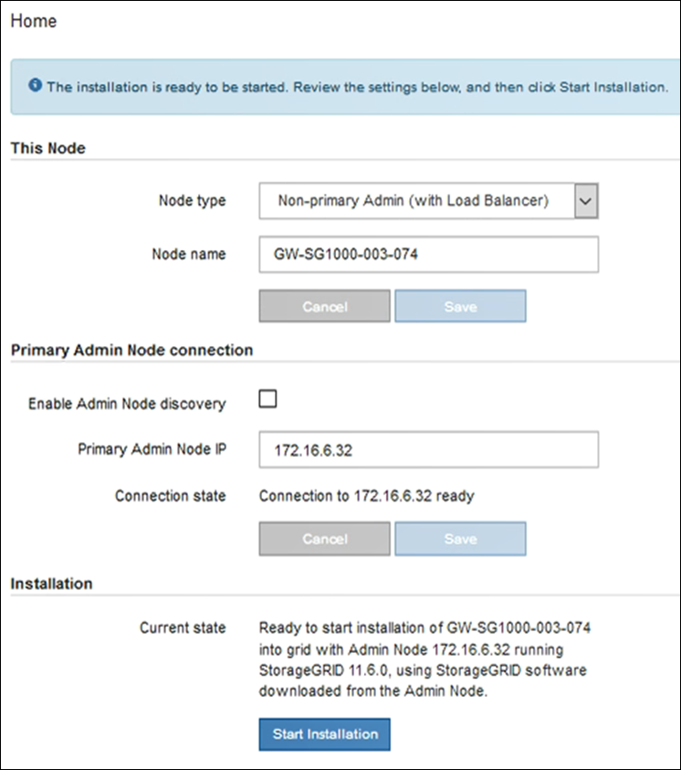

= 서비스 어플라이언스를 게이트웨이 또는 비기본 관리 노드로 배포합니다
:allow-uri-read: 
:icons: font
:imagesdir: ../media/

[role="lead"]
서비스 어플라이언스를 게이트웨이 노드 또는 비 기본 관리 노드로 배포하는 경우 어플라이언스에 포함된 StorageGRID 어플라이언스 설치 프로그램을 사용합니다.

.무엇을 &#8217;필요로 할거야
* 이 제품은 랙 또는 캐비닛에 설치되었고 네트워크에 연결되어 있으며 전원이 켜져 있습니다.
* StorageGRID 어플라이언스 설치 프로그램을 사용하여 어플라이언스에 대해 네트워크 링크, IP 주소 및 포트 재매핑(필요한 경우)이 구성되었습니다.
+

IMPORTANT: 포트를 다시 매핑한 경우 동일한 포트를 사용하여 로드 밸런서 끝점을 구성할 수 없습니다. 다시 매핑된 포트를 사용하여 끝점을 만들 수 있지만 이러한 끝점은 로드 밸런서 서비스가 아닌 원래 CLB 포트 및 서비스에 다시 매핑됩니다. 의 단계를 따릅니다 xref:../maintain/removing-port-remaps.adoc[포트 재맵을 제거합니다].

+

NOTE: CLB 서비스는 더 이상 사용되지 않습니다.

* StorageGRID 시스템의 기본 관리 노드가 배포되었습니다.
* StorageGRID 어플라이언스 설치 프로그램의 IP 구성 페이지에 나열된 모든 그리드 네트워크 서브넷은 기본 관리 노드의 그리드 네트워크 서브넷 목록에 정의되어 있습니다.
* 에 서비스 랩톱이 있습니다 xref:../admin/web-browser-requirements.adoc[지원되는 웹 브라우저].
* 어플라이언스에 할당된 IP 주소를 알고 있습니다. 연결된 모든 StorageGRID 네트워크에 대해 IP 주소를 사용할 수 있습니다.

서비스 어플라이언스 노드에 StorageGRID를 설치하려면 다음을 따르십시오.

* 기본 관리 노드의 IP 주소와 어플라이언스 노드의 이름을 지정하거나 확인합니다.
* 설치를 시작하고 소프트웨어가 설치될 때까지 기다립니다.
+
어플라이언스 게이트웨이 노드 설치 작업을 중간에 중단하면 설치가 일시 중지됩니다. 설치를 다시 시작하려면 그리드 관리자에 로그인하고 모든 그리드 노드를 승인하고 StorageGRID 설치 프로세스를 완료합니다. 비 기본 관리자 노드 설치는 사용자의 승인이 필요하지 않습니다.

IMPORTANT: SG100 및 SG1000 서비스 어플라이언스를 같은 사이트에 배포하지 마십시오. 성능을 예측할 수 없습니다.

NOTE: 한 번에 여러 어플라이언스 노드를 구축해야 하는 경우 'configure-sGA.py' 어플라이언스 설치 스크립트를 사용하여 설치 프로세스를 자동화할 수 있습니다. Appliance Installer를 사용하여 구성 정보가 포함된 JSON 파일을 업로드할 수도 있습니다. 을 참조하십시오 xref:automating-appliance-installation-and-configuration.adoc[어플라이언스 설치 및 구성 자동화(SG100 및 SG1000)] 설치 자동화에 대한 자세한 내용은 를 참조하십시오.

.단계
. 브라우저를 열고 어플라이언스의 IP 주소를 입력합니다.
+
(* https://_Controller_IP_:8443*`)

+
StorageGRID 어플라이언스 설치 관리자 홈 페이지가 나타납니다.

. 기본 관리 노드 연결 섹션에서 기본 관리 노드의 IP 주소를 지정해야 하는지 여부를 확인합니다.
+
이전에 이 데이터 센터에 다른 노드를 설치한 경우 StorageGRID 어플라이언스 설치 관리자는 기본 관리 노드 또는 admin_IP가 구성된 다른 그리드 노드가 동일한 서브넷에 있다고 가정하여 이 IP 주소를 자동으로 검색할 수 있습니다.

. 이 IP 주소가 표시되지 않거나 변경해야 하는 경우 주소를 지정합니다.
+
|===
| 옵션을 선택합니다 | 설명 

 a| 
수동 IP 입력
 a| 
.. 관리자 노드 검색 사용 * 확인란의 선택을 취소합니다.
.. IP 주소를 수동으로 입력합니다.
.. 저장 * 을 클릭합니다.
.. 새 IP 주소가 준비될 때까지 연결 상태를 기다립니다.

 a| 
연결된 모든 운영 관리 노드의 자동 검색
 a| 
.. 관리자 노드 검색 사용 * 확인란을 선택합니다.
.. 검색된 IP 주소 목록이 표시될 때까지 기다립니다.
.. 이 어플라이언스 스토리지 노드를 구축할 그리드의 기본 관리 노드를 선택합니다.
.. 저장 * 을 클릭합니다.
.. 새 IP 주소가 준비될 때까지 연결 상태를 기다립니다.

|===
. 노드 이름 * 필드에 이 어플라이언스 노드에 사용할 이름을 입력하고 * 저장 * 을 클릭합니다.
+
노드 이름은 StorageGRID 시스템의 이 어플라이언스 노드에 할당됩니다. 그리드 관리자의 노드 페이지(개요 탭)에 표시됩니다. 필요한 경우 노드를 승인할 때 이름을 변경할 수 있습니다.

. 필요에 따라 다른 버전의 StorageGRID 소프트웨어를 설치하려면 다음 단계를 수행하십시오.
+
.. 설치 아카이브를 다운로드합니다.https://mysupport.netapp.com/site/products/all/details/storagegrid-appliance/downloads-tab["NetApp 다운로드: StorageGRID 어플라이언스"^].
.. 아카이브를 추출합니다.
.. StorageGRID 어플라이언스 설치 프로그램에서 * 고급 * > * StorageGRID 소프트웨어 업로드 * 를 선택합니다.
.. 현재 소프트웨어 패키지를 제거하려면 * 제거 * 를 클릭합니다.
+
image::../media/appliance_installer_rmv_current_software.png[어플라이언스 설치 프로그램 - 현재 소프트웨어를 제거합니다]

.. 다운로드하고 압축을 푼 소프트웨어 패키지를 * 찾아보기 * 를 클릭한 다음 * 찾아보기 * 를 클릭하여 체크섬 파일을 찾습니다.
+
image::../media/appliance_installer_upload_sg_software.png[어플라이언스 설치 프로그램 - SG 소프트웨어를 업로드합니다]

.. 홈 페이지로 돌아가려면 * 홈 * 을 선택합니다.

. 설치 섹션에서 현재 상태가 기본 관리 노드 '_admin_ip_'을(를) 사용하는 그리드에 '_node name_'의 설치를 시작할 준비가 되었으며 * 설치 시작 * 버튼이 활성화되어 있는지 확인합니다.
+
설치 시작 * 버튼이 활성화되지 않은 경우 네트워크 구성 또는 포트 설정을 변경해야 할 수 있습니다. 자세한 내용은 제품의 설치 및 유지보수 지침을 참조하십시오.

. StorageGRID 어플라이언스 설치 관리자 홈 페이지에서 * 설치 시작 * 을 클릭합니다.
+

+
현재 상태가 ""설치 진행 중""으로 변경되고 모니터 설치 페이지가 표시됩니다.

+

NOTE: 모니터 설치 페이지에 수동으로 액세스해야 하는 경우 메뉴 모음에서 * 모니터 설치 * 를 클릭합니다.

. 그리드에 어플라이언스 노드가 여러 개 포함된 경우 각 어플라이언스에 대해 이전 단계를 반복합니다.

