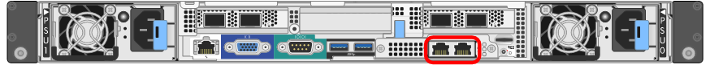

= 설치 정보 수집(SG100 및 SG1000)
:allow-uri-read: 
:icons: font
:imagesdir: ../media/

[role="lead"]
StorageGRID 어플라이언스를 설치 및 구성할 때 이더넷 스위치 포트, IP 주소, 포트 및 네트워크 연결 모드에 대한 정보를 결정하고 수집해야 합니다. 어플라이언스에 연결하는 각 네트워크에 필요한 정보를 기록합니다. 이러한 값은 하드웨어를 설치하고 구성하는 데 필요합니다.

== 관리 및 유지보수 포트

StorageGRID용 관리 네트워크는 시스템 관리 및 유지 보수에 사용되는 선택적 네트워크입니다. 어플라이언스는 어플라이언스에서 다음 1GbE 관리 포트를 사용하여 관리 네트워크에 연결됩니다.

SG100 RJ-45 포트 *

SG1000 RJ-45 포트 *

image::../media/sg1000_rj_45_ports_circled.png[SG1000 RJ-45 포트]

* 관리 및 유지보수 연결 *

|===
| 정보가 필요합니다 | 귀사의 가치 

 a| 
관리자 네트워크가 활성화되었습니다
 a| 
다음 중 하나를 선택하십시오.

* 아니요
* 예(기본값)

 a| 
네트워크 연결 모드
 a| 
다음 중 하나를 선택하십시오.

* 독립(기본값)
* Active - 백업

 a| 
다이어그램에서 원으로 표시된 왼쪽 포트의 스위치 포트(독립 네트워크 연결 모드의 기본 활성 포트)
 a| 

 a| 
다이어그램에서 원으로 표시된 오른쪽 포트의 스위치 포트(Active-Backup 네트워크 연결 모드만 해당)
 a| 

 a| 
관리자 네트워크 포트의 MAC 주소입니다

* 참고: * 어플라이언스 전면의 MAC 주소 레이블에는 BMC 관리 포트의 MAC 주소가 나열됩니다. 관리 네트워크 포트의 MAC 주소를 확인하려면 레이블의 16진수에 * 2 * 를 추가해야 합니다. 예를 들어 레이블의 MAC 주소가 * 09 * 로 끝나는 경우 관리 포트의 MAC 주소는 * 0B * 로 끝납니다. 레이블의 MAC 주소가 * (_y_) FF * 로 끝나는 경우 관리 포트의 MAC 주소는 * (_y_+1) 01 * 로 끝납니다. Windows에서 계산기를 열고, Programmer 모드로 설정하고, Hex를 선택하고, MAC 주소를 입력한 다음, * + 2 = * 를 입력하여 이 계산을 쉽게 수행할 수 있습니다.
 a| 

 a| 
전원을 켠 후 사용할 수 있는 경우, Admin Network 포트에 대해 DHCP가 할당한 IP 주소입니다

* 참고: * MAC 주소를 사용하여 할당된 IP를 조회하여 DHCP 할당 IP 주소를 확인할 수 있습니다.
 a| 
* IPv4 주소(CIDR):
* 게이트웨이:

 a| 
관리 네트워크의 어플라이언스 노드에 사용할 고정 IP 주소입니다

* 참고: * 네트워크에 게이트웨이가 없는 경우 게이트웨이에 대해 동일한 정적 IPv4 주소를 지정합니다.
 a| 
* IPv4 주소(CIDR):
* 게이트웨이:

 a| 
관리 네트워크 서브넷(CIDR)
 a| 

|===

== 네트워킹 포트

어플라이언스에 있는 4개의 네트워킹 포트는 StorageGRID 그리드 네트워크 및 선택적 클라이언트 네트워크에 연결됩니다.

* 네트워킹 연결 *

|===
| 정보가 필요합니다 | 귀사의 가치 

 a| 
링크 속도
 a| 
SG100의 경우 다음 중 하나를 선택합니다.

* 자동(기본값)
* 10GbE
* 25GbE

SG1000의 경우 다음 중 하나를 선택합니다.

* 자동(기본값)
* 10GbE
* 25GbE
* 40GbE
* 100GbE

* 참고: * SG1000, 10 및 25-GbE 속도의 경우 QSA 어댑터를 사용해야 합니다.

 a| 
포트 결합 모드
 a| 
다음 중 하나를 선택하십시오.

* 고정(기본값)
* 집계

 a| 
포트 1용 스위치 포트(고정 모드용 클라이언트 네트워크)
 a| 

 a| 
포트 2용 스위치 포트(고정 모드용 그리드 네트워크)
 a| 

 a| 
포트 3용 스위치 포트(고정 모드용 클라이언트 네트워크)
 a| 

 a| 
포트 4용 스위치 포트(고정 모드용 그리드 네트워크)
 a| 

|===

== 그리드 네트워크 포트

StorageGRID용 그리드 네트워크는 모든 내부 StorageGRID 트래픽에 사용되는 필수 네트워크입니다. 이 어플라이언스는 네트워크 포트 4개를 사용하여 그리드 네트워크에 연결됩니다.

* 그리드 네트워크 연결 *

|===
| 정보가 필요합니다 | 귀사의 가치 

 a| 
네트워크 연결 모드
 a| 
다음 중 하나를 선택하십시오.

* Active-Backup(기본값)
* LACP(802.3ad)

 a| 
VLAN 태그 지정이 활성화되었습니다
 a| 
다음 중 하나를 선택하십시오.

* 아니요(기본값)
* 예

 a| 
VLAN 태그(VLAN 태그 지정이 활성화된 경우)
 a| 
0에서 4095 사이의 값을 입력합니다.

 a| 
전원을 켠 후 사용할 수 있는 경우 그리드 네트워크에 대해 DHCP 할당 IP 주소입니다
 a| 
* IPv4 주소(CIDR):
* 게이트웨이:

 a| 
그리드 네트워크에서 어플라이언스 노드에 사용할 고정 IP 주소입니다

* 참고: * 네트워크에 게이트웨이가 없는 경우 게이트웨이에 대해 동일한 정적 IPv4 주소를 지정합니다.
 a| 
* IPv4 주소(CIDR):
* 게이트웨이:

 a| 
그리드 네트워크 서브넷(CIDR)
 a| 

 a| 
MTU(Maximum Transmission Unit) 설정(선택 사항) 1500의 기본값을 사용하거나 MTU를 9000과 같은 점보 프레임에 적합한 값으로 설정할 수 있습니다.
 a| 

|===

== 클라이언트 네트워크 포트

StorageGRID용 클라이언트 네트워크는 일반적으로 그리드에 대한 클라이언트 프로토콜 액세스를 제공하는 데 사용되는 선택적 네트워크입니다. 어플라이언스는 네트워크 포트 4개를 사용하여 클라이언트 네트워크에 연결됩니다.

* 클라이언트 네트워크 연결 *

|===
| 정보가 필요합니다 | 귀사의 가치 

 a| 
클라이언트 네트워크가 활성화되었습니다
 a| 
다음 중 하나를 선택하십시오.

* 아니요(기본값)
* 예

 a| 
네트워크 연결 모드
 a| 
다음 중 하나를 선택하십시오.

* Active-Backup(기본값)
* LACP(802.3ad)

 a| 
VLAN 태그 지정이 활성화되었습니다
 a| 
다음 중 하나를 선택하십시오.

* 아니요(기본값)
* 예

 a| 
VLAN 태그(VLAN 태그 지정이 활성화된 경우)
 a| 
0에서 4095 사이의 값을 입력합니다.

 a| 
전원을 켠 후 사용할 수 있는 경우 클라이언트 네트워크에 대해 DHCP 할당 IP 주소입니다
 a| 
* IPv4 주소(CIDR):
* 게이트웨이:

 a| 
클라이언트 네트워크의 어플라이언스 노드에 사용할 고정 IP 주소입니다

* 참고: * 클라이언트 네트워크가 활성화된 경우 어플라이언스의 기본 경로는 여기에 지정된 게이트웨이를 사용합니다.
 a| 
* IPv4 주소(CIDR):
* 게이트웨이:

|===

== BMC 관리 네트워크 포트

다이어그램에 표시된 1GbE 관리 포트를 사용하여 서비스 어플라이언스의 BMC 인터페이스에 액세스할 수 있습니다. 이 포트는 IPMI(Intelligent Platform Management Interface) 표준을 사용하여 이더넷을 통한 컨트롤러 하드웨어의 원격 관리를 지원합니다.

* SG100 BMC 관리 포트 *

image::../media/sg100_bmc_management_port.png[SG100 관리 포트]

* SG1000 BMC 관리 포트 *

image::../media/sg1000_bmc_management_port.png[SG1000 BMC 관리 포트]

* BMC 관리 네트워크 연결 *

|===
| 정보가 필요합니다 | 귀사의 가치 

 a| 
BMC 관리 포트에 연결할 이더넷 스위치 포트(다이어그램에서 원으로 표시됨)
 a| 

 a| 
전원을 켠 후 사용할 수 있는 경우 BMC 관리 네트워크에 대해 DHCP 할당 IP 주소입니다
 a| 
* IPv4 주소(CIDR):
* 게이트웨이:

 a| 
BMC 관리 포트에 사용할 고정 IP 주소입니다
 a| 
* IPv4 주소(CIDR):
* 게이트웨이:

|===
xref:sg100-and-sg1000-appliances-overview.adoc[SG100 및 SG1000 어플라이언스 개요]

xref:cabling-appliance-sg100-and-sg1000.adoc[케이블 어플라이언스 SG100 및 SG1000]

xref:configuring-storagegrid-ip-addresses-sg100-and-sg1000.adoc[StorageGRID IP 주소를 구성합니다]
