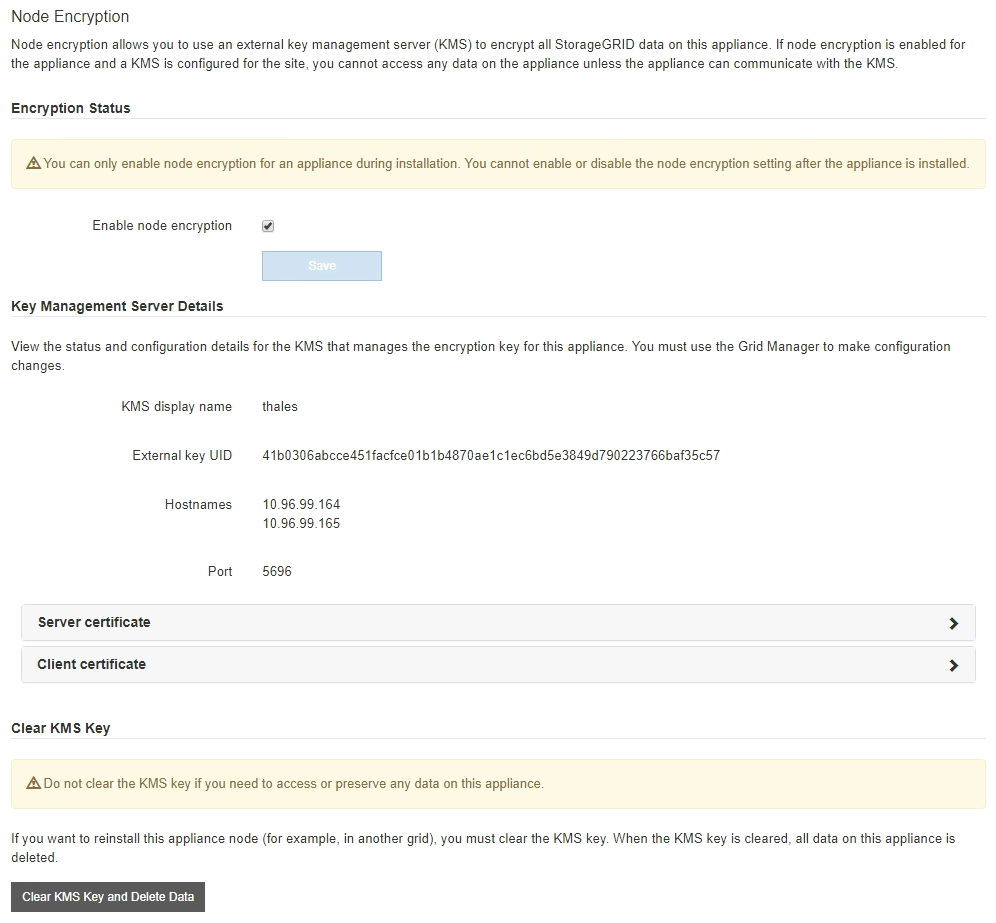

= 유지보수 모드에서 노드 암호화 모니터링(SG100 및 SG1000)
:allow-uri-read: 
:icons: font
:imagesdir: ../media/

[role="lead"]
설치 중에 어플라이언스에 대한 노드 암호화를 활성화한 경우 노드 암호화 상태 및 키 관리 서버(KMS) 세부 정보를 포함하여 각 어플라이언스 노드의 노드 암호화 상태를 모니터링할 수 있습니다.

.무엇을 &#8217;필요로 할거야
* 설치 중에 어플라이언스에 대한 노드 암호화를 활성화했습니다. 어플라이언스를 설치한 후에는 노드 암호화를 활성화할 수 없습니다.
* 있습니다 xref:placing-appliance-into-maintenance-mode.adoc[제품을 유지보수 모드로 전환하였습니다].

.단계
. StorageGRID 어플라이언스 설치 프로그램에서 * 하드웨어 구성 * > * 노드 암호화 * 를 선택합니다.
+

+
노드 암호화 페이지에는 다음 세 가지 섹션이 있습니다.

+
** 암호화 상태 는 어플라이언스에 대해 노드 암호화가 활성화되었는지 여부를 표시합니다.
** 키 관리 서버 세부 정보 는 어플라이언스를 암호화하는 데 사용되는 KMS에 대한 정보를 보여 줍니다. 서버 및 클라이언트 인증서 섹션을 확장하여 인증서 세부 정보 및 상태를 볼 수 있습니다.
+
*** 만료된 인증서 갱신과 같은 인증서 자체의 문제를 해결하려면 을 참조하십시오 xref:../admin/kms-configuring.adoc[KMS 구성 지침].
*** KMS 호스트에 연결할 때 예기치 않은 문제가 발생하는 경우, 를 확인하십시오 xref:checking-dns-server-configuration.adoc[DNS(Domain Name System) 서버가 올바릅니다] 그리고 그것입니다 xref:configuring-network-links-sg100-and-sg1000.adoc[어플라이언스 네트워킹이 올바르게 구성되었습니다].
*** 인증서 문제를 해결할 수 없는 경우 기술 지원 부서에 문의하십시오.

** KMS 키 지우기(Clear KMS Key)는 어플라이언스에 대한 노드 암호화를 해제하고, StorageGRID 사이트에 구성된 키 관리 서버와 어플라이언스를 제거하고, 어플라이언스에서 모든 데이터를 삭제합니다. 반드시 해야 합니다 xref:clearing-key-management-server-configuration.adoc[KMS 키를 지웁니다] 다른 StorageGRID 시스템에 제품을 설치하기 전에
+

IMPORTANT: KMS 구성을 지우면 어플라이언스에서 데이터가 삭제되어 영구적으로 액세스할 수 없게 됩니다. 이 데이터는 복구할 수 없습니다.

. 노드 암호화 상태 확인을 마쳤으면 노드를 재부팅합니다. StorageGRID 어플라이언스 설치 프로그램에서 * 고급 * > * 컨트롤러 재부팅 * 을 선택한 후 다음 옵션 중 하나를 선택합니다.
+
** 노드를 그리드에 다시 조인하는 상태에서 컨트롤러를 재부팅하려면 * StorageGRID로 재부팅 * 을 선택합니다. 유지보수 모드에서 작업을 수행하고 노드를 정상 운영으로 전환할 준비가 되었으면 이 옵션을 선택합니다.
** 유지보수 모드로 재부팅 * 을 선택하여 유지보수 모드로 남아 있는 노드를 사용하여 컨트롤러를 재부팅합니다. (이 옵션은 컨트롤러가 유지보수 모드일 때만 사용할 수 있습니다.) 그리드에 다시 연결하기 전에 노드에서 수행해야 하는 추가 유지보수 작업이 있는 경우 이 옵션을 선택합니다.
+
image::../media/reboot_controller_from_maintenance_mode.png[유지보수 모드에서 컨트롤러를 재부팅합니다]

+
어플라이언스가 재부팅되고 그리드에 다시 가입하는 데 최대 20분이 걸릴 수 있습니다. 재부팅이 완료되고 노드가 그리드에 다시 결합되었는지 확인하려면 Grid Manager로 돌아갑니다. nodes * 페이지에 어플라이언스 노드에 대한 정상 상태(아이콘 없음)가 표시되어야 하며, 이는 활성화된 알림이 없고 노드가 그리드에 연결되었음을 나타냅니다.

+
image::../media/nodes_menu.png[어플라이언스 노드가 그리드에 다시 합류했습니다]

xref:../admin/index.adoc[StorageGRID 관리]
