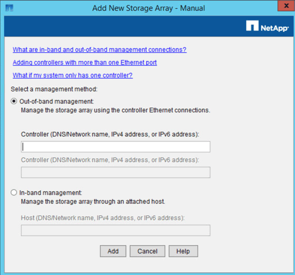

= SANtricity 스토리지 관리자에 어플라이언스를 추가합니다
:allow-uri-read: 
:icons: font
:imagesdir: ../media/

[role="lead"]
어플라이언스의 E2700 컨트롤러를 SANtricity 스토리지 관리자에 연결한 다음 어플라이언스를 스토리지 어레이로 추가합니다.

을(를) 사용하고 있습니다 xref:../admin/web-browser-requirements.adoc[지원되는 웹 브라우저].

자세한 내용은 SANtricity 스토리지 관리자 설명서를 참조하십시오.

.단계
. 웹 브라우저를 열고 IP 주소를 SANtricity 저장소 관리자(+' * https://_E2700_Controller_IP_*` )의 URL로 입력합니다
+
SANtricity 스토리지 관리자의 로그인 페이지가 나타납니다.

. 추가 방법 선택 * 페이지에서 * 수동 * 을 선택하고 * 확인 * 을 클릭합니다.
. Edit * > * Add Storage Array * 를 선택합니다.
+
Add New Storage Array - Manual 페이지가 나타납니다.

+

. 대역외 관리 * 상자에 다음 값 중 하나를 입력합니다.
+
** * DHCP 사용: * DHCP 서버가 E2700 컨트롤러의 관리 포트 1에 할당한 IP 주소입니다
** [DHCP를 사용하지 않음: * ' 192.168.128.101'
+

NOTE: 어플라이언스의 컨트롤러 중 하나만 SANtricity 스토리지 관리자에 연결되므로 하나의 IP 주소만 입력하면 됩니다.

. 추가 * 를 클릭합니다.

http://mysupport.netapp.com/documentation/productlibrary/index.html?productID=61197["NetApp 문서: SANtricity 스토리지 관리자"^]
