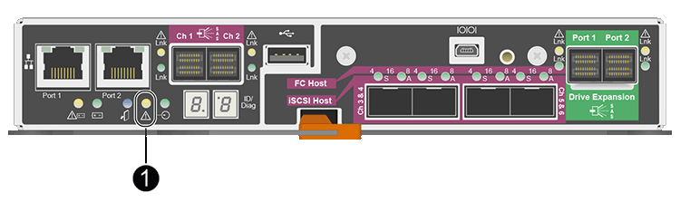

= E2700 컨트롤러를 교체합니다
:allow-uri-read: 
:icons: font
:imagesdir: ../media/

[role="lead"]
E2700 컨트롤러가 최적의 상태로 작동하지 않거나 오류가 발생한 경우 교체해야 할 수 있습니다.

.무엇을 &#8217;필요로 할거야
* 교체할 컨트롤러와 부품 번호가 동일한 교체 컨트롤러가 있습니다.
* 컨트롤러에 연결된 각 케이블을 식별하는 라벨이 있습니다.
* 정전기 방지 보호 기능이 있습니다.
* 유지 관리 또는 루트 액세스 권한이 있어야 합니다. 자세한 내용은 StorageGRID 관리 지침을 참조하십시오.

컨트롤러에서 황색 서비스 조치 필요 LED(그림 1에 표시됨)를 확인하여 컨트롤러에 장애가 있는지 확인할 수 있습니다. 이 LED가 켜져 있으면 컨트롤러를 교체해야 합니다.

컨트롤러를 교체할 때 어플라이언스 스토리지 노드에 액세스할 수 없습니다. E2700 컨트롤러가 충분히 작동하는 경우 E5500SG 컨트롤러를 유지보수 모드로 전환할 수 있습니다.

컨트롤러를 교체할 때는 원래 컨트롤러에서 배터리를 분리하여 교체 컨트롤러에 설치해야 합니다.

.단계
. 컨트롤러 제거를 준비합니다.
+
SANtricity 저장소 관리자를 사용하여 다음 단계를 수행합니다.

+
.. 현재 컨트롤러에 설치되어 있는 SANtricity OS 소프트웨어 버전을 기록해 둡니다.
.. 현재 설치된 NVSRAM 버전을 기록해 둡니다.
.. 드라이브 보안 기능이 활성화된 경우, 저장된 키가 있는지, 설치에 필요한 암호를 알고 있는지 확인하십시오.
+

IMPORTANT: * 데이터 액세스 손실 가능성 -- * 어플라이언스의 모든 드라이브가 보안이 활성화된 경우, SANtricity 스토리지 관리자의 엔터프라이즈 관리 창을 사용하여 보안 드라이브의 잠금을 해제할 때까지 새 컨트롤러가 어플라이언스에 액세스할 수 없습니다.

.. 구성 데이터베이스를 백업합니다.
+
컨트롤러를 제거할 때 문제가 발생하면 저장된 파일을 사용하여 구성을 복원할 수 있습니다.

.. 어플라이언스에 대한 지원 데이터를 수집합니다.
+

NOTE: 구성 요소를 교체하기 전과 교체 후에 지원 데이터를 수집하면 교체로 문제가 해결되지 않을 경우 기술 지원 부서에 전체 로그 세트를 보낼 수 있습니다.

. StorageGRID 어플라이언스가 StorageGRID 시스템에서 실행 중인 경우 xref:placing-appliance-into-maintenance-mode.adoc[E5500SG 컨트롤러를 유지보수 모드로 설정합니다].
. E2700 컨트롤러가 제어된 방식으로 종료가 가능하도록 충분히 작동하는지 확인하려면 모든 작업이 완료되었는지 확인하십시오.
+
.. Array Management 창의 제목 표시줄에서 * Monitor * > * Reports * > * Operations in Progress * 를 선택합니다.
.. 모든 작업이 완료되었는지 확인합니다.

. 단일 E2700 컨트롤러 교체 절차의 지침을 따라 다음 단계를 완료하십시오.
+
.. 케이블에 레이블을 지정한 다음 케이블을 분리합니다.
+

IMPORTANT: 성능 저하를 방지하려면 케이블을 비틀거나 접거나 끼거나 밟지 마십시오.

.. 오류가 발생한 컨트롤러를 제품에서 분리합니다.
.. 컨트롤러 덮개를 분리합니다.
.. 나비 나사를 풀고 오류가 발생한 컨트롤러에서 배터리를 분리합니다.
.. 교체 컨트롤러에 배터리를 설치하고 컨트롤러 덮개를 장착합니다.
.. 교체 컨트롤러를 제품에 설치합니다.
.. 케이블을 교체합니다.
.. E2700 컨트롤러가 재부팅될 때까지 기다립니다. 7세그먼트 디스플레이에 99 상태가 표시되는지 확인합니다.

. 보안 드라이브를 사용하는 경우 드라이브 보안 키를 가져옵니다.
. 제품을 정상 작동 모드로 되돌리십시오. StorageGRID 어플라이언스 설치 프로그램에서 * 고급 * > * 컨트롤러 재부팅 * 을 선택한 다음 * StorageGRID * 으로 재부팅 * 을 선택합니다.
+
image::../media/reboot_controller_from_maintenance_mode.png[유지보수 모드에서 컨트롤러를 재부팅합니다]

+
재부팅 중 다음 화면이 나타납니다.

+
image::../media/reboot_controller_in_progress.png[재부팅 진행 중]

+
어플라이언스가 재부팅되고 그리드에 다시 추가됩니다. 이 프로세스는 최대 20분 정도 소요될 수 있습니다.

. 재부팅이 완료되고 노드가 그리드에 다시 결합되었는지 확인합니다. 그리드 관리자에서 노드 페이지에 어플라이언스 노드에 대한 정상 상태(노드 이름 왼쪽에 아이콘이 없음)가 표시되는지 확인합니다. 이는 활성화된 알림이 없고 노드가 그리드에 연결되었음을 나타냅니다.
+
image::../media/node_rejoin_grid_confirmation.png[어플라이언스 노드가 그리드에 다시 합류했습니다]

. SANtricity 스토리지 관리자에서 새 컨트롤러가 최적화되었는지 확인하고 지원 데이터를 수집합니다.

https://mysupport.netapp.com/info/web/ECMP11751516.html["NetApp E-Series 및 EF-Series 하드웨어 교체 절차 를 참조하십시오"^]

http://mysupport.netapp.com/documentation/productlibrary/index.html?productID=61765["NetApp 설명서: E2700 시리즈"^]
