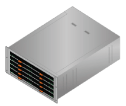
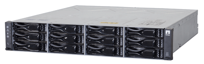

= 박스 포장 풀기(SG5600)
:allow-uri-read: 
:icons: font
:imagesdir: ../media/

[role="lead"]
StorageGRID 제품을 설치하기 전에 모든 상자의 포장을 풀고 내용물을 포장 명세서에 있는 품목과 비교합니다.

* * SG5660 엔클로저, 60개 드라이브로 구성된 4U 섀시 *
+

* * SG5612 엔클로저, 12개 드라이브를 지원하는 2U 섀시 *
+

* * 4U 베젤 또는 2U 엔드캡 *
+
image:../media/appliance_bezel.gif["4U 베젤"] image:../media/appliance_bezel_2u_endcaps.gif["2U 엔드캡"]

* NL-SAS 드라이브 *
+
image::../media/appliance_drive.gif[드라이브]

+
2U SG5612에 드라이브가 사전 설치되어 있지만 4U SG5660에서는 배송 안전을 위해 드라이브를 사용할 수 없습니다.

* * E5500SG 컨트롤러 *
+
image::../media/sga_controller_5600_diagram.gif[E5600 컨트롤러]

* * E2700 컨트롤러 *
+
image::../media/sga_controller_2700_diagram.gif[E2700 컨트롤러]

* * 장착 레일 및 나사 *
+
image::../media/appliance_mounting_rail_kit.png[마운트용 레일 키트]

* * 엔클로저 핸들(4U 엔클로저만) *
+
image::../media/appliance_enclosure_handles.gif[엔클로저 핸들]

== 케이블 및 커넥터

StorageGRID 어플라이언스에는 다음과 같은 케이블 및 커넥터가 포함되어 있습니다.

* * 해당 국가의 전원 코드 *
+
image::../media/appliance_power_cords.gif[전원 코드]

+
본 제품은 벽면 플러그와 같은 외부 전원에 연결하기 위한 AC 전원 코드 2개가 함께 제공됩니다. 캐비닛에는 제품과 함께 제공된 전원 코드 대신 사용하는 특수 전원 코드가 있을 수 있습니다.

* SAS 인터커넥트 케이블 *
+
image::../media/appliance_mini_sas_cables.gif[미니 SAS 케이블]

+
미니 SAS-HD 및 미니 SAS 커넥터가 있는 0.5미터 SAS 상호 연결 케이블 2개.

+
사각형 커넥터는 E2700 컨트롤러에 연결되며 직사각형 커넥터는 E5600SG 컨트롤러에 연결합니다.

