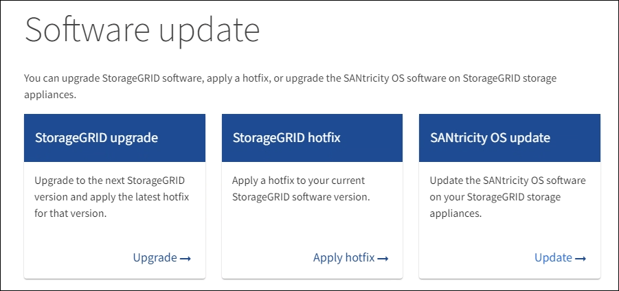
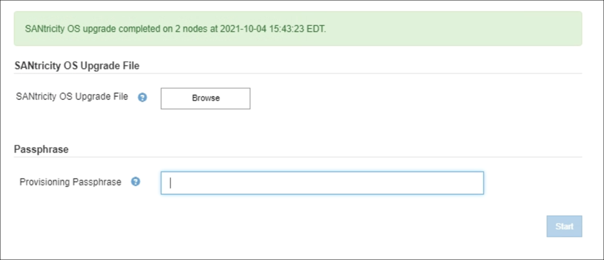

= 그리드 관리자를 사용하여 스토리지 컨트롤러의 SANtricity OS를 업그레이드합니다
:allow-uri-read: 
:icons: font
:imagesdir: ../media/

[role="lead"]
현재 SANtricity OS 08.42.20.00(11.42) 이상을 사용하는 스토리지 컨트롤러의 경우 그리드 관리자를 사용하여 업그레이드를 적용해야 합니다.

.무엇을 &#8217;필요로 할거야
* 업그레이드에 사용 중인 SANtricity OS 버전이 어플라이언스와 호환되는지 확인하려면 NetApp 상호 운용성 매트릭스 툴(IMT)을 참조하십시오.
* 유지 관리 또는 루트 액세스 권한이 있습니다.
* 를 사용하여 그리드 관리자에 로그인했습니다 xref:../admin/web-browser-requirements.adoc[지원되는 웹 브라우저].
* 프로비저닝 암호가 있습니다.
* SANtricity OS의 NetApp 다운로드 페이지에 액세스할 수 있습니다.

SANtricity OS 업그레이드 프로세스를 완료할 때까지 다른 소프트웨어 업데이트(StorageGRID 소프트웨어 업그레이드 또는 핫픽스)를 수행할 수 없습니다. SANtricity OS 업그레이드 프로세스가 완료되기 전에 핫픽스 또는 StorageGRID 소프트웨어 업그레이드를 시작하려고 하면 SANtricity OS 업그레이드 페이지로 리디렉션됩니다.

SANtricity OS 업그레이드가 업그레이드를 위해 선택된 모든 적용 가능한 노드에 적용되기 전에는 절차가 완료되지 않습니다. 각 노드에서 SANtricity OS를 로드하는 데 30분 이상, 각 StorageGRID 스토리지 어플라이언스를 재부팅하는 데 최대 90분이 걸릴 수 있습니다.

CAUTION: 다음 단계는 그리드 관리자를 사용하여 업그레이드를 수행하는 경우에만 적용됩니다. 컨트롤러가 08.42.20.00(11.42) 이전의 SANtricity OS를 사용하는 경우 그리드 관리자를 사용하여 어플라이언스의 스토리지 컨트롤러를 업그레이드할 수 없습니다.

NOTE: 이 절차에서는 NVSRAM을 SANtricity OS 업그레이드와 관련된 최신 버전으로 자동 업그레이드합니다. 별도의 NVSRAM 업그레이드 파일을 적용할 필요가 없습니다.

.단계
. [[download_SANtricity_OS]]NetApp Support 사이트에서 새로운 SANtricity OS 소프트웨어 파일을 다운로드합니다.
+
스토리지 컨트롤러의 SANtricity OS 버전을 선택해야 합니다.

+
https://mysupport.netapp.com/site/products/all/details/eseries-santricityos/downloads-tab["NetApp 다운로드: SANtricity OS"^]

. 유지보수 * > * 시스템 * > * 소프트웨어 업데이트 * 를 선택합니다.
+

. SANtricity OS 업데이트 섹션에서 * 업데이트 * 를 선택합니다.
+
SANtricity OS 업그레이드 페이지가 나타납니다.

+
image::../media/santricity_os_upgrade_first.png[StorageGRID First SANtricity OS 페이지를 보여 주는 스크린샷]

. NetApp Support 사이트에서 다운로드한 SANtricity OS 업그레이드 파일을 선택합니다.
+
.. 찾아보기 * 를 선택합니다.
.. 파일을 찾아 선택합니다.
.. 열기 * 를 선택합니다.
+
파일이 업로드되고 검증됩니다. 유효성 검사 프로세스가 완료되면 * 찾아보기 * 버튼 옆에 파일 이름이 표시됩니다.

+

NOTE: 파일 이름은 확인 프로세스의 일부이므로 변경하지 마십시오.

. 프로비저닝 암호를 입력합니다.
+
시작 * 버튼이 활성화됩니다.

+
image::../media/santricity_start_button.png[StorageGRID First SANtricity OS 페이지를 보여 주는 스크린샷]

. 시작 * 을 선택합니다.
+
업그레이드된 노드의 서비스가 다시 시작됨에 따라 브라우저의 연결이 일시적으로 끊길 수 있다는 경고 상자가 나타납니다.

+
image::../media/santricity_upgrade_warning.png[연결을 보여 주는 스크린샷이 일시적으로 손실됩니다 대화 상자]

. SANtricity OS 업그레이드 파일을 기본 관리 노드로 스테이징하려면 * OK * 를 선택하십시오.
+
SANtricity OS 업그레이드가 시작될 때:

+
.. 상태 점검이 실행됩니다. 이 프로세스에서는 노드 상태가 주의 필요 인지 확인합니다.
+

NOTE: 오류가 보고되면 이를 해결하고 * 시작 * 을 다시 선택합니다.

.. SANtricity OS 업그레이드 진행률 테이블이 나타납니다. 이 표에는 그리드의 모든 스토리지 노드 및 각 노드의 현재 업그레이드 단계가 나와 있습니다.
+

NOTE: 이 표에는 모든 어플라이언스 스토리지 노드가 표시됩니다. 소프트웨어 기반 스토리지 노드가 표시되지 않습니다. 업그레이드가 필요한 모든 노드에 대해 * Approve * 를 선택합니다.

+
image::../media/santricity_upgrade_progress_table.png[SANtricity OS 업그레이드 페이지의 SANtricity OS 업그레이드 진행률 부분을 보여 주는 스크린샷]

. 선택적으로 * Site *, * Name *, * Progress *, * Stage *, * Details *, * Site *, * Site *, *, * Details *, 또는 * 현재 컨트롤러 펌웨어 버전 *. 또는 * 검색 * 상자에 용어를 입력하여 특정 노드를 검색합니다.
+
섹션의 오른쪽 아래 모서리에 있는 왼쪽 및 오른쪽 화살표를 사용하여 노드 목록을 스크롤할 수 있습니다.

. 업그레이드 대기열에 추가할 준비가 된 그리드 노드를 승인합니다. 동일한 유형의 승인된 노드는 한 번에 하나씩 업그레이드됩니다.
+

IMPORTANT: 노드를 중지하고 재부팅할 준비가 되어 있는지 확실하지 않은 경우 어플라이언스 스토리지 노드에 대한 SANtricity OS 업그레이드를 승인하지 마십시오. 노드에서 SANtricity OS 업그레이드가 승인되면 해당 노드의 서비스가 중지되고 업그레이드 프로세스가 시작됩니다. 나중에 노드 업그레이드가 완료되면 어플라이언스 노드가 재부팅됩니다. 이러한 작업은 노드와 통신하는 클라이언트에 대해 서비스 중단을 일으킬 수 있습니다.

+
** 모든 스토리지 노드를 SANtricity OS 업그레이드 대기열에 추가하려면 * 모두 승인 * 버튼 중 하나를 선택합니다.
+

NOTE: 노드 업그레이드 순서가 중요한 경우 노드 또는 노드 그룹을 한 번에 하나씩 승인하고 다음 노드를 승인하기 전에 각 노드에서 업그레이드가 완료될 때까지 기다립니다.

** 하나 이상의 * Approve * (승인 *) 버튼을 선택하여 하나 이상의 노드를 SANtricity OS 업그레이드 대기열에 추가합니다.
+
Approve * 를 선택하면 업그레이드 프로세스에서 노드를 업그레이드할 수 있는지 여부를 결정합니다. 노드를 업그레이드할 수 있는 경우 업그레이드 대기열에 추가됩니다.

+
일부 노드의 경우 선택한 업그레이드 파일이 의도적으로 적용되지 않으며 이러한 특정 노드를 업그레이드하지 않고 업그레이드 프로세스를 완료할 수 있습니다. 의도적으로 업그레이드되지 않은 노드는 완료(업그레이드 시도) 단계를 표시하고 세부 정보 열에 노드가 업그레이드되지 않은 이유를 표시합니다.

. SANtricity OS 업그레이드 대기열에서 노드 또는 모든 노드를 제거해야 하는 경우 * 제거 * 또는 * 모두 제거 * 를 선택합니다.
+
스테이지가 대기 모드 를 넘어 진행되면 * 제거 * 버튼이 숨겨지고 더 이상 SANtricity OS 업그레이드 프로세스에서 노드를 제거할 수 없습니다.

. SANtricity OS 업그레이드가 승인된 각 그리드 노드에 적용될 때까지 기다립니다.
+
** SANtricity OS 업그레이드를 적용하는 동안 노드에 오류 단계가 표시되는 경우 해당 노드에 대한 업그레이드가 실패한 것입니다. 기술 지원의 도움을 받아 어플라이언스를 유지보수 모드로 전환하여 복구해야 할 수도 있습니다.
** 노드의 펌웨어가 너무 오래되어 그리드 관리자로 업그레이드되지 않는 경우, 노드에 오류 단계가 표시됩니다: ""이 노드에서 SANtricity OS를 업그레이드하려면 유지보수 모드를 사용해야 합니다. 제품의 설치 및 유지관리 지침을 참조하십시오. 업그레이드 후 향후 업그레이드를 위해 이 유틸리티를 사용할 수 있습니다." 오류를 해결하려면 다음을 수행합니다.
+
... 유지보수 모드를 사용하여 오류 단계가 표시된 노드에서 SANtricity OS를 업그레이드합니다.
... 그리드 관리자를 사용하여 SANtricity OS 업그레이드를 다시 시작하고 완료합니다.

+
승인된 모든 노드에서 SANtricity OS 업그레이드가 완료되면 SANtricity OS 업그레이드 진행률 테이블이 닫히고 SANtricity OS 업그레이드가 완료된 날짜와 시간이 녹색 배너에 표시됩니다.

. 노드를 업그레이드할 수 없는 경우 세부 정보 열에 표시된 이유를 기록하고 적절한 조치를 취하십시오.
+
** "스토리지 노드가 이미 업그레이드되었습니다." 추가 조치가 필요하지 않습니다.
** "SANtricity OS 업그레이드는 이 노드에 적용되지 않습니다." 노드에는 StorageGRID 시스템에서 관리할 수 있는 스토리지 컨트롤러가 없습니다. 이 메시지가 표시된 노드를 업그레이드하지 않고 업그레이드 프로세스를 완료합니다.
** "'SANtricity OS 파일이 이 노드와 호환되지 않습니다.'" 노드에는 선택한 것과 다른 SANtricity OS 파일이 필요합니다. 현재 업그레이드를 완료한 후 노드에 대한 올바른 SANtricity OS 파일을 다운로드하고 업그레이드 프로세스를 반복합니다.

IMPORTANT: 나열된 모든 스토리지 노드에서 SANtricity OS 업그레이드를 승인할 때까지 SANtricity OS 업그레이드 프로세스가 완료되지 않습니다.

. 노드 승인을 종료하여 SANtricity OS 페이지로 돌아가 새 SANtricity OS 파일 업로드를 허용하려면 다음을 수행합니다.
+
.. 노드 건너뛰기 및 마침 * 을 선택합니다.
+
모든 노드를 업그레이드하지 않고 업그레이드 프로세스를 완료할지 묻는 경고가 나타납니다.

.. SANtricity OS * 페이지로 돌아가려면 * OK * 를 선택하십시오.
.. 노드 승인을 계속할 준비가 되면 로 이동합니다 <<download_santricity_os,SANtricity OS를 다운로드합니다>> 를 눌러 업그레이드 프로세스를 다시 시작합니다.

+

NOTE: 노드가 이미 승인되었으며 오류 없이 업그레이드되었습니다.

. 다른 SANtricity OS 업그레이드 파일이 필요한 전체 단계가 있는 노드에 대해 이 업그레이드 절차를 반복합니다.
+

NOTE: Needs Attention(주의 필요) 상태인 모든 노드의 경우 유지보수 모드를 사용하여 업그레이드를 수행합니다.

+

NOTE: 업그레이드 절차를 반복하면 이전에 업그레이드된 노드를 승인해야 합니다.

https://mysupport.netapp.com/matrix["NetApp 상호 운용성 매트릭스 툴"^]

xref:upgrading-santricity-os-on-e2700-controller-using-maintenance-mode.adoc[유지보수 모드를 사용하여 E2700 컨트롤러에서 SANtricity OS를 업그레이드합니다]
