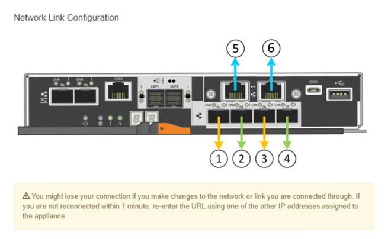
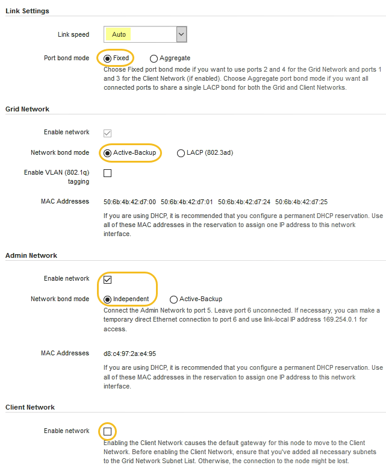

= 네트워크 링크 구성(SG5700)
:allow-uri-read: 
:icons: font
:imagesdir: ../media/

[role="lead"]
어플라이언스를 그리드 네트워크, 클라이언트 네트워크 및 관리 네트워크에 연결하는 데 사용되는 포트에 대한 네트워크 링크를 구성할 수 있습니다. 링크 속도와 포트 및 네트워크 연결 모드를 설정할 수 있습니다.

.필요한 것
10/25-GbE 포트에 25-GbE 링크 속도를 사용하려는 경우:

* 사용하려는 포트에 SFP28 트랜시버를 설치했습니다.
* 이러한 기능을 지원할 수 있는 스위치에 포트를 연결했습니다.
* 이 고속 스위치를 사용하도록 스위치를 구성하는 방법을 이해할 수 있습니다.

Aggregate 포트 결합 모드, LACP 네트워크 결합 모드 또는 10/25-GbE 포트에 대한 VLAN 태그 지정을 사용하려면 다음을 수행합니다.

* 어플라이언스의 포트를 VLAN 및 LACP를 지원할 수 있는 스위치에 연결했습니다.
* LACP 결합에 여러 스위치가 사용되는 경우 스위치는 MLAG(Multi-Chassis Link Aggregation Group) 또는 이와 동등한 스위치를 지원합니다.
* VLAN, LACP, MLAG 또는 이와 동등한 기능을 사용하도록 스위치를 구성하는 방법을 이해합니다.
* 각 네트워크에 사용할 고유 VLAN 태그를 알고 있습니다. 이 VLAN 태그는 네트워크 트래픽이 올바른 네트워크로 라우팅되도록 각 네트워크 패킷에 추가됩니다.
* 관리 네트워크에 Active-Backup 모드를 사용하려는 경우 컨트롤러의 두 관리 포트에 이더넷 케이블을 연결했습니다.

.이 작업에 대해
이 그림은 4개의 10/25-GbE 포트가 고정 포트 결합 모드(기본 구성)에서 접합되는 방식을 보여줍니다.

image::../media/e5700sg_fixed_port.gif[E5700SG 컨트롤러의 10/25-GbE 포트가 고정 모드로 접합되는 방식을 보여주는 이미지입니다]

|===
| 속성 표시기 | 어떤 포트가 연결되어 있는지 확인합니다 

 a| 
c
 a| 
이 네트워크를 사용하는 경우 포트 1과 3이 클라이언트 네트워크에 대해 함께 연결됩니다.

 a| 
g
 a| 
포트 2와 4는 그리드 네트워크를 위해 서로 연결되어 있습니다.

|===
이 그림은 4개의 10/25-GbE 포트가 Aggregate 포트 결합 모드에서 결합되는 방식을 보여줍니다.

image::../media/e5700sg_aggregate_port.gif[E5500SG 컨트롤러의 10/25-GbE 포트가 애그리게이트 모드에서 결합되는 방식을 보여주는 이미지입니다]

|===
| 속성 표시기 | 어떤 포트가 연결되어 있는지 확인합니다 

 a| 
1
 a| 
4개 포트 모두 단일 LACP 결합으로 그룹화되므로 모든 포트를 그리드 네트워크 및 클라이언트 네트워크 트래픽에 사용할 수 있습니다.

|===
이 표에는 4개의 10/25-GbE 포트를 구성하는 옵션이 요약되어 있습니다. 기본 설정은 굵게 표시됩니다. 기본이 아닌 설정을 사용하려면 구성 연결 페이지에서 설정을 구성하기만 하면 됩니다.

* * 고정(기본값) 포트 결합 모드 *
+
|===
| 네트워크 연결 모드 | 클라이언트 네트워크 비활성화(기본값) | 클라이언트 네트워크가 활성화되었습니다 

 a| 
Active-Backup(기본값)
 a| 
** 포트 2와 4는 그리드 네트워크에 액티브-백업 결합을 사용합니다.
** 포트 1과 3은 사용되지 않습니다.
** VLAN 태그는 선택 사항입니다.

 a| 
** 포트 2와 4는 그리드 네트워크에 액티브-백업 결합을 사용합니다.
** 포트 1과 3은 클라이언트 네트워크에 대해 액티브-백업 연결을 사용합니다.
** VLAN 태그는 두 네트워크에 대해 모두 지정할 수 있습니다.

 a| 
LACP(802.3ad)
 a| 
** 포트 2와 4는 그리드 네트워크에 LACP 결합을 사용합니다.
** 포트 1과 3은 사용되지 않습니다.
** VLAN 태그는 선택 사항입니다.

 a| 
** 포트 2와 4는 그리드 네트워크에 LACP 결합을 사용합니다.
** 포트 1과 3은 클라이언트 네트워크에 LACP 결합을 사용합니다.
** VLAN 태그는 두 네트워크에 대해 모두 지정할 수 있습니다.

|===
* * 집계 포트 결합 모드 *
+
|===
| 네트워크 연결 모드 | 클라이언트 네트워크 비활성화(기본값) | 클라이언트 네트워크가 활성화되었습니다 

 a| 
LACP(802.3ad)만 해당
 a| 
** 포트 1-4는 그리드 네트워크에 단일 LACP 결합을 사용합니다.
** 단일 VLAN 태그는 그리드 네트워크 패킷을 식별합니다.

 a| 
** 포트 1-4는 그리드 네트워크 및 클라이언트 네트워크에 단일 LACP 결합을 사용합니다.
** 두 개의 VLAN 태그를 통해 그리드 네트워크 패킷을 클라이언트 네트워크 패킷과 분리할 수 있습니다.

|===

포트 결합 및 네트워크 결합 모드에 대한 자세한 내용은 E5500SG 컨트롤러의 10/25-GbE 포트 연결 정보를 참조하십시오.

이 그림에서는 E700SG 컨트롤러의 1GbE 관리 포트 2개가 관리 네트워크의 Active-Backup 네트워크 연결 모드로 연결되는 방식을 보여 줍니다.

image::../media/e5700sg_bonded_management_ports.gif[SG6000 연결된 관리 포트]

.단계
. StorageGRID 어플라이언스 설치 프로그램의 메뉴 모음에서 * 네트워킹 구성 * > * 링크 구성 * 을 클릭합니다.
+
네트워크 링크 구성 페이지에는 네트워크 및 관리 포트 번호가 지정된 어플라이언스 다이어그램이 표시됩니다.

+

+
링크 상태 테이블에는 번호가 매겨진 포트의 링크 상태(위/아래) 및 속도(1/10/25/40/100Gbps)가 나열됩니다.

+
image::../media/sg5712_configuring_network_linkstatus.png[SG5712 링크 상태]

+
이 페이지에 처음 액세스하는 경우:

+
** * 링크 속도 * 는 * 10GbE * 로 설정됩니다.
** * 포트 결합 모드 * 가 * 고정 * 으로 설정됩니다.
** 그리드 네트워크의 * 네트워크 결합 모드 * 가 * 액티브-백업 * 으로 설정됩니다.
** Admin Network*가 활성화되고 네트워크 연결 모드가 * Independent * 로 설정됩니다.
** 클라이언트 네트워크 * 가 비활성화됩니다.
+

. 10/25 GbE 포트에 대해 25 GbE 링크 속도를 사용하려는 경우 링크 속도 드롭다운 목록에서 * 25GbE * 를 선택합니다.
+
그리드 네트워크 및 클라이언트 네트워크에 대해 사용 중인 네트워크 스위치도 이 속도를 지원하고 구성해야 합니다. SFP28 트랜시버는 포트에 설치해야 합니다.

. 사용하려는 StorageGRID 네트워크를 활성화 또는 비활성화합니다.
+
그리드 네트워크가 필요합니다. 이 네트워크를 비활성화할 수 없습니다.

+
.. 어플라이언스가 관리 네트워크에 연결되어 있지 않은 경우 관리 네트워크의 * 네트워크 활성화 * 확인란을 선택 취소합니다.
+
image::../media/admin_network_disabled.gif[관리자 네트워크 활성화 또는 비활성화에 대한 확인란을 보여 주는 스크린샷]

.. 어플라이언스가 클라이언트 네트워크에 연결되어 있는 경우 클라이언트 네트워크의 * 네트워크 활성화 * 확인란을 선택합니다.
+
이제 10/25-GbE 포트의 클라이언트 네트워크 설정이 표시됩니다.

. 표를 참조하여 포트 결합 모드 및 네트워크 연결 모드를 구성합니다.
+
예를 들면 다음과 같습니다.

+
** 그리드 및 클라이언트 네트워크에 대해 * 집계 * 및 * LACP * 선택. 각 네트워크에 대해 고유한 VLAN 태그를 지정해야 합니다. 0에서 4095 사이의 값을 선택할 수 있습니다.
** 관리자 네트워크에 대해 * Active-Backup * 이 선택되었습니다.
+
image::../media/network_link_configuration_aggregate.gif[집계 모드의 링크 구성 설정을 보여 주는 스크린샷]

. 선택 사항에 만족하면 * 저장 * 을 클릭합니다.
+

NOTE: 연결된 네트워크 또는 링크를 변경한 경우 연결이 끊어질 수 있습니다. 1분 내에 다시 연결되지 않으면 어플라이언스에 할당된 다른 IP 주소 중 하나를 사용하여 StorageGRID 어플라이언스 설치 프로그램의 URL을 다시 입력합니다. + " * https://_E5700SG_Controller_IP_:8443*`

.관련 정보
xref:port-bond-modes-for-e5700sg-controller-ports.adoc[E5500SG 컨트롤러 포트의 포트 연결 모드]
