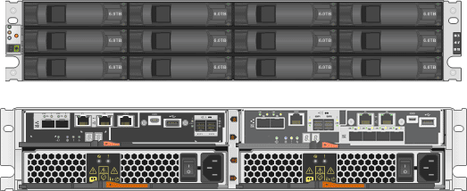
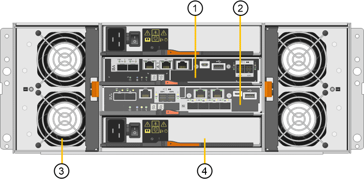

= SG5700 어플라이언스: 개요
:allow-uri-read: 
:icons: font
:imagesdir: ../media/

[role="lead"]
SG5700 StorageGRID 어플라이언스는 StorageGRID 그리드에서 스토리지 노드로 작동하는 통합 스토리지 및 컴퓨팅 플랫폼입니다. 어플라이언스는 어플라이언스 스토리지 노드와 가상(소프트웨어 기반) 스토리지 노드를 결합하는 하이브리드 그리드 환경에서 사용할 수 있습니다.

StorageGRID SG5700 어플라이언스는 다음 기능을 제공합니다.

* StorageGRID 스토리지 노드의 스토리지 및 컴퓨팅 요소를 통합합니다.
* 스토리지 노드 구축 및 구성을 간소화하는 StorageGRID 어플라이언스 설치 프로그램이 포함되어 있습니다.
* 하드웨어 관리 및 모니터링을 위한 E-Series SANtricity System Manager 포함.
* StorageGRID 그리드 네트워크 및 클라이언트 네트워크에 대한 10GbE 또는 25GbE 연결을 최대 4개까지 지원합니다.
* FDE(전체 디스크 암호화) 드라이브 또는 FIPS(Federal Information Processing Standard) 드라이브를 지원합니다. 이러한 드라이브를 SANtricity 시스템 관리자의 드라이브 보안 기능과 함께 사용하면 데이터에 대한 무단 액세스가 방지됩니다.

SG5712와 SG5760은 SG5712와 SG5760의 두 가지 모델로 SG5700 어플라이언스를 사용할 수 있습니다. 두 모델 모두 다음과 같은 구성 요소를 포함합니다.

|===
| 구성 요소 | SG5712 | SG5760 

 a| 
컴퓨팅 컨트롤러
 a| 
E5500SG 컨트롤러
 a| 
E5500SG 컨트롤러

 a| 
스토리지 컨트롤러
 a| 
E-Series E2800 컨트롤러
 a| 
E-Series E2800 컨트롤러

 a| 
섀시
 a| 
E-Series DE212C 엔클로저, 2개의 랙 유닛(2U) 엔클로저
 a| 
E-Series DE460C 엔클로저, 4개의 랙 유닛(4U) 엔클로저

 a| 
드라이브
 a| 
NL-SAS 드라이브 12개(3.5인치)
 a| 
NL-SAS 드라이브 60개(3.5인치)

 a| 
중복 전원 공급 장치 및 팬
 a| 
2개의 전원 팬 캐니스터
 a| 
두 개의 전원 캐니스터 및 두 개의 팬 캐니스터

|===
StorageGRID 어플라이언스에서 사용할 수 있는 최대 기본 스토리지는 각 엔클로저의 드라이브 수에 따라 고정됩니다. 쉘프를 추가하려면 드라이브를 추가할 때 사용 가능한 스토리지를 확장할 수 없습니다.

== 모델 SG5712

이 그림은 12개의 드라이브를 장착할 수 있는 2U 엔클로저의 SG5712 모델의 전면 및 후면을 보여줍니다.

SG5712에는 컨트롤러 2개와 전원 팬 캐니스터 2개가 포함되어 있습니다.

image::../media/sg5712_with_callouts.gif[SG5712 어플라이언스의 컨트롤러 및 전원 팬 캐니스터]

|===
| 속성 표시기 | 설명 

 a| 
1
 a| 
E2800 컨트롤러(스토리지 컨트롤러)

 a| 
2
 a| 
E5500SG 컨트롤러(컴퓨팅 컨트롤러)

 a| 
3
 a| 
전원 팬 캐니스터

|===

== 모델 SG5760

이 그림은 SG5760 모델의 전면 및 후면, 5개의 드라이브 드로어에 60개의 드라이브를 장착할 수 있는 4U 엔클로저를 보여 줍니다.

image::../media/sg5760_front_and_back_views.gif[SG5760 어플라이언스의 전면 및 후면]

SG5760에는 컨트롤러 2개, 팬 캐니스터 2개, 전원 캐니스터 2개가 있습니다.

|===
| 속성 표시기 | 설명 

 a| 
1
 a| 
E2800 컨트롤러(스토리지 컨트롤러)

 a| 
2
 a| 
E5500SG 컨트롤러(컴퓨팅 컨트롤러)

 a| 
3
 a| 
팬 캐니스터(1/2)

 a| 
4
 a| 
전원 캐니스터(1/2)

|===
http://mysupport.netapp.com/info/web/ECMP1658252.html["NetApp E-Series 시스템 문서 사이트"^]
