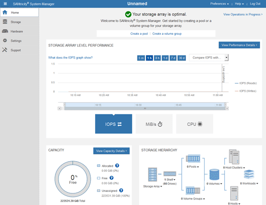

= SANtricity 시스템 관리자에서 하드웨어 상태를 검토합니다
:allow-uri-read: 
:icons: font
:imagesdir: ../media/

[role="lead"]
SANtricity 시스템 관리자를 사용하여 스토리지 컨트롤러 쉘프의 개별 하드웨어 구성요소를 모니터링 및 관리하고 하드웨어 진단 및 환경 정보(예: 구성요소 온도)와 드라이브 관련 문제를 검토할 수 있습니다.

.필요한 것
* 을(를) 사용하고 있습니다 xref:../admin/web-browser-requirements.adoc[지원되는 웹 브라우저].
* 그리드 관리자를 통해 SANtricity 시스템 관리자에 액세스하려면 스토리지 어플라이언스 관리자 권한이나 루트 액세스 권한이 있어야 합니다.
* StorageGRID 어플라이언스 설치 프로그램을 사용하여 SANtricity 시스템 관리자에 액세스하려면 SANtricity 시스템 관리자 사용자 이름과 암호가 있어야 합니다.
* 웹 브라우저를 통해 SANtricity System Manager에 직접 액세스하려면 SANtricity System Manager 관리자의 사용자 이름과 암호가 있어야 합니다.

NOTE: 그리드 관리자 또는 StorageGRID 어플라이언스 설치 프로그램을 사용하여 SANtricity 시스템 관리자에 액세스하려면 SANtricity 펌웨어 8.70(11.70) 이상이 있어야 합니다.

IMPORTANT: 그리드 관리자 또는 어플라이언스 설치 프로그램에서 SANtricity 시스템 관리자에 액세스하는 것은 일반적으로 하드웨어를 모니터링하고 E-Series AutoSupport를 구성하는 데만 사용됩니다. 펌웨어 업그레이드와 같은 SANtricity System Manager 내의 많은 기능과 작업은 StorageGRID 어플라이언스 모니터링에는 적용되지 않습니다. 문제를 방지하려면 항상 어플라이언스에 대한 하드웨어 설치 및 유지 관리 지침을 따르십시오.

.단계
. SANtricity 시스템 관리자에 액세스합니다.
+
xref:setting-up-and-accessing-santricity-system-manager.adoc[SANtricity 시스템 관리자를 설정하고 액세스합니다]

. 필요한 경우 관리자 사용자 이름과 암호를 입력합니다.
. 설정 마법사를 닫고 SANtricity 시스템 관리자 홈 페이지를 표시하려면 * 취소 * 를 클릭합니다.
+
SANtricity 시스템 관리자 홈 페이지가 나타납니다. SANtricity 시스템 관리자에서 컨트롤러 쉘프는 스토리지 어레이라고 합니다.

+

. 어플라이언스 하드웨어에 대해 표시된 정보를 검토하고 모든 하드웨어 구성 요소의 상태가 Optimal(최적)인지 확인합니다.
+
.. 하드웨어 * 탭을 클릭합니다.
.. Show back of shelf * 를 클릭합니다.
+
image::../media/sam_hardware_controllers_a_and_b.gif[SANtricity 시스템 관리자의 하드웨어 상태 탭입니다]

+
쉘프 후면에서 각 스토리지 컨트롤러의 배터리, 2개의 전원 캐니스터, 2개의 팬 캐니스터 및 확장 쉘프(있는 경우)를 모두 볼 수 있습니다. 부품 온도를 볼 수도 있습니다.

.. 각 스토리지 컨트롤러의 설정을 보려면 컨트롤러를 선택하고 컨텍스트 메뉴에서 * 설정 보기 * 를 선택합니다.
.. 쉘프 뒷면에 있는 다른 구성 요소의 설정을 보려면 보려는 구성 요소를 선택합니다.
.. Show front of shelf * 를 클릭하고 보려는 부품을 선택합니다.
+
쉘프 전면에서 스토리지 컨트롤러 쉘프 또는 확장 쉘프(있는 경우)에 대한 드라이브 및 드라이브 드로어를 볼 수 있습니다.

구성 요소의 상태에 주의가 필요한 경우 Recovery Guru의 단계에 따라 문제를 해결하거나 기술 지원 부서에 문의하십시오.
