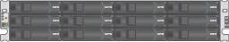

= 박스 포장 풀기(SG5700)
:allow-uri-read: 
:icons: font
:imagesdir: ../media/

[role="lead"]
StorageGRID 제품을 설치하기 전에 모든 상자의 포장을 풀고 내용물을 포장 명세서에 있는 품목과 비교합니다.

* 12개의 드라이브가 설치된 * SG5712 어플라이언스
+

* * 드라이브가 설치되지 않은 SG5760 어플라이언스 *
+
image::../media/de460c_table_size.gif[SG5760 4U 어플라이언스]

* * 제품의 전면 베젤 *
+
image::../media/sg5700_front_bezels.gif[SG5712 및 SG5760의 베젤]

* * 지침이 포함된 레일 키트 *
+
image::../media/rail_kit.gif[레일 키트]

* * SG5760: 60개 드라이브 *
+
image::../media/sg5760_drive.gif[드라이브]

* * SG5760: 핸들 *
+
image::../media/handles.gif[SG5760 핸들]

* * SG5760: 사각 구멍 랙 설치용 후면 브래킷 및 케이지 너트 *
+
image::../media/back_brackets_table_size.gif[SG5760용 후면 브래킷 및 케이지 너트]

== 케이블 및 커넥터

StorageGRID 어플라이언스에는 다음과 같은 케이블 및 커넥터가 포함되어 있습니다.

* * 해당 국가용 전원 코드 2개 *
+
image::../media/power_cords.gif[전원 코드]

+
캐비닛에는 제품과 함께 제공된 전원 코드 대신 사용하는 특수 전원 코드가 있을 수 있습니다.

* * 광 케이블 및 SFP 트랜시버 *
+
image::../media/fc_cable_and_sfp.gif[광 케이블 및 SFP]

+
FC 상호 연결 포트를 위한 광 케이블 2개

+
4개의 16Gb/s FC 상호 연결 포트 및 4개의 10GbE 네트워크 포트와 호환되는 8개의 SFP+ 트랜시버입니다

