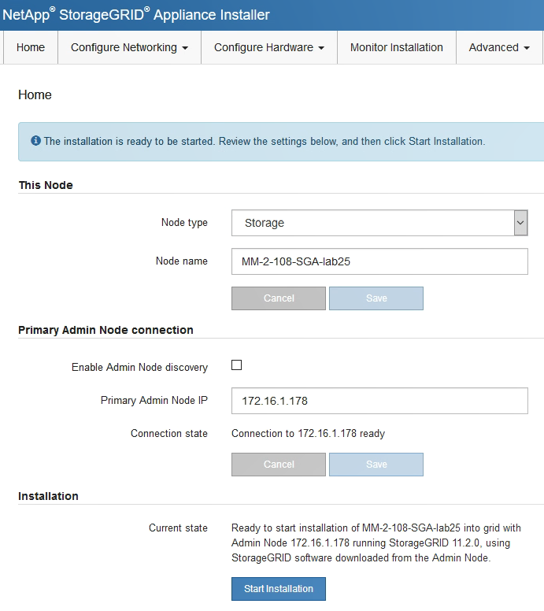

= StorageGRID 어플라이언스 설치 프로그램에 액세스합니다
:allow-uri-read: 
:icons: font
:imagesdir: ../media/

[role="lead"]
설치 프로그램 버전을 확인하고 그리드 네트워크, 관리자 네트워크(옵션) 및 클라이언트 네트워크(옵션)의 세 StorageGRID 네트워크와 어플라이언스 및 네트워크 사이의 연결을 구성하려면 StorageGRID 어플라이언스 설치 프로그램에 액세스해야 합니다.

.무엇을 &#8217;필요로 할거야
* StorageGRID 관리 네트워크에 연결할 수 있는 관리 클라이언트를 사용 중이거나 서비스 랩톱을 사용 중입니다.
* 클라이언트 또는 서비스 랩톱에 지원되는 웹 브라우저가 있습니다.
* SG6000-CN 컨트롤러는 사용하려는 모든 StorageGRID 네트워크에 연결되어 있습니다.
* 이러한 네트워크에서 SG6000-CN 컨트롤러의 IP 주소, 게이트웨이 및 서브넷을 알고 있습니다.
* 사용할 네트워크 스위치를 구성했습니다.

StorageGRID 어플라이언스 설치 프로그램에 처음 액세스하려면 SG6000-CN 컨트롤러의 관리 네트워크 포트에 대해 DHCP 할당 IP 주소를 사용하거나(컨트롤러가 관리 네트워크에 연결되어 있다고 가정) 서비스 랩톱을 SG6000-CN 컨트롤러에 직접 연결할 수 있습니다.

.단계
. 가능하면 SG6000-CN 컨트롤러의 관리 네트워크 포트에 대한 DHCP 주소를 사용하여 StorageGRID 어플라이언스 설치 프로그램에 액세스합니다.
+
image::../media/sg6000_cn_admin_network_port.gif[SG6000-CN 컨트롤러의 관리 네트워크 포트]

+
.. SG6000-CN 컨트롤러 전면에서 MAC 주소 레이블을 찾아 관리 네트워크 포트의 MAC 주소를 확인합니다.
+
MAC 주소 레이블에는 BMC 관리 포트의 MAC 주소가 나열됩니다.

+
관리 네트워크 포트의 MAC 주소를 확인하려면 레이블의 16진수에 * 2 * 를 추가해야 합니다. 예를 들어 레이블의 MAC 주소가 * 09 * 로 끝나는 경우 관리 포트의 MAC 주소는 * 0B * 로 끝납니다. 레이블의 MAC 주소가 * (_y_) FF * 로 끝나는 경우 관리 포트의 MAC 주소는 * (_y_+1) 01 * 로 끝납니다. Windows에서 계산기를 열고, Programmer 모드로 설정하고, Hex를 선택하고, MAC 주소를 입력한 다음, * + 2 = * 를 입력하여 이 계산을 쉽게 수행할 수 있습니다.

.. 네트워크 관리자에게 MAC 주소를 제공하여 관리자가 관리 네트워크에서 어플라이언스의 DHCP 주소를 찾을 수 있도록 합니다.
.. 클라이언트에서 StorageGRID 어플라이언스 설치 프로그램의 URL을 입력합니다. + ``https://_Appliance_Controller_IP_:8443*`
+
'_SG6000-CN_Controller_IP_'의 경우 DHCP address를 사용한다.

.. 보안 경고 메시지가 나타나면 브라우저의 설치 마법사를 사용하여 인증서를 보고 설치합니다.
+
다음에 이 URL에 액세스할 때 알림이 나타나지 않습니다.

+
StorageGRID 어플라이언스 설치 관리자 홈 페이지가 나타납니다. 이 페이지에 처음 액세스할 때 표시되는 정보와 메시지는 어플라이언스가 현재 StorageGRID 네트워크에 연결되어 있는 방식에 따라 다릅니다. 오류 메시지가 나타날 수 있으며, 이 메시지는 이후 단계에서 해결될 것입니다.

+

. DHCP를 사용하여 IP 주소를 얻을 수 없는 경우 링크 로컬 연결을 사용할 수 있습니다.
+
.. 이더넷 케이블을 사용하여 SG6000-CN 컨트롤러의 맨 오른쪽 RJ-45 포트에 서비스 랩톱을 직접 연결합니다.
+
image::../media/sg6000_cn_link_local_port.gif[SG6000-CN용 관리 포트 위치]

.. 서비스 랩톱에서 웹 브라우저를 엽니다.
.. StorageGRID 어플라이언스 설치 프로그램에 대한 이 URL을 입력합니다: + ``* \https://169.254.0.1:8443*`
+
StorageGRID 어플라이언스 설치 관리자 홈 페이지가 나타납니다. 이 페이지에 처음 액세스할 때 표시되는 정보 및 메시지는 어플라이언스가 현재 연결되어 있는 방식에 따라 다릅니다.

+

NOTE: 링크 로컬 연결을 통해 홈 페이지에 액세스할 수 없는 경우 서비스 랩톱 IP 주소를 "169.254.0.2"로 구성한 후 다시 시도하십시오.

StorageGRID 어플라이언스 설치 프로그램에 액세스한 후:

* 어플라이언스의 StorageGRID 어플라이언스 설치 프로그램 버전이 StorageGRID 시스템에 설치된 소프트웨어 버전과 일치하는지 확인합니다. 필요한 경우 StorageGRID 어플라이언스 설치 프로그램을 업그레이드합니다.
+
xref:verifying-and-upgrading-storagegrid-appliance-installer-version.adoc[StorageGRID 어플라이언스 설치 프로그램 버전을 확인하고 업그레이드합니다]

* StorageGRID 어플라이언스 설치 관리자 홈 페이지에 표시되는 메시지를 검토하고 필요에 따라 링크 구성 및 IP 구성을 구성합니다.

xref:../admin/web-browser-requirements.adoc[웹 브라우저 요구 사항]
