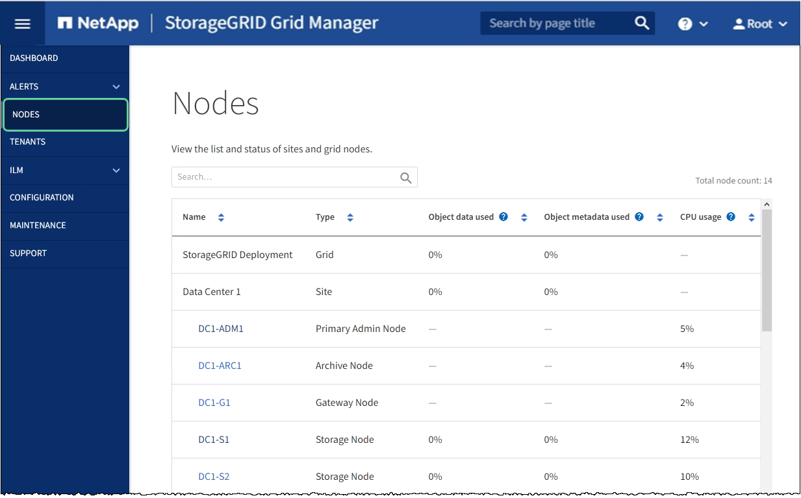

= SG6000-CN 컨트롤러의 링크 구성을 변경합니다
:allow-uri-read: 
:icons: font
:imagesdir: ../media/

[role="lead"]
SG6000-CN 컨트롤러의 이더넷 링크 구성을 변경할 수 있습니다. 포트 연결 모드, 네트워크 연결 모드 및 링크 속도를 변경할 수 있습니다.

제품이 다 되었습니다 xref:placing-appliance-into-maintenance-mode.adoc[유지보수 모드로 전환되었습니다].

SG6000-CN 컨트롤러의 이더넷 링크 구성을 변경하는 옵션은 다음과 같습니다.

* 포트 결합 모드 * 를 고정에서 집계로, 또는 Aggregate에서 고정으로 변경
* Active-Backup에서 LACP로 또는 LACP에서 Active-Backup으로 * 네트워크 결합 모드 * 변경
* VLAN 태그 지정 활성화 또는 비활성화 또는 VLAN 태그 값 변경
* 링크 속도 변경

.단계
. StorageGRID 어플라이언스 설치 프로그램에서 * 네트워킹 구성 * > * 링크 구성 * 을 선택합니다.
+
image::../media/link_configuration_option.gif[링크 구성]

. [[link_config_changes, start=2]]링크 설정을 원하는 대로 변경합니다.
+
옵션에 대한 자세한 내용은 을 참조하십시오 xref:configuring-network-links-sg6000.adoc[네트워크 링크 구성(SG6000)].

. 선택 사항에 만족하면 * 저장 * 을 클릭합니다.
+

NOTE: 연결된 네트워크 또는 링크를 변경한 경우 연결이 끊어질 수 있습니다. 1분 내에 다시 연결되지 않으면 어플라이언스에 할당된 다른 IP 주소 중 하나를 사용하여 StorageGRID 어플라이언스 설치 프로그램의 URL을 다시 입력합니다. + " * https://_Appliance_Controller_IP_:8443*`

+
VLAN 설정을 변경한 경우 어플라이언스의 서브넷이 변경되었을 수 있습니다. 어플라이언스의 IP 주소를 변경해야 하는 경우 에 따르십시오 xref:../maintain/configuring-ip-addresses.adoc[IP 주소를 구성합니다] 지침.

+
xref:configuring-storagegrid-ip-addresses-sg6000.adoc[StorageGRID IP 주소를 구성합니다]

. 메뉴에서 * 네트워킹 구성 * > * Ping 테스트 * 를 선택합니다.
. Ping 테스트 도구를 사용하여 에서 변경한 링크 구성의 영향을 받을 수 있는 네트워크의 IP 주소에 대한 연결을 확인합니다 ,링크 구성 변경 단계.
+
수행할 다른 테스트 외에도 기본 관리 노드의 그리드 네트워크 IP 주소와 하나 이상의 다른 스토리지 노드의 그리드 네트워크 IP 주소를 ping할 수 있는지 확인합니다. 필요한 경우 로 돌아갑니다 ,링크 구성 변경 링크 구성 문제를 단계별로 해결합니다.

. 링크 구성 변경이 작동 중이고 노드가 유지보수 모드일 때 수행할 추가 절차가 있으면 지금 수행합니다. 작업을 완료했거나 오류가 발생하여 다시 시작하려면 * 고급 * > * 컨트롤러 재부팅 * 을 선택하고 다음 옵션 중 하나를 선택합니다.
+
** StorageGRID * 로 재부팅 * 을 선택합니다
** 유지보수 모드로 재부팅 * 을 선택하여 유지보수 모드로 남아 있는 노드를 사용하여 컨트롤러를 재부팅합니다. 절차 중에 오류가 발생하여 다시 시작하려면 이 옵션을 선택합니다. 노드가 유지보수 모드로 재부팅된 후 장애가 발생한 절차의 적절한 단계에서 다시 시작하십시오.
+
image::../media/reboot_controller_from_maintenance_mode.png[유지보수 모드에서 컨트롤러를 재부팅합니다]

+
어플라이언스가 재부팅되고 그리드에 다시 가입하는 데 최대 20분이 걸릴 수 있습니다. 재부팅이 완료되고 노드가 그리드에 다시 결합되었는지 확인하려면 Grid Manager로 돌아갑니다. nodes * 페이지에 어플라이언스 노드에 대한 정상 상태(아이콘 없음)가 표시되어야 하며, 이는 활성화된 알림이 없고 노드가 그리드에 연결되었음을 나타냅니다.

+

