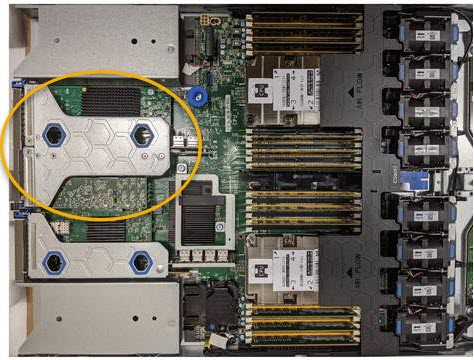

= Fibre Channel HBA를 제거합니다
:allow-uri-read: 
:icons: font
:imagesdir: ../media/

[role="lead"]
SG6000-CN 컨트롤러의 파이버 채널 호스트 버스 어댑터(HBA)가 최적의 상태로 작동하지 않거나 장애가 발생한 경우 이를 교체해야 할 수 있습니다.

.무엇을 &#8217;필요로 할거야
* 올바른 교체용 Fibre Channel HBA가 있습니다.
* 교체할 파이버 채널 HBA가 포함된 SG6000-CN 컨트롤러를 확인했습니다.
+
xref:verifying-fibre-channel-hba-to-replace.adoc[교체할 Fibre Channel HBA를 확인합니다]

* 데이터 센터의 파이버 채널 HBA를 교체하는 SG6000-CN 컨트롤러를 물리적으로 배치했습니다.
+
xref:locating-controller-in-data-center.adoc[데이터 센터에서 컨트롤러를 찾습니다]

* 컨트롤러 덮개를 제거했습니다.
+
xref:removing-sg6000-cn-controller-cover.adoc[SG6000-CN 컨트롤러 덮개를 분리합니다]

서비스 중단을 방지하려면 Fibre Channel HBA 교체를 시작하기 전에 다른 모든 스토리지 노드가 그리드에 연결되어 있는지 확인하거나 서비스 중단이 정상적으로 예상되는 예약된 유지 보수 기간 동안 어댑터를 교체하십시오. 정보 수명 주기 관리를 사용하여 개체를 관리하는 방법에 대한 지침은 노드 연결 상태 결정에 대한 정보를 참조하십시오.

IMPORTANT: 개체의 복사본을 하나만 생성하는 ILM 규칙을 사용한 적이 있는 경우 예약된 유지 관리 기간 동안 파이버 채널 HBA를 교체해야 합니다. 그렇지 않으면 이 절차 중에 해당 개체에 대한 액세스가 일시적으로 끊어질 수 있습니다. +정보 수명 주기 관리를 사용하여 개체를 관리하는 방법에 대한 정보를 참조하십시오.

.단계
. ESD 밴드의 스트랩 끝을 손목 둘레에 감고 클립 끝을 금속 바닥에 단단히 고정하여 정전기 방전을 방지하십시오.
. 파이버 채널 HBA를 포함하는 컨트롤러 후면에서 라이저 어셈블리를 찾습니다.
+

. 파란색 표시가 있는 구멍을 통해 라이저 조립품을 잡고 조심스럽게 위로 들어 올립니다. 라이저 조립품을 들어 올릴 때 섀시 앞쪽으로 이동하여 설치된 어댑터의 외부 커넥터가 섀시에서 분리되도록 합니다.
. 라이저 카드를 금속 프레임 면이 아래로 향하게 하여 평평한 정전기 방지 표면에 놓고 어댑터에 액세스합니다.
+
image::../media/sg6060_fc_hba_location.jpg[라이저 어셈블리의 SG6060 파이버 채널 HBA]

+
라이저 어셈블리에는 파이버 채널 HBA와 이더넷 네트워크 어댑터의 두 어댑터가 있습니다. Fibre Channel HBA는 그림에 나와 있습니다.

. 파란색 어댑터 래치(원으로 표시됨)를 열고 라이저 어셈블리에서 파이버 채널 HBA를 조심스럽게 분리합니다. 어댑터를 살짝 흔들어 커넥터에서 어댑터를 분리합니다. 과도한 힘을 가하지 마십시오.
. 어댑터를 평평한 정전기 방지 표면에 놓습니다.

교체용 Fibre Channel HBA를 설치합니다.

xref:reinstalling-fibre-channel-hba.adoc[Fibre Channel HBA를 다시 설치합니다]

xref:reinstalling-fibre-channel-hba.adoc[Fibre Channel HBA를 다시 설치합니다]

xref:../admin/index.adoc[StorageGRID 관리]

xref:../monitor/index.adoc[모니터링하고 문제를 해결합니다]

xref:../ilm/index.adoc[ILM을 사용하여 개체를 관리합니다]
