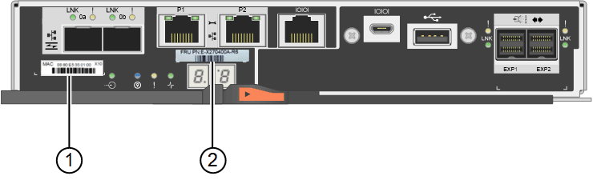

= 스토리지 컨트롤러를 교체합니다
:icons: font
:imagesdir: ../media/

[role="lead"]
E2800 컨트롤러 또는 EF570 컨트롤러가 최적의 상태로 작동하지 않거나 장애가 발생한 경우 이를 교체해야 할 수 있습니다.

.무엇을 &#8217;필요로 할거야
* 교체할 컨트롤러와 부품 번호가 동일한 교체 컨트롤러가 있습니다.
* 컨트롤러에 연결된 각 케이블을 식별하는 라벨이 있습니다.
* ESD 밴드를 가지고 있거나 다른 정전기 방지 예방 조치를 취했습니다.
* 1 십자 드라이버가 있습니다.
* 이중 구성의 컨트롤러 교체를 위한 E-Series 지침이 있습니다.
+

IMPORTANT: 지시가 있는 경우에만 E-Series 지침을 참조하고, 특정 단계를 수행하기 위한 자세한 내용은 E-Series를 참조하십시오. 절차가 동일하지 않으므로 E-Series 지침에 따라 StorageGRID 어플라이언스의 컨트롤러를 교체하지 마십시오.

* 데이터 센터에서 컨트롤러를 교체하는 스토리지 어플라이언스를 물리적으로 배치했습니다.
+
xref:locating-controller-in-data-center.adoc[데이터 센터에서 컨트롤러를 찾습니다]

두 가지 방법으로 오류가 발생한 컨트롤러가 있는지 확인할 수 있습니다.

* SANtricity 시스템 관리자의 Recovery Guru에서 컨트롤러를 교체하도록 안내합니다.
* 컨트롤러의 주황색 주의 LED가 켜져 컨트롤러에 장애가 있음을 나타냅니다.
+

IMPORTANT: 쉘프 내의 두 컨트롤러 모두에 주의 LED가 켜져 있는 경우 기술 지원 팀에 지원을 요청하십시오.

스토리지 컨트롤러 쉘프에 2개의 스토리지 컨트롤러가 포함되어 있으므로 다음 조건이 충족될 경우 어플라이언스의 전원을 켜고 읽기/쓰기 작업을 수행하는 동안 컨트롤러 중 하나를 교체할 수 있습니다.

* 쉘프 내의 두 번째 컨트롤러가 Optimal(최적) 상태입니다.
* SANtricity 시스템 관리자의 Recovery Guru 세부 정보 영역에 있는 ""제거 확인"" 필드가 "예"로 표시되어 이 구성 요소를 제거해도 안전함을 나타냅니다.

IMPORTANT: 가능한 경우 예기치 못한 오류나 고장으로 인한 잠재적인 영향을 최소화하기 위해 이 교체 절차를 위해 어플라이언스를 유지보수 모드로 두십시오.

IMPORTANT: 쉘프의 두 번째 컨트롤러 캐니스터가 최적의 상태가 아니거나 Recovery Guru에서 컨트롤러 캐니스터를 제거할 수 없는 경우 기술 지원 부서에 문의하십시오.

컨트롤러를 교체할 때는 원래 컨트롤러에서 배터리를 분리하여 교체 컨트롤러에 설치해야 합니다. 경우에 따라 원래 컨트롤러에서 호스트 인터페이스 카드를 제거하고 교체 컨트롤러에 설치해야 할 수도 있습니다.

NOTE: 대부분의 어플라이언스 모델의 스토리지 컨트롤러에는 HIC(호스트 인터페이스 카드)가 포함되지 않습니다.

.단계
. 새 컨트롤러의 포장을 풀고 정전기가 없는 평평한 표면에 놓습니다.
+
오류가 발생한 컨트롤러를 배송할 때 사용할 포장재를 보관합니다.

. 교체 컨트롤러 뒷면에서 MAC 주소 및 FRU 부품 번호 레이블을 찾습니다.
+
이 그림은 E2800 컨트롤러를 보여 줍니다. EF570 컨트롤러 교체 절차는 동일합니다.

+

+
|===
| 라벨 | 라벨 | 설명 

 a| 
1
 a| 
MAC 주소
 a| 
관리 포트 1의 MAC 주소("'P1"). DHCP를 사용하여 원래 컨트롤러의 IP 주소를 얻은 경우 이 주소가 새 컨트롤러에 연결되어 있어야 합니다.

 a| 
2
 a| 
FRU 부품 번호입니다
 a| 
FRU 부품 번호입니다. 이 번호는 현재 설치된 컨트롤러의 교체 부품 번호와 일치해야 합니다.

|===
. 컨트롤러 제거를 준비합니다.
+
SANtricity 시스템 관리자를 사용하여 다음 단계를 수행합니다. 자세한 내용은 스토리지 컨트롤러 교체에 대한 E-Series 지침을 참조하십시오.

+
.. 장애가 발생한 컨트롤러의 교체 부품 번호가 교체 컨트롤러의 FRU 부품 번호와 같은지 확인합니다.
+
컨트롤러에 장애가 발생하여 교체해야 하는 경우 Recovery Guru의 세부 정보 영역에 교체 부품 번호가 표시됩니다. 이 번호를 수동으로 찾아야 하는 경우 컨트롤러의 * Base * 탭을 보면 됩니다.

+

IMPORTANT: * 데이터 액세스 손실 가능성 -- * 두 부품 번호가 동일하지 않은 경우 이 절차를 시도하지 마십시오.

.. 구성 데이터베이스를 백업합니다.
+
컨트롤러를 제거할 때 문제가 발생하면 저장된 파일을 사용하여 구성을 복원할 수 있습니다.

.. 어플라이언스에 대한 지원 데이터를 수집합니다.
+

NOTE: 구성 요소를 교체하기 전과 교체 후에 지원 데이터를 수집하면 교체로 문제가 해결되지 않을 경우 기술 지원 부서에 전체 로그 세트를 보낼 수 있습니다.

.. 오프라인 상태에서 교체할 컨트롤러를 가지고 가십시오.

. 제품에서 컨트롤러를 분리합니다.
+
.. ESD 밴드를 착용하거나 정전기 방지 조치를 취하십시오.
.. 케이블에 레이블을 지정한 다음 케이블 및 SFP를 분리합니다.
+

IMPORTANT: 성능 저하를 방지하려면 케이블을 비틀거나 접거나 끼거나 밟지 마십시오.

.. 캠 핸들의 래치를 눌러 제품에서 컨트롤러를 분리한 다음 캠 핸들을 오른쪽으로 엽니다.
.. 양손과 캠 손잡이를 사용하여 제어기를 제품에서 밀어 꺼냅니다.
+

IMPORTANT: 컨트롤러의 무게를 지탱하려면 항상 두 손을 사용하십시오.

.. 착탈식 덮개가 위를 향하도록 하여 정전기가 없는 평평한 표면에 컨트롤러를 놓습니다.
.. 단추를 누르고 덮개를 밀어 덮개를 분리합니다.

. 장애가 발생한 컨트롤러에서 배터리를 분리하고 교체 컨트롤러에 설치합니다.
+
.. 컨트롤러 내부(배터리와 DIMM 사이)의 녹색 LED가 꺼져 있는지 확인합니다.
+
이 녹색 LED가 켜져 있으면 컨트롤러는 여전히 배터리 전원을 사용하고 있습니다. 구성 요소를 제거하기 전에 이 LED가 꺼질 때까지 기다려야 합니다.

+
image::../media/e2800_internal_cache_active_led.gif[E2800의 경우 녹색 LED입니다]

+
|===
| 항목 | 설명 

 a| 
1
 a| 
내부 캐시 활성 LED

 a| 
2
 a| 
배터리

|===
.. 배터리의 파란색 분리 래치를 찾습니다.
.. 분리 래치를 아래로 눌러 배터리를 분리합니다.
+
image::../media/e2800_remove_battery.gif[배터리 래치]

+
|===
| 항목 | 설명 

 a| 
1
 a| 
배터리 분리 래치

 a| 
2
 a| 
배터리

|===
.. 배터리를 들어 올려 컨트롤러에서 꺼냅니다.
.. 교체용 컨트롤러에서 덮개를 분리합니다.
.. 교체용 컨트롤러의 방향을 조정하여 배터리 슬롯이 사용자를 향하도록 합니다.
.. 배터리를 약간 아래쪽으로 비스듬히 컨트롤러에 삽입합니다.
+
배터리 전면의 금속 플랜지를 컨트롤러 하단의 슬롯에 삽입하고 배터리 상단을 컨트롤러 왼쪽의 작은 정렬 핀 아래에 밀어 넣어야 합니다.

.. 배터리 래치를 위로 이동하여 배터리를 고정합니다.
+
래치가 제자리에 고정되면 래치 하단이 섀시의 금속 슬롯에 후크됩니다.

.. 컨트롤러를 뒤집어 배터리가 올바르게 설치되었는지 확인합니다.
+

IMPORTANT: * 하드웨어 손상 가능성 * -- 배터리 전면의 금속 플랜지가 컨트롤러의 슬롯에 완전히 삽입되어야 합니다(첫 번째 그림 참조). 배터리가 올바르게 설치되지 않은 경우(두 번째 그림 참조) 금속 플랜지가 컨트롤러 보드에 닿으면 손상이 발생할 수 있습니다.

+
*** * 정답 -- 배터리의 금속 플랜지가 컨트롤러의 슬롯에 완전히 삽입되어 있습니다. *
+
image::../media/e2800_battery_flange_ok.gif[배터리 플랜지 정답]

*** * 잘못됨 -- 배터리의 금속 플랜지가 컨트롤러의 슬롯에 삽입되지 않음: *
+
image::../media/e2800_battery_flange_not_ok.gif[배터리 플랜지 잘못됨]

.. 컨트롤러 덮개를 장착합니다.

. 교체 컨트롤러를 제품에 설치합니다.
+
.. 이동식 덮개가 아래를 향하도록 컨트롤러를 뒤집습니다.
.. 캠 손잡이를 열린 상태에서 컨트롤러를 제품 안으로 끝까지 밀어 넣습니다.
.. 캠 핸들을 왼쪽으로 이동하여 컨트롤러를 제자리에 고정합니다.
.. 케이블 및 SFP를 교체합니다.
.. 원래 컨트롤러가 IP 주소에 DHCP를 사용한 경우 교체 컨트롤러 후면의 레이블에 있는 MAC 주소를 찾습니다. 제거한 컨트롤러의 DNS/네트워크 및 IP 주소를 대체 컨트롤러의 MAC 주소와 연관시킬 것을 네트워크 관리자에게 요청합니다.
+

NOTE: 원래 컨트롤러가 IP 주소에 DHCP를 사용하지 않은 경우 새 컨트롤러는 제거한 컨트롤러의 IP 주소를 채택합니다.

. SANtricity 시스템 관리자를 사용하여 컨트롤러를 온라인 상태로 전환합니다.
+
.. 하드웨어 * 를 선택합니다.
.. 그래픽에 드라이브가 표시되면 * Show back of shelf * 를 선택합니다.
.. 온라인으로 설정하려는 컨트롤러를 선택합니다.
.. 상황에 맞는 메뉴에서 * 온라인 위치 * 를 선택하고 작업을 수행할지 확인합니다.
.. 7세그먼트 디스플레이에 99 상태가 표시되는지 확인합니다.

. 새 컨트롤러가 최적의 상태인지 확인하고 지원 데이터를 수집합니다.

http://mysupport.netapp.com/info/web/ECMP1658252.html["NetApp E-Series 시스템 문서 사이트"^]
