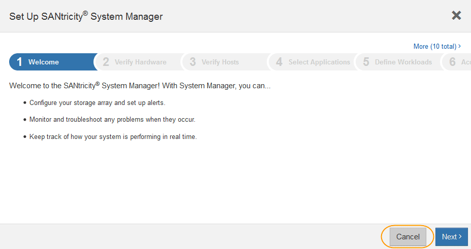

= SANtricity 시스템 관리자를 설정하고 액세스합니다
:icons: font
:imagesdir: ../media/

[role="lead"]
스토리지 컨트롤러의 하드웨어를 모니터링하거나 E-Series AutoSupport를 구성하려면 스토리지 컨트롤러의 SANtricity System Manager에 액세스해야 할 수 있습니다.

.무엇을 &#8217;필요로 할거야
* 을(를) 사용하고 있습니다 xref:../admin/web-browser-requirements.adoc[지원되는 웹 브라우저].
* 그리드 관리자를 통해 SANtricity 시스템 관리자에 액세스하려면 StorageGRID가 설치되어 있어야 하며 스토리지 어플라이언스 관리자 권한이나 루트 액세스 권한이 있어야 합니다.
* StorageGRID 어플라이언스 설치 프로그램을 사용하여 SANtricity 시스템 관리자에 액세스하려면 SANtricity 시스템 관리자 사용자 이름과 암호가 있어야 합니다.
* 웹 브라우저를 통해 SANtricity System Manager에 직접 액세스하려면 SANtricity System Manager 관리자의 사용자 이름과 암호가 있어야 합니다.

NOTE: 그리드 관리자 또는 StorageGRID 어플라이언스 설치 프로그램을 사용하여 SANtricity 시스템 관리자에 액세스하려면 SANtricity 펌웨어 8.70 이상이 있어야 합니다. StorageGRID 어플라이언스 설치 프로그램을 사용하여 * 도움말 * > * 정보 * 를 선택하여 펌웨어 버전을 확인할 수 있습니다.

IMPORTANT: 그리드 관리자 또는 어플라이언스 설치 프로그램에서 SANtricity 시스템 관리자에 액세스하는 것은 일반적으로 하드웨어를 모니터링하고 E-Series AutoSupport를 구성하는 데만 사용됩니다. 펌웨어 업그레이드와 같은 SANtricity System Manager 내의 많은 기능과 작업은 StorageGRID 어플라이언스 모니터링에는 적용되지 않습니다. 문제를 방지하려면 항상 어플라이언스에 대한 하드웨어 설치 및 유지 관리 지침을 따르십시오.

설치 및 구성 프로세스 단계에 따라 SANtricity System Manager에 액세스하는 방법에는 세 가지가 있습니다.

* 어플라이언스가 아직 StorageGRID 시스템에 노드로 배포되지 않은 경우 StorageGRID 어플라이언스 설치 프로그램의 고급 탭을 사용해야 합니다.
+

NOTE: 노드가 배포되면 StorageGRID 어플라이언스 설치 프로그램을 사용하여 SANtricity 시스템 관리자에 액세스할 수 없습니다.

* 어플라이언스가 StorageGRID 시스템에서 노드로 구축된 경우 그리드 관리자의 노드 페이지에서 SANtricity 시스템 관리자 탭을 사용합니다.
* StorageGRID 어플라이언스 설치 관리자 또는 그리드 관리자를 사용할 수 없는 경우 관리 포트에 연결된 웹 브라우저를 사용하여 SANtricity 시스템 관리자에 직접 액세스할 수 있습니다.

이 절차에는 SANtricity 시스템 관리자에 대한 초기 액세스 단계가 포함되어 있습니다. SANtricity 시스템 관리자를 이미 설정한 경우 로 이동합니다 <<config_hardware_alerts_sg6000,하드웨어 경고 단계를 구성합니다>>.

NOTE: 그리드 관리자 또는 StorageGRID 어플라이언스 설치 프로그램을 사용하면 어플라이언스의 관리 포트를 구성하거나 연결하지 않고도 SANtricity 시스템 관리자에 액세스할 수 있습니다.

SANtricity 시스템 관리자를 사용하여 다음을 모니터링할 수 있습니다.

* 스토리지 어레이 레벨 성능, I/O 지연 시간, CPU 활용률, 처리량 등의 성능 데이터
* 하드웨어 구성 요소 상태입니다
* 진단 데이터 보기를 포함한 지원 기능

SANtricity 시스템 관리자를 사용하여 다음 설정을 구성할 수 있습니다.

* 스토리지 컨트롤러 쉘프에 있는 구성 요소에 대한 e-메일 경고, SNMP 경고 또는 syslog 알림을 제공합니다
* 스토리지 컨트롤러 쉘프의 구성요소에 대한 E-Series AutoSupport 설정입니다.
+
E-Series AutoSupport에 대한 자세한 내용은 를 참조하십시오 http://mysupport.netapp.com/info/web/ECMP1658252.html["NetApp E-Series 시스템 문서 사이트"^].

* 드라이브 보안 키 - 보안 드라이브 잠금을 해제하는 데 필요(드라이브 보안 기능이 활성화된 경우 이 단계 필요)
* SANtricity 시스템 관리자에 액세스하기 위한 관리자 암호입니다

.단계
. 다음 중 하나를 수행합니다.
+
** StorageGRID 어플라이언스 설치 프로그램을 사용하여 * 고급 * > * SANtricity 시스템 관리자 * 를 선택합니다
** 그리드 관리자를 사용하여 * 노드 * > " * _어플라이언스 스토리지 노드_ * "> * SANtricity 시스템 관리자 * 를 선택합니다

+

NOTE: 이러한 옵션을 사용할 수 없거나 로그인 페이지가 나타나지 않으면 를 사용해야 합니다 xref:setting-ip-addresses-for-storage-controllers-using-storagegrid-appliance-installer.adoc[스토리지 컨트롤러의 IP 주소입니다]. 스토리지 컨트롤러 IP로 이동하여 SANtricity System Manager에 액세스합니다.

. 관리자 암호를 설정하거나 입력합니다.
+
SANtricity 시스템 관리자는 모든 사용자가 공유하는 단일 관리자 암호를 사용합니다.

+

. 마법사를 닫으려면 * 취소 * 를 선택하십시오.
+

IMPORTANT: StorageGRID 어플라이언스에 대한 설정 마법사를 완료하지 마십시오.

+
image::../media/sam_home_page.gif[SANtricity 시스템 관리자 홈 페이지의 스크린 샷]

. [[config_hardware_alerts_sg6000, start=4]] 하드웨어 경고를 구성합니다.
+
.. SANtricity 시스템 관리자의 온라인 도움말을 보려면 * 도움말 * 을 선택하십시오.
.. 온라인 도움말의 * 설정 * > * 알림 * 섹션을 사용하여 알림에 대해 알아보십시오.
.. ""방법" 지침에 따라 e-메일 경고, SNMP 경고 또는 syslog 알림을 설정합니다.

. 스토리지 컨트롤러 쉘프의 구성요소에 대한 AutoSupport를 관리합니다.
+
.. SANtricity 시스템 관리자의 온라인 도움말을 보려면 * 도움말 * 을 선택하십시오.
.. 온라인 도움말의 * 지원 * > * 지원 센터 * 섹션을 사용하여 AutoSupport 기능에 대해 알아보십시오.
.. AutoSupport를 관리하려면 ""방법" 지침을 따르십시오.
+
관리 포트를 사용하지 않고 E-Series AutoSupport 메시지를 보내기 위해 StorageGRID 프록시를 구성하는 방법에 대한 자세한 내용은 로 이동하십시오 xref:../admin/configuring-storage-proxy-settings.adoc[스토리지 프록시 설정 구성 지침].

. 어플라이언스에 대해 드라이브 보안 기능이 활성화된 경우 보안 키를 생성하고 관리합니다.
+
.. SANtricity 시스템 관리자의 온라인 도움말을 보려면 * 도움말 * 을 선택하십시오.
.. 드라이브 보안에 대해 알아보려면 온라인 도움말의 * 설정 * > * 시스템 * > * 보안 키 관리 * 섹션을 사용하십시오.
.. ""방법" 지침에 따라 보안 키를 만들고 관리합니다.

. 필요에 따라 관리자 암호를 변경합니다.
+
.. SANtricity 시스템 관리자의 온라인 도움말을 보려면 * 도움말 * 을 선택하십시오.
.. 온라인 도움말의 * Home * > * 스토리지 배열 관리 * 섹션을 사용하여 관리자 암호에 대해 알아보십시오.
.. ""방법" 지침에 따라 암호를 변경하십시오.

