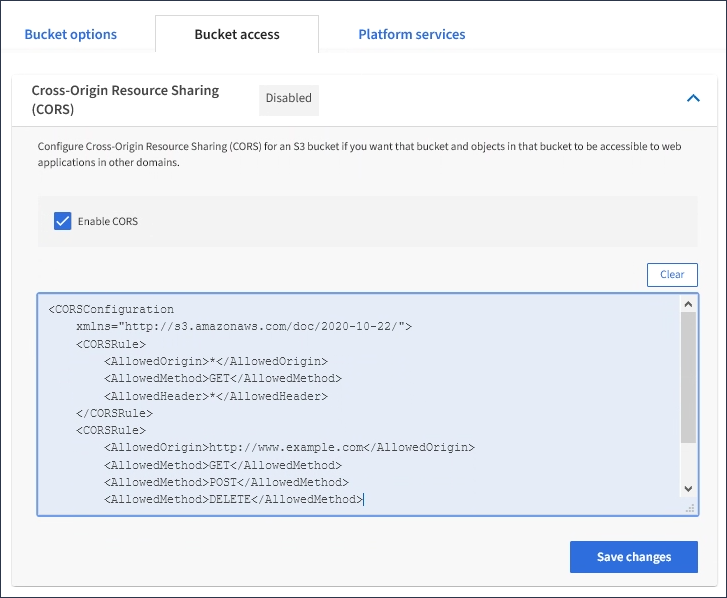

= CORS(Cross-Origin Resource Sharing) 구성
:allow-uri-read: 
:icons: font
:imagesdir: ../media/

[role="lead"]
다른 도메인의 웹 애플리케이션에서 해당 버킷의 버킷 및 오브젝트에 액세스할 수 있도록 하려면 S3 버킷에 대해 CORS(Cross-Origin Resource Sharing)를 구성할 수 있습니다.

.필요한 것
* 를 사용하여 테넌트 관리자에 로그인해야 합니다 xref:../admin/web-browser-requirements.adoc[지원되는 웹 브라우저].
* 모든 버킷 관리 또는 루트 액세스 권한이 있는 사용자 그룹에 속해야 합니다. 이러한 권한은 그룹 또는 버킷 정책의 사용 권한 설정을 재정의합니다.

.이 작업에 대해
CORS(Cross-Origin Resource Sharing)는 한 도메인의 클라이언트 웹 애플리케이션이 다른 도메인의 리소스에 액세스할 수 있도록 하는 보안 메커니즘입니다. 예를 들어, 그래픽을 저장하기 위해 "이미지"라는 S3 버킷을 사용한다고 가정합니다. 영상물통용 CORS를 구성하여 해당 버켓의 영상을 웹사이트 http://www.example.com` 에 표시할 수 있습니다.

.단계
. 텍스트 편집기를 사용하여 CORS를 활성화하는 데 필요한 XML을 만듭니다.
+
이 예에서는 S3 버킷에 대해 CORS를 활성화하는 데 사용되는 XML을 보여 줍니다. 이 XML을 사용하면 모든 도메인이 버킷에 GET 요청을 보낼 수 있지만 "+http://www.example.com+` 도메인에서만 POST 및 삭제 요청을 보낼 수 있습니다. 모든 요청 헤더가 허용됩니다.

+
[listing]
----
<CORSConfiguration
    xmlns="http://s3.amazonaws.com/doc/2020-10-22/">
    <CORSRule>
        <AllowedOrigin>*</AllowedOrigin>
        <AllowedMethod>GET</AllowedMethod>
        <AllowedHeader>*</AllowedHeader>
    </CORSRule>
    <CORSRule>
        <AllowedOrigin>http://www.example.com</AllowedOrigin>
        <AllowedMethod>GET</AllowedMethod>
        <AllowedMethod>POST</AllowedMethod>
        <AllowedMethod>DELETE</AllowedMethod>
        <AllowedHeader>*</AllowedHeader>
    </CORSRule>
</CORSConfiguration>
----
+
CORS 구성 XML에 대한 자세한 내용은 을 참조하십시오 http://["AWS(Amazon Web Services) 문서: Amazon Simple Storage Service 개발자 가이드 를 참조하십시오"^].

. 테넌트 관리자에서 * 스토리지(S3) * > * 버킷 * 을 선택합니다.
. 목록에서 버킷 이름을 선택합니다.
+
버킷 세부 정보 페이지가 나타납니다.

. Bucket access * > * Cross-Origin Resource Sharing (CORS) * 를 선택합니다.
. CORS * 활성화 확인란을 선택합니다.
. 텍스트 상자에 CORS 구성 XML을 붙여 넣고 * 변경 내용 저장 * 을 선택합니다.
+

. 버킷의 CORS 설정을 수정하려면 텍스트 상자에서 CORS 구성 XML을 업데이트하거나 다시 시작하려면 * Clear * 를 선택하십시오. 그런 다음 * 변경 사항 저장 * 을 선택합니다.
. 버킷에 대한 CORS를 비활성화하려면 * CORS * 활성화 확인란의 선택을 취소한 다음 * 변경 사항 저장 * 을 선택합니다.

