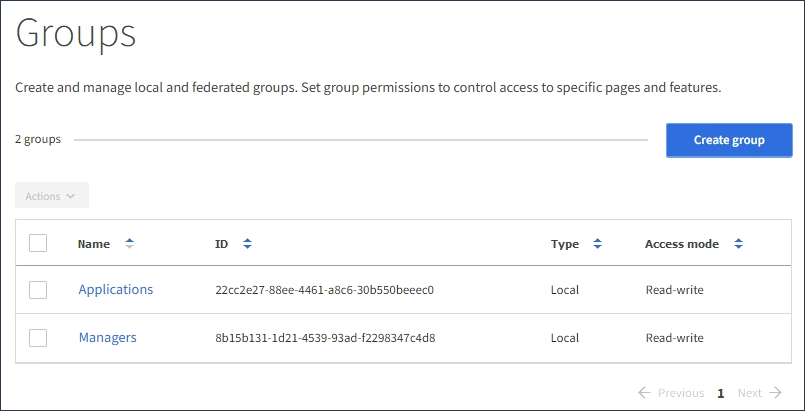

= S3 테넌트에 대한 그룹을 생성합니다
:allow-uri-read: 
:icons: font
:imagesdir: ../media/

[role="lead"]
통합 그룹을 가져오거나 로컬 그룹을 생성하여 S3 사용자 그룹에 대한 권한을 관리할 수 있습니다.

.필요한 것
* 를 사용하여 테넌트 관리자에 로그인해야 합니다 xref:../admin/web-browser-requirements.adoc[지원되는 웹 브라우저].
* 루트 액세스 권한이 있는 사용자 그룹에 속해야 합니다. 을 참조하십시오 xref:tenant-management-permissions.adoc[테넌트 관리 권한].
* 통합 그룹을 가져오려는 경우 ID 페더레이션을 구성하고 통합 그룹이 이미 구성된 ID 소스에 있습니다.

S3에 대한 자세한 내용은 을 참조하십시오 xref:../s3/index.adoc[S3을 사용합니다].

.단계
. 액세스 관리 * > * 그룹 * 을 선택합니다.
+

. Create group * 을 선택합니다.
. 로컬 그룹을 생성하려면 * Local group * 탭을 선택하고, 이전에 구성된 ID 소스에서 그룹을 가져오려면 * Federated group * 탭을 선택합니다.
+
StorageGRID 시스템에서 SSO(Single Sign-On)를 사용하는 경우 로컬 그룹에 속한 사용자는 그룹 권한에 따라 클라이언트 애플리케이션을 사용하여 테넌트의 리소스를 관리할 수 있지만 테넌트 관리자에 로그인할 수 없습니다.

. 그룹의 이름을 입력합니다.
+
** * 로컬 그룹 *: 표시 이름과 고유 이름을 모두 입력합니다. 나중에 표시 이름을 편집할 수 있습니다.
** * 페더레이션 그룹 *: 고유한 이름을 입력합니다. Active Directory의 경우 고유한 이름은 'AMAccountName' 속성과 관련된 이름입니다. OpenLDAP의 경우 고유 이름은 "uid" 특성과 관련된 이름입니다.

. Continue * 를 선택합니다.
. 액세스 모드를 선택합니다. 사용자가 여러 그룹에 속해 있고 모든 그룹이 읽기 전용으로 설정되어 있는 경우 사용자는 선택한 모든 설정 및 기능에 대해 읽기 전용 권한을 갖게 됩니다.
+
** * 읽기-쓰기 * (기본값): 사용자는 테넌트 관리자에 로그인하여 테넌트 구성을 관리할 수 있습니다.
** * 읽기 전용 *: 사용자는 설정 및 기능만 볼 수 있습니다. 테넌트 관리자 또는 테넌트 관리 API에서 작업을 변경하거나 수행할 수 없습니다. 로컬 읽기 전용 사용자는 자신의 암호를 변경할 수 있습니다.

. 이 그룹에 대한 그룹 권한을 선택합니다.
+
테넌트 관리 권한에 대한 정보를 참조하십시오.

. Continue * 를 선택합니다.
. 그룹 정책을 선택하여 이 그룹의 구성원이 가질 S3 액세스 권한을 결정합니다.
+
** * S3 액세스 없음 *: 기본값. 이 그룹의 사용자는 버킷 정책을 통해 액세스가 부여되지 않는 한 S3 리소스에 액세스할 수 없습니다. 이 옵션을 선택하면 루트 사용자만 기본적으로 S3 리소스에 액세스할 수 있습니다.
** * 읽기 전용 액세스 *: 이 그룹의 사용자는 S3 리소스에 대한 읽기 전용 액세스 권한을 가집니다. 예를 들어 이 그룹의 사용자는 개체를 나열하고 개체 데이터, 메타데이터 및 태그를 읽을 수 있습니다. 이 옵션을 선택하면 읽기 전용 그룹 정책의 JSON 문자열이 텍스트 상자에 나타납니다. 이 문자열은 편집할 수 없습니다.
** * 전체 액세스 *: 이 그룹의 사용자는 버킷을 포함하여 S3 리소스에 대한 모든 액세스 권한을 가집니다. 이 옵션을 선택하면 전체 액세스 그룹 정책의 JSON 문자열이 텍스트 상자에 나타납니다. 이 문자열은 편집할 수 없습니다.
** * 사용자 정의 *: 그룹의 사용자에게는 텍스트 상자에 지정한 사용 권한이 부여됩니다. 언어 구문 및 예제를 비롯한 그룹 정책에 대한 자세한 내용은 S3 클라이언트 애플리케이션 구현 지침을 참조하십시오.

. 사용자 정의 * 를 선택한 경우 그룹 정책을 입력합니다. 각 그룹 정책은 크기 제한이 5,120바이트입니다. 올바른 JSON 형식 문자열을 입력해야 합니다.
+
이 예제에서 그룹 구성원은 지정된 버킷의 사용자 이름(키 접두사)과 일치하는 폴더만 나열하고 액세스할 수 있습니다. 이러한 폴더의 개인 정보를 확인할 때는 다른 그룹 정책 및 버킷 정책의 액세스 권한을 고려해야 합니다.

+
image::../media/tenant_add_group_custom.png[테넌트 그룹에 사용자 지정 그룹 정책을 추가합니다]

. 통합 그룹을 생성하는지 또는 로컬 그룹을 생성하는지에 따라 표시되는 버튼을 선택합니다.
+
** 통합 그룹: * 그룹 생성 *
** 로컬 그룹: * 계속 *

+
로컬 그룹을 만드는 경우 * Continue * 를 선택하면 4단계(사용자 추가)가 나타납니다. 이 단계는 통합 그룹에 대해서는 나타나지 않습니다.

. 그룹에 추가할 각 사용자에 대한 확인란을 선택한 다음 * 그룹 생성 * 을 선택합니다.
+
필요에 따라 사용자를 추가하지 않고 그룹을 저장할 수 있습니다. 나중에 그룹에 사용자를 추가하거나 새 사용자를 추가할 때 그룹을 선택할 수 있습니다.

. 마침 * 을 선택합니다.
+
생성한 그룹이 그룹 목록에 나타납니다. 캐시 때문에 변경사항을 적용하려면 15분이 소요될 수 있습니다.

