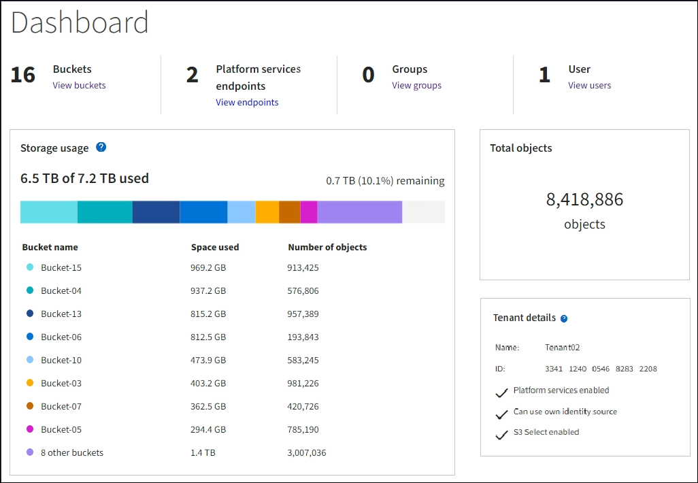

= 테넌트 관리자 대시보드 이해
:icons: font
:imagesdir: ../media/

[role="lead"]
테넌트 관리자 대시보드에서는 테넌트 계정의 구성과 테넌트의 버킷(S3) 또는 컨테이너(Swift)에 있는 객체가 사용하는 공간의 양을 개괄적으로 보여 줍니다. 테넌트에 할당량이 있는 경우 대시보드에는 사용된 할당량의 양과 남아 있는 양이 표시됩니다. 테넌트 계정과 관련된 오류가 있는 경우 대시보드 에 오류가 표시됩니다.

IMPORTANT: 사용된 공간 값은 추정값입니다. 이러한 추정치는 베스트 타이밍, 네트워크 연결 및 노드 상태의 영향을 받습니다.

객체가 업로드되면 대시보드는 다음 예제와 같습니다.

== 테넌트 계정 요약

대시보드 상단에는 다음 정보가 포함되어 있습니다.

* 구성된 버킷 또는 컨테이너, 그룹 및 사용자 수
* 구성된 플랫폼 서비스 엔드포인트의 수입니다

링크를 선택하여 세부 정보를 볼 수 있습니다.

대시보드의 오른쪽에는 다음과 같은 정보가 포함되어 있습니다.

* 테넌트의 총 객체 수입니다.
+
S3 계정의 경우 오브젝트가 수집되지 않고 루트 액세스 권한이 있는 경우 총 오브젝트 수 대신 시작 지침이 나타납니다.

* 테넌트 계정 이름 및 ID와 테넌트가 사용할 수 있는지 여부를 포함한 테넌트 세부 정보입니다 xref:what-platform-services-are.adoc[플랫폼 서비스], xref:../admin/using-identity-federation.adoc[고유한 ID 소스입니다], 또는 xref:../admin/manage-s3-select-for-tenant-accounts.adoc[S3 를 선택합니다] (설정된 권한만 나열됩니다).

== 스토리지 및 할당량 사용

Storage usage(저장소 사용) 패널에는 다음과 같은 정보가 포함되어 있습니다.

* 테넌트에 대한 객체 데이터의 양입니다.
+

IMPORTANT: 이 값은 업로드된 총 오브젝트 데이터 양을 나타내며 해당 오브젝트 및 해당 메타데이터의 복사본을 저장하는 데 사용되는 공간을 나타내지 않습니다.

* 할당량이 설정된 경우 개체 데이터에 사용할 수 있는 총 공간과 남은 공간의 양과 백분율이 표시됩니다. 할당량은 섭취 가능한 오브젝트 데이터의 양을 제한합니다.
+

IMPORTANT: 할당량 활용도는 내부 추정치에 기반하며 경우에 따라 초과될 수 있습니다. 예를 들어, 테넌트가 객체를 업로드하기 시작할 때 StorageGRID는 할당량을 확인하고 테넌트가 할당량을 초과할 경우 새 베스트(ingest)를 거부합니다. 그러나 StorageGRID에서는 할당량이 초과되었는지 확인할 때 현재 업로드 크기를 고려하지 않습니다. 개체를 삭제하면 할당량 활용률이 다시 계산될 때까지 테넌트가 일시적으로 새 개체를 업로드하지 못할 수 있습니다. 할당량 사용률 계산에는 10분 이상이 소요될 수 있습니다.

* 가장 큰 버킷 또는 컨테이너의 상대적 크기를 나타내는 막대 차트.
+
차트 세그먼트 위에 커서를 놓으면 해당 버킷이나 컨테이너에서 소비한 전체 공간을 볼 수 있습니다.

+
image::../media/tenant_dashboard_storage_usage_segment.png[막대 차트 세그먼트]

* 막대 도표에 대응하려면 총 오브젝트 데이터 양과 각 버킷 또는 컨테이너의 오브젝트 수를 포함하여 가장 큰 버킷 또는 컨테이너의 목록입니다.
+
image::../media/tenant_dashboard_buckets.png[테넌트 대시보드 버킷]

+
테넌트에 9개 이상의 버킷이나 컨테이너가 있는 경우 다른 모든 버킷이나 컨테이너는 목록 하단의 단일 항목으로 결합됩니다.

== 할당량 사용 알림을 표시합니다

그리드 관리자에서 할당량 사용 알림이 활성화된 경우 할당량이 낮거나 초과되면 다음과 같이 테넌트 관리자에 표시됩니다.

테넌트 할당량의 90% 이상이 사용된 경우 * Tenant quota usage high * 경고가 트리거됩니다. 자세한 내용은 StorageGRID 모니터링 및 문제 해결 설명서의 경고 참조를 참조하십시오.

image::../media/tenant_dashboard_quota_remaining.png[남은 테넌트 대시보드 할당량]

할당량을 초과하면 새 객체를 업로드할 수 없습니다.

image::../media/tenant_dashboard_quota_used.png[사용된 테넌트 대시보드 할당량]

NOTE: 추가 세부 정보를 보고 알림에 대한 규칙 및 알림을 관리하려면 StorageGRID 모니터링 및 문제 해결 지침을 참조하십시오.

== 끝점 오류

Grid Manager를 사용하여 플랫폼 서비스에 사용할 하나 이상의 엔드포인트를 구성한 경우 지난 7일 이내에 엔드포인트 오류가 발생한 경우 Tenant Manager 대시보드에 경고가 표시됩니다.

image::../media/tenant_dashboard_endpoint_error.png[끝점 메시지를 보여 주는 대시보드]

끝점 오류에 대한 세부 정보를 보려면 끝점 을 선택하여 끝점 페이지를 표시합니다.

xref:troubleshooting-platform-services-endpoint-errors.adoc[플랫폼 서비스 끝점 오류 문제 해결]

xref:../monitor/index.adoc[모니터링하고 문제를 해결합니다]
