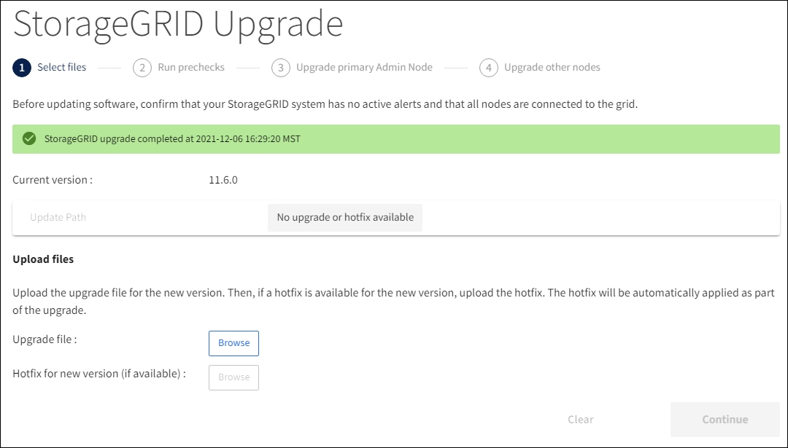

= 업그레이드를 수행합니다
:allow-uri-read: 
:icons: font
:imagesdir: ../media/

[role="lead"]
업그레이드를 수행할 준비가 되면 '.upgrade' 아카이브를 선택하고 프로비저닝 암호를 입력합니다. 옵션으로 실제 업그레이드를 수행하기 전에 업그레이드 사전 점검을 실행할 수 있습니다.

.필요한 것
모든 고려 사항을 검토하고 모든 계획 및 준비 단계를 완료했습니다.

== 업그레이드 파일을 업로드합니다

. 를 사용하여 Grid Manager에 로그인합니다 xref:../admin/web-browser-requirements.adoc[지원되는 웹 브라우저].
. 유지보수 * > * 시스템 * > * 소프트웨어 업데이트 * 를 선택합니다.
+
소프트웨어 업데이트 페이지가 나타납니다.

. StorageGRID 업그레이드 * 를 선택합니다.
. StorageGRID 업그레이드 페이지에서 '.upgrade' 아카이브를 선택합니다.
+
.. 찾아보기 * 를 선택합니다.
.. 'NetApp_StorageGRID_11.6.0_Software_UniqueID.upgrade' 파일을 찾아 선택합니다
.. 열기 * 를 선택합니다.
+
파일이 업로드되고 검증됩니다. 검증 프로세스가 완료되면 업그레이드 파일 이름 옆에 녹색 확인 표시가 나타납니다.

. 텍스트 상자에 프로비저닝 암호를 입력합니다.
+
Prechecks 실행 * 및 * 업그레이드 시작 * 버튼이 활성화됩니다.

+
image::../media/storagegrid_upgrade_buttons_enabled.png[StorageGRID 업그레이드 버튼이 활성화되었습니다]

== 사전 점검을 실행합니다

선택적으로 실제 업그레이드를 시작하기 전에 시스템 상태를 확인할 수 있습니다. Prechecks 실행 * 을 선택하면 업그레이드를 시작하기 전에 문제를 감지하고 해결할 수 있습니다. 업그레이드를 시작할 때 동일한 사전 점검을 수행합니다. PreCheck 실패로 인해 업그레이드 프로세스가 중단되고 일부 오류는 해결을 위해 기술 지원 부서의 개입이 필요할 수 있습니다.

. 사전 검사 실행 * 을 선택합니다.
. 사전 점검을 완료할 때까지 기다립니다.
. 지침에 따라 보고된 모든 사전 점검 오류를 해결하십시오.
+

IMPORTANT: 사용자 지정 방화벽 포트를 연 경우 사전 검사 확인 중에 알림을 받습니다. 업그레이드를 진행하기 전에 기술 지원 부서에 문의해야 합니다.

== 업그레이드를 시작하고 기본 관리 노드를 업데이트합니다

업그레이드가 시작되면 업그레이드 사전 점검을 수행하고 서비스 중지, 소프트웨어 업그레이드 및 서비스 재시작이 포함된 기본 관리 노드가 업그레이드됩니다. 기본 관리자 노드가 업그레이드 중인 동안에는 그리드 관리자에 액세스할 수 없습니다. 감사 로그도 사용할 수 없습니다. 이 업그레이드에는 최대 30분이 소요될 수 있습니다.

. 업그레이드를 수행할 준비가 되면 * 업그레이드 시작 * 을 선택합니다.
+
기본 관리 노드가 재부팅되면 브라우저의 연결이 끊어진다는 경고 메시지가 나타납니다.

+
image::../media/software_upgrade_connection_will_be_lost.png[소프트웨어 업그레이드 연결이 손실됩니다]

. 경고를 확인하고 업그레이드 프로세스를 시작하려면 * OK * 를 선택합니다.
. 업그레이드 사전 점검을 수행하고 운영 관리 노드를 업그레이드할 때까지 기다립니다.
+

NOTE: 사전 점검 오류가 보고되면 이를 해결하고 * 업그레이드 시작 * 을 다시 선택하십시오.

+
기본 관리 노드를 업그레이드하는 동안 여러 * 503: 서비스 사용 불가 * 및 * 서버에 연결하는 중 문제 * 메시지가 나타납니다. 이 메시지는 무시해도 됩니다.

+
image::../media/software_upgrade_503_error.png[소프트웨어 업그레이드 503 오류]

+
image::../media/software_upgrade_problem_connecting_error.png[소프트웨어 업그레이드 연결 문제 오류]

. 400: Bad Request * 메시지가 표시되면 다음 단계로 이동합니다. 관리자 노드 업그레이드가 완료되었습니다.
+
image::../media/software_upgrade_400_error.png[소프트웨어 업그레이드 400 오류]

== 브라우저 캐시를 지우고 다시 로그인합니다

. 기본 관리 노드를 업그레이드한 후 웹 브라우저의 캐시를 지우고 다시 로그인합니다.
+
자세한 내용은 웹 브라우저 설명서를 참조하십시오.

+

IMPORTANT: 이전 버전의 소프트웨어에서 사용된 오래된 리소스를 제거하려면 웹 브라우저의 캐시를 지워야 합니다.

+
기본 관리 노드가 업그레이드되었음을 나타내는 다시 설계된 Grid Manager 인터페이스가 나타납니다.

+
image::../media/grid_manager_dashboard.png[Grid Manager 대시보드]

. 측면 표시줄에서 * maintenance * 를 선택하여 Maintenance(유지 관리) 메뉴를 엽니다.
. 시스템 * 섹션에서 * 소프트웨어 업데이트 * 를 선택합니다.
. StorageGRID 업그레이드 * 섹션에서 * 업그레이드 * 를 선택합니다.
. 각 주요 업그레이드 작업에 대한 정보를 제공하는 StorageGRID 업그레이드 페이지의 업그레이드 진행률 섹션을 검토합니다.
+
.. * 업그레이드 서비스 시작 * 은 첫 번째 업그레이드 작업입니다. 이 작업 중에 소프트웨어 파일이 그리드 노드로 배포되고 업그레이드 서비스가 시작됩니다.
.. 업그레이드 서비스 * 작업 시작이 완료되면 * 그리드 노드 업그레이드 * 작업이 시작됩니다.
.. 업그레이드 그리드 노드 * 작업이 진행 중인 동안 그리드 노드 상태 테이블이 나타나고 시스템의 각 그리드 노드에 대한 업그레이드 단계가 표시됩니다.

== 복구 패키지를 다운로드하고 모든 그리드 노드를 업그레이드합니다

. 그리드 노드가 그리드 노드 상태 테이블에 나타난 후 그리드 노드를 승인하기 전에 xref:obtaining-required-materials-for-software-upgrade.adoc#download-the-recovery-package[복구 패키지의 새 복사본을 다운로드합니다].
+

IMPORTANT: 기본 관리 노드에서 소프트웨어 버전을 업그레이드한 후 복구 패키지 파일의 새 복사본을 다운로드해야 합니다. 복구 패키지 파일을 사용하면 오류가 발생할 경우 시스템을 복원할 수 있습니다.

. Grid Node Status 테이블의 정보를 검토합니다. 그리드 노드는 관리 노드, API 게이트웨이 노드, 스토리지 노드 및 아카이브 노드 유형별로 섹션에 정렬됩니다.
+
image::../media/software_upgrade_start_grid_node_status.png[관리자 노드 완료 후 그리드 노드 업그레이드 스크린샷]

+
그리드 노드는 이 페이지가 처음 나타날 때 다음 단계 중 하나일 수 있습니다.

+
** 완료(기본 관리 노드만 해당)
** 업그레이드를 준비하는 중입니다
** 소프트웨어 다운로드가 대기 중입니다
** 다운로드 중입니다
** 승인을 기다리는 중입니다

. 업그레이드 대기열에 추가할 준비가 된 그리드 노드를 승인합니다.
+

IMPORTANT: 그리드 노드에서 업그레이드가 시작되면 해당 노드의 서비스가 중지됩니다. 나중에 그리드 노드가 재부팅됩니다. 노드와 통신하는 클라이언트 애플리케이션의 서비스 중단을 방지하기 위해 노드를 중지 및 재부팅할 준비가 되어 있는지 확실하지 않은 경우 노드에 대한 업그레이드를 승인하지 마십시오. 필요에 따라 유지 보수 기간을 예약하거나 고객에게 알립니다.

+
StorageGRID 시스템의 모든 그리드 노드를 업그레이드해야 하지만 업그레이드 순서를 사용자 지정할 수 있습니다. 개별 그리드 노드, 그리드 노드 그룹 또는 모든 그리드 노드를 승인할 수 있습니다.

+
노드 업그레이드 순서가 중요한 경우, 노드 또는 노드 그룹을 한 번에 하나씩 승인하고 다음 노드 또는 노드 그룹을 승인하기 전에 각 노드에서 업그레이드가 완료될 때까지 기다리십시오.

+
** 하나 이상의 개별 노드를 업그레이드 대기열에 추가하려면 * Approve * 버튼을 하나 이상 선택합니다. 동일한 유형의 노드를 두 개 이상 승인하는 경우 노드는 한 번에 하나씩 업그레이드됩니다.
** 각 섹션에서 * Approve All * 버튼을 선택하여 동일한 유형의 모든 노드를 업그레이드 대기열에 추가합니다.
** 최상위 * 모두 승인 * 버튼을 선택하여 그리드의 모든 노드를 업그레이드 대기열에 추가합니다.
** 업그레이드 대기열에서 노드 또는 모든 노드를 제거하려면 * 제거 * 또는 * 모두 제거 * 를 선택합니다. 스테이지가 * 서비스 중지 * 에 도달하면 노드를 제거할 수 없습니다. 제거 * 버튼이 표시되지 않습니다.
+
image::../media/software_upgrade_two_nodes_queued.png[스테이지가 서비스를 중지함을 보여주는 스크린 샷]

. 각 노드가 대기 중, 서비스 중지, 컨테이너 중지, Docker 이미지 정리, 기본 OS 패키지 업그레이드, 재부팅, 재부팅 후 단계 수행, 서비스 시작 및 완료 등의 업그레이드 단계를 진행할 때까지 기다립니다.
+

NOTE: 어플라이언스 노드가 기본 OS 패키지 업그레이드 단계에 도달하면 어플라이언스의 StorageGRID 어플라이언스 설치 프로그램 소프트웨어가 업데이트됩니다. 이러한 자동 프로세스를 통해 StorageGRID 어플라이언스 설치 프로그램 버전이 StorageGRID 소프트웨어 버전과 동기화된 상태로 유지됩니다.

== 업그레이드를 완료합니다

모든 그리드 노드가 업그레이드 단계를 완료하면 * 그리드 노드 업그레이드 * 작업이 완료된 것으로 표시됩니다. 나머지 업그레이드 작업은 백그라운드에서 자동으로 수행됩니다.

. 기능 사용 * 작업이 완료되는 즉시(빠르게 발생) 업그레이드된 StorageGRID 버전의 새 기능을 사용할 수도 있습니다.
. 업그레이드 데이터베이스 * 작업 중에 업그레이드 프로세스에서는 각 노드를 검사하여 Cassandra 데이터베이스를 업데이트할 필요가 없는지 확인합니다.
+

NOTE: StorageGRID 11.5에서 11.6으로의 업그레이드는 Cassandra 데이터베이스 업그레이드가 필요하지 않지만 Cassandra 서비스는 각 스토리지 노드에서 중지되었다가 다시 시작됩니다. 향후 StorageGRID 기능 릴리즈를 위해 Cassandra 데이터베이스 업데이트 단계를 완료하는 데 며칠이 걸릴 수 있습니다.

. 데이터베이스 업그레이드 * 작업이 완료되면 * 최종 업그레이드 단계 * 작업이 완료될 때까지 몇 분 정도 기다립니다.
+
최종 업그레이드 단계 작업이 완료되면 업그레이드가 완료됩니다.

== 업그레이드를 확인합니다

. 업그레이드가 성공적으로 완료되었는지 확인합니다.
+
.. 그리드 관리자 상단에서 도움말 아이콘을 선택하고 * 정보 * 를 선택합니다.
.. 표시된 버전이 예상한 버전인지 확인합니다.
.. 유지보수 * > * 시스템 * > * 소프트웨어 업데이트 * 를 선택합니다.
.. StorageGRID 업그레이드 * 섹션에서 * 업그레이드 * 를 선택합니다.
.. 녹색 배너에 예상 날짜 및 시간에 소프트웨어 업그레이드가 완료되었다는 메시지가 표시되는지 확인합니다.
+

. StorageGRID 업그레이드 페이지에서 현재 StorageGRID 버전에 사용 가능한 핫픽스가 있는지 확인합니다.
+

NOTE: 업데이트 경로가 표시되지 않으면 브라우저에서 NetApp Support 사이트에 연결할 수 없는 것일 수 있습니다. 또는 AutoSupport 페이지(* 지원 * > * 도구 * > * AutoSupport *)의 * 소프트웨어 업데이트 확인 * 확인란이 비활성화될 수 있습니다.

. 핫픽스를 사용할 수 있는 경우 파일을 다운로드합니다. 그런 다음 를 사용합니다 xref:../maintain/storagegrid-hotfix-procedure.adoc[StorageGRID 핫픽스 절차] 를 눌러 핫픽스를 적용합니다.
. 그리드 작업이 정상으로 돌아갔는지 확인합니다.
+
.. 서비스가 정상적으로 작동하고 있으며 예기치 않은 경고가 없는지 확인합니다.
.. StorageGRID 시스템에 대한 클라이언트 연결이 예상대로 작동하고 있는지 확인합니다.

